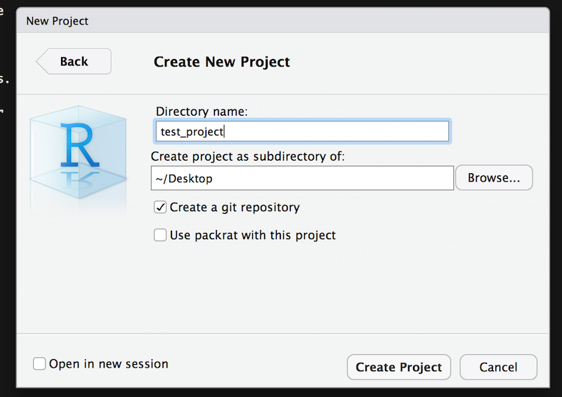
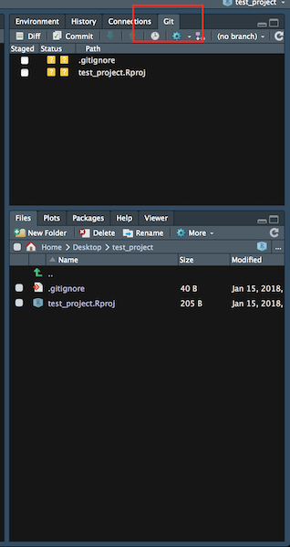
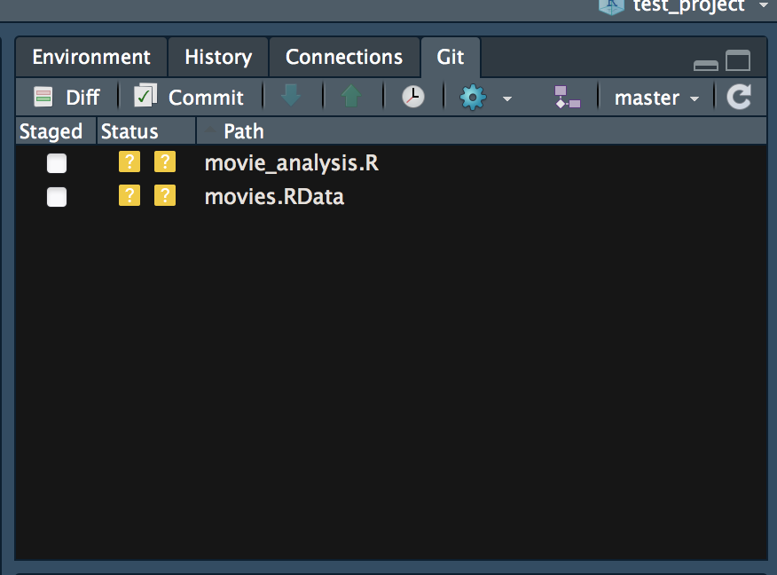
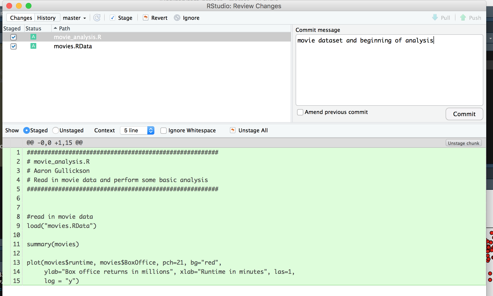
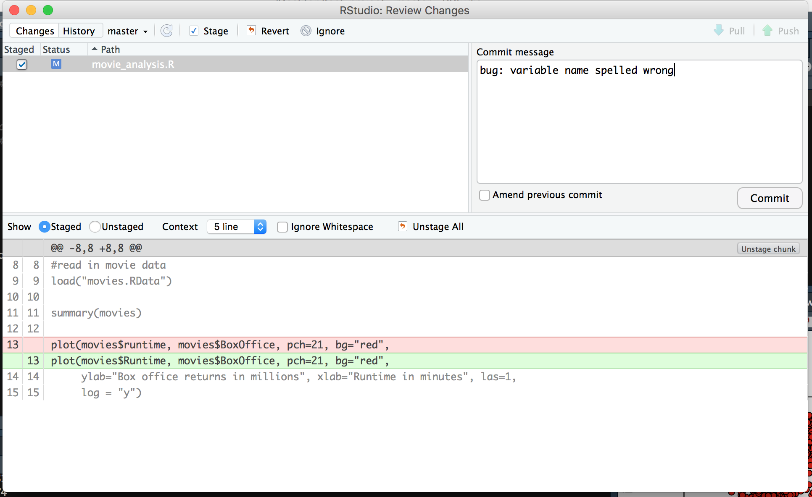
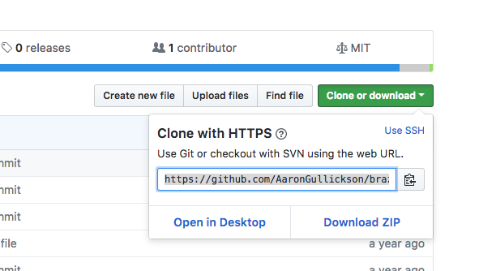
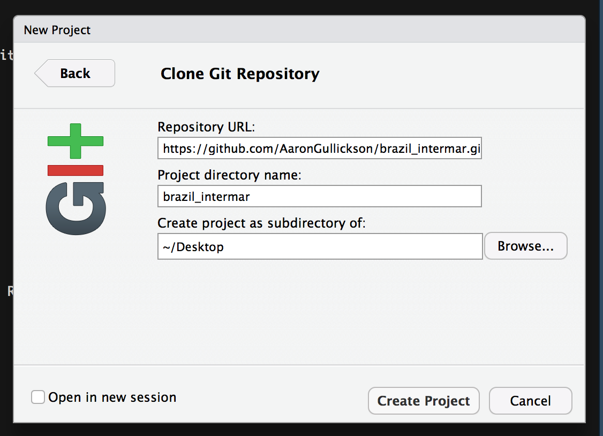
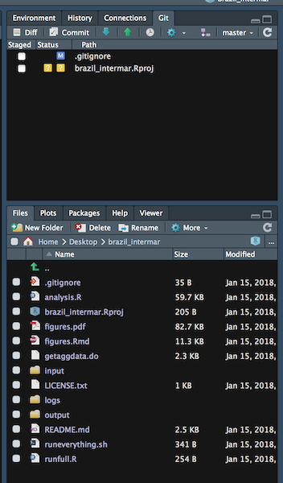
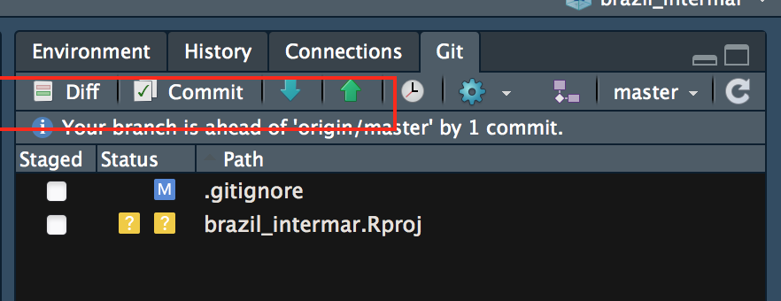
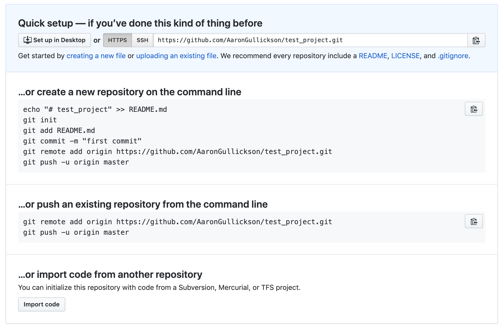

## Using Git

Git is an example of a version control system. Version control systems allow you to track changes to files within a directory and to distribute changes to files to other collaborators. They also allow you to revert changes and to merge any changes made by different collaborators. Version control systems have been used by developers for decades to manage collaborative projects and to keep track of changes.

For academics, version control systems have a lot to offer. This is particularly true for academics doing quantitative work, because much of the daily work flow of quantitative work resembles that of developers. Briefly here are some of the benefits of implementing version control for your projects.

1. **Research log:** All changes to your project need to be “committed” to a repository with a brief description of your changes. You can look over the history of these commits to get a record of all the things you have done on your project.
2. **Nothing is lost:** All changes that you committed to your repository are recoverable. If you realize that the code you changed isn't working right, you can easily revert back to a prior commit or find the text/code that was changed and bring it back in piecemeal.
3. **Keep files tidy:** The typical project folder for most academics will contain multiple versions of the same document, perhaps entitled something like “paper-1.docx”, “paper-v2.1_06272017.docx”, “paper_conference_revision.docx”, “paper_FINAL.docx”, “paper_FINAL_REALLY_THIS_TIME.docx”, and so on. Similarly, scripts are often littered throughout the directory without a clear indication of what scripts will do what and which ones are actually essential to the project. This is a mess. With version control, all of that messiness can go away. Because all changes are tracked by the version control system, there is no need to hang on to older versions of files.
4. **Collaborate intelligently:** Because changes can be shared among multiple users, version control systems make collaboration much simpler. I don’t have to hunt through my emails to find a version of the file that my co-author sent me. I don’t have to remember to send out my changes to everyone and hope they also didn't make changes. I just “push” my changes directly and “pull” in the changes of others.
5. **Back up your system:** If you push your changes to another repository (highly encouraged), then you effectively back up your project. It also makes it easy to work on the same project across multiple computers because you can push and pull changes between the computers.

### Plain Text is Better

Version control systems work best when your files are written in simple plain text rather than as binary files. Version control systems can get inside of a plain text file and document changes line to line. Version control can only tell that a binary file was changed, without information about the changes within the binary file. This makes is much easier to log, document, and merge changes in plain text files than in binary files.

All of the scripts that we typically write are plain text files. A lot of the datasets that we use (but not all) are in plain text CSV or fixed-width format. Most academics, however, are more familiar with writing their papers in a WYSIWIG (What You See Is What You Get) document processing format like Microsoft Word, which saves files as a binary. To truly get the most out of a version control system, you might want to consider writing documents using a logical mark up language like R Markdown or [LaTeX](https://www.latex-project.org). We will discuss both of these options later in the term. In the meantime, I would recommend taking a look at [Kieran Healy’s The Plain Person’s Guide to Plain Text Social Science](https://kieranhealy.org/publications/plain-person-text/) which gives an easy introduction to getting outside the "office" approach to science.

### Git

Git is a version control system designed by the legendary open-source programmer Linus Torvalds. It has become the de facto standard for version control in recent years. It is open-source, lightweight, free to use, and runs on all major platforms.

Git should not be confused with a commercial service like GitHub. GitHub provides users with remote git repositories for sharing and collaborating on projects, but it is not git itself.

Git at its most basic is a command-line program. All of the basic commands that I will discuss below can be run by opening up a console/terminal on your operating system and typing them in. That won’t be our primary way of accessing git, but I want you to know that when RStudio runs git, it is just performing the same commands that you could do directly from the command line. At the end of this document, I discuss the basic commands you can run from the command line with git. 

Here is a basic diagram of a git workflow. We will build up our understanding of this diagram in parts.


#### Git installation

You can install git on your system by downloading the appropriate files [here](https://git-scm.com/downloads) and installing them on your computer. On most computers, this will not give you a graphical client to open, but it will install git "under the hood" of your computer and make it accessible to RStudio.

In order to use git properly, you will need to tell it your name and email address. This information will be attached to any commit you make. You can do this from the command line, but since that is intimidating to most people, we can also do it from within RStudio. 

In RStudio, you will need to install the **usethis** package:

```{r eval=FALSE, echo=TRUE}
install.packages("usethis")
```

You can then run the **use_git_config** command to specify your user name and email:

```{r eval=FALSE, echo=TRUE}
use_git_config(user.name = "Your Name Here", user.email = "myemail@uoregon.edu")
```

Ideally, your email should be the same one that you provided as your primary email to GitHub. You should only have to setup this configuration once. You should now be ready to go.

#### Setting up a repository

The basic idea of git is that your project directory is stored in a repository. This repository keeps a record of all changes made to the project. The repository lives in the same place as your project directory, but it is not the same as the project directory.

You can set up a new git repository from within RStudio using the “File > New Project” menu option. From the dialog window that opens, select “New Directory” and then “New Project.” On the “Create New Project” window, be sure to check “Create a git repository” and then give the directory a name and location. You can see from the screenshot below that I am creating a new test_project on my desktop.



You will now see a couple of files in your new directory. The .gitignore file contains a list of files that you want git to ignore (i.e. not track changes). The Rproj file keeps track of this directory as a project in RStudio. You can double-click this file from your file browser to open up the project in RStudio.



Most importantly, you will notice a new “Git” tab in the upper right panel. This is where the magic happens. This tab is already listing two files in the workspace as different from the repository. Next we will learn how to commit these changed files to the repository.

#### Committing changes to your local repository

Any time you make a change to a file in your project directory, that change will be noted by git. However, the change will not be automatically added to your repository. Changes made to your files are changes in your workspace. To get those changes to show up in the repository, you have to follow a two-step process:

1. **add**: This will add any changed files to the “staging area” but will not put them in the repository yet.
2. **commit**: This will commit all changes from the files in the “staging area” to the repository. Typically, you will also include a text message here that gives some indication of what the changes do.

Now, lets make some substantive changes to the project. I am going to do two things. I am going to add in the movies RData file and a script that does some basic analysis:

```{r, echo=TRUE, eval=FALSE}
#######################################################
# movie_analysis.R
# Aaron Gullickson
# Read in movie data and perform some basic analysis
#######################################################


#read in movie data
load("movies.RData")

summary(movies)

ggplot(movies, aes(x=runtime, y=BoxOffice))+
  geom_point(alpha=0.2)+
  labs(x="runtime in minutes", y="box office returns in millions of USD",
       title="Scatterplot of runtime by box office returns")
```

Once I add these things to my directory, I will see that the git tab in RStudio is showing me changed files for both the movies.RData file and the movie_analysis.R script. I can click the “Staged” button to add these files to my staging area and then hit the “Commit” button.



The “Commit” button will bring up another window which will allow me to review changes and add a commit message.




Once I am satisfied with these changes and I have added a commit message, I can hit the “Commit” button to commit these changes to the repository. You can then close out of this dialog and you will see that there are no pending changes in the git repository.

But wait! There is an error in my script. I forgot to capitalize the “Runtime” variable. If I make this correction to my script, I will see that movie_analysis.R is now showing up as modified. If you go to the review changes dialog, you will see that the single line that was changed is indicated in the diff view.



So the basic workflow here for a project is quite simple. At logical intervals, you should stage and commit changes that you have made to your repository. You will then have a complete log of all changes made to the project from its beginning. You can access this log with the little clock icon in the git tab in RStudio.

#### Working with remotes

Keeping track of your own changes in a repository is only half the fun. The real power of git is in the ability to share changes with other repositories. One of the key features of git is that it allows for peer-to-peer connections between repositories. Often, collaborators will set up one repository as the central repository (on GitHub, for example). Each collaborator can **clone** this repository to their own computer. After changes are committed to the local repository (the "master" repository), those changes can then be **pushed** back to the central repository (the "origin" repository). If I want to get changes that have been pushed by other collaborators, I can **pull** those changes from the central repository to my own local repository.

As an example, I am going to clone one of my own [public repositories](https://github.com/AaronGullickson/brazil_intermar) and then show you how to make changes and push those changes back to the GitHub repository.

##### Cloning the Repository

The first step is to clone the GitHub repository. You will notice a “Clone or Download” button in the upper right of all GitHub repositories. If I click on that, it will give me a link to clone via https (I can also clone by ssh, but that is more complicated).



I copy that link and then go back to the “File > New Project” option in RStudio. This time, I will select the “Version Control” option and then “Git” option. I will then paste my https link into the “Repository URL” line. This will give me an automatic project directory name. I just have to select where to put this directory and then “Create Project.”



Git will clone the repository and RStudio will open up this directory as a project. Notice that it already wants to add a couple of files, because I did not have this repository set up as an RStudio project yet.



I am going to make one simple change to the analysis.R file in this directory. I am going to add the following simple comment right below the file header:

```
#This is an example comment for Sociology 512
```

I then commit those changes:

Its important to understand clearly what I have and have not done at this point. I **have** made a change to my **local** workspace and committed that change to my **local** repository. But nobody else in the world knows about this change yet because I **have not** made any changes to the **remote** repository from GitHub. The Git tab in RStudio provides me an important reminder of this fact:



It is telling me that my repository is one commit ahead of the origin repository on GitHub. Let me pause for an important note on nomenclature. The master repository is always your own local repository. The origin repository is the place from which you cloned your local repository. You can change this name and you can link to multiple remote repositories but we won’t get that complex at the moment.

What we want to do is **push** the changes in our repository to the remote repository on GitHub. We can do this as easy as falling off a log by clicking the big green button in the Git tab. The first time you do this, you will be asked for your GitHub password. I give the password, and git pushes my changes. If you now look at this file on the GitHub repository, you will see the new comment.

What if I want to get any changes that might have been made by someone else to the GitHub repository? I can get those changes easily enough by **pulling** from the GitHub repository. RStudio makes this easy with the big blue button pointing down.

Sometimes you may need to merge in changes from someone else when you push and pull. This can usually be handled gracefully, but occasionally you may run into conflicts if you both changed the same line of code. In those cases, git will leave both versions of the code in the document and you will have to make a decision about how to integrate them. If you are working on some big changes with collaborators then a better solution is to create a separate [branch](https://git-scm.com/book/en/v2/Git-Branching-Basic-Branching-and-Merging) and then use the [pull request](https://help.github.com/en/github/collaborating-with-issues-and-pull-requests/about-pull-requests) system in GitHub to help manage conflicts, but that is beyond what we will learn for the basics. 

##### A basic git workflow

I know that this may initially seem like a lot to juggle but the basic workflow of this process is really simple once you get used to it. Here is how you should think about integrating git into your workflow when you sit down to work on a project:

1. run a **pull** command to catch any changes made by other collaborators since the last time you worked on the project.
2. Do your work (writing code, downloading data, writing a paper, etc.)
3. When you have reached a logical place to do so, **commit** all of the changes from your project to your local repository. You can do this multiple times in a work session if you are working on different parts of the project. Remember that its best to separate out commits by logically distinct changes rather than something like "A bunch of changes for the day."
4. When you are done for the day **push** all the changes back to the central repository. Now your colleagues will have access to your changes and you have a backup.

#### Github Private Repositories

Its important to keep in mind the distinction between git and GitHub. GitHub is just a service that provides free remote git repositories and a variety of additional bells and whistles like wiki's and issue tracking (mostly associated with software development, but also useful for academics). There are other git repository service providers out there like [GitLab](https://gitlab.com/) and [BitBucket](https://bitbucket.org). You can even run remote git repositories off of your own server, as I do.

Free accounts on GitHub do not give you any access to private repositories, which means that any repository you push to GitHub is viewable by the world. However, as students, you can apply for the [GitHub Student Developer Pack](https://education.github.com/pack). This pack provides access to quite a list of software that you probably don't need, but importantly it also gives you private repositories for free. If you plan to use git in your research workflow, its well worth it to apply. Note that the repositories you work with for our class will be private because they are associated with the GitHub Classroom that I have created.

One important note about GitHub repositories: **the maximum size for a single file is 100MB**. This can create problems because git will allow you to commit a file larger than this size but you will not be able to push it up to GitHub, which means you will have to remove it from your commit history to push. If you are writing a script over 100MB, then you are doing it wrong. However, datasets can sometimes be larger than 100MB. R can usually read datasets that have been compressed (e.g. .zip, .gz, .bz2 extension) so keeping your datasets zipped is a good practice to avoid this problem. For really big datasets, you may need to either break up the dataset or host it somewhere else and read it remotely. 

#### Git from the command line

We will use the git tab interface in RStudio for all of our gitting needs this term, but its useful to know the actual command line interface as well for potential problem shooting. For this section, I will use the same "test_project" I described above as an example. 


You should be able to access a command line interface with the "Terminal" tab in the main window of RStudio. This will probably show up by default in MacOSX. If not, you should be able to bring up a new one with Tools > Terminal > New Terminal. It may not show up in Windows, but you can also get a command line interface in Windows using the "git-bash" application that came with Git. 

The terminal will look very similar to the command line interface of R, but this command line is actually interfacing directly with the command line of your computer, not R. Like R, it expects the commands to be executed in the correct working directory. You can change working directories with the *cd* command (short for "change directory").

Once in the correct directory, you can run git commands. All git commands are two words with the first word being "git". The first and most useful git command is **git status**.

```bash
git status
```

```bash
On branch master

No commits yet

Untracked files:
  (use "git add <file>..." to include in what will be committed)

        .gitignore
        test_project.Rproj

nothing added to commit but untracked files present (use "git add" to track)
```

This command tells me the current state of my repository. It shows here that I have two untracked files that have not been committed to the repository. Committing these files is a two-step process. First I need to use the **git add** command followed by the file names (and paths if in sub-directories) to the staging area:

```bash
git add .gitignore test_project.Rproj
git status
```

```bash
On branch master

No commits yet

Changes to be committed:
  (use "git rm --cached <file>..." to unstage)

        new file:   .gitignore
        new file:   test_project.Rproj
```

The status command now shows the files are staged and ready to be committed. I can now commit them with the **git commit** command. I will use the "-m" option to specify a log message.

```bash
git commit -m "initial commit of project files"
git status
```

```bash
On branch master
nothing to commit, working tree clean
```

Git is now telling me that everything looks good. I have no other uncommitted changes in my repository. If I make new files or edit existing files, I can then repeat this two step process of adding and committing files.

I can also use **git log** to show the history of all my commits:

```bash
git log
```

```bash
commit 35a0940b190dab64a08a5cad5025eb045ac7d353 (HEAD -> master)
Author: Aaron Gullickson <aarong@uoregon.edu>
Date:   Mon Jan 27 10:17:40 2020 -0800

    initial commit of project files
```

In this case its showing me the only commit that I made, when I made it and the commit message that I included. It also gives a unique ID for the commit. 

I can also push and pull my changes but first I need a remote repository. You can set up a new empty repository on GitHub through the GitHub web interface. GitHub will then nicely give you information on how to get your local repository up the remote one:



The first thing we have to do is create a new "origin" remote repository. We can do this with the **git remote** command:

```bash
git remote add origin https://github.com/AaronGullickson/test_project.git
```

Note that I could have called this anything I wanted, but "origin" is the general practice. Now that I have the remote repository's address set up, I can use the **git push** command to upload the contents of my local repository to GitHub:

```bash
git push -u origin master
```

```bash
Enumerating objects: 4, done.
Counting objects: 100% (4/4), done.
Delta compression using up to 12 threads
Compressing objects: 100% (3/3), done.
Writing objects: 100% (4/4), 457 bytes | 457.00 KiB/s, done.
Total 4 (delta 0), reused 0 (delta 0)
To https://github.com/AaronGullickson/test_project.git
 * [new branch]      master -> master
Branch 'master' set up to track remote branch 'master' from 'origin'.
```

It looks like everything worked. The first time I do this I need to specify the names of the repositories involved ("origin master"), but I  also include the "-u" command which will tell git to treat the origin remote repository as my default "upstream" repository in the future. In the future, I will then just need to type "git push" to do the same operation.

If someone else were to make changes to the remote repository, I could then use the *git pull* command to integrate them into my local repository.
