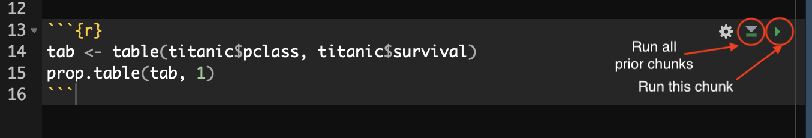
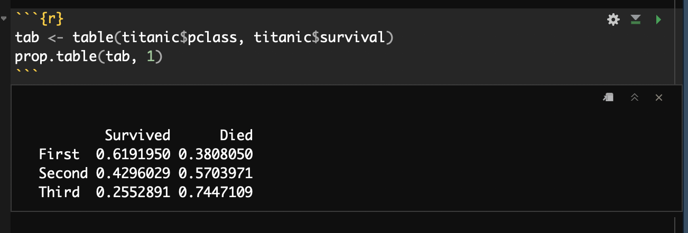
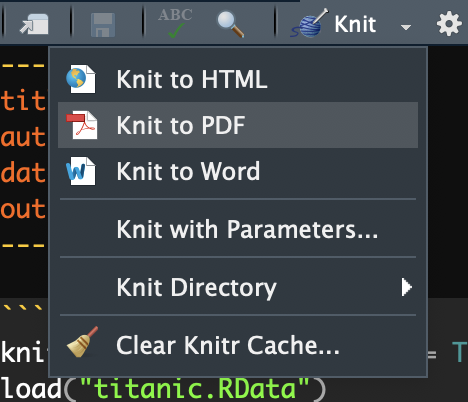
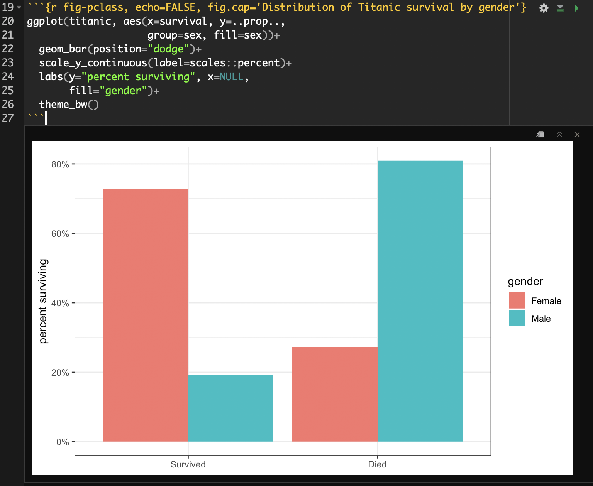

## Using R Markdown

Every piece of content in this book including this lab was produced in what is called an "R Markdown" document. R Markdown is a recent innovation, but its part of a larger universe of tools that allow you to write documents with *logical markup* and embedded executable code. R Markdown documents allow you to combine textual description, code, and the output from code seamlessly into a single document. There are multiple ways this can be used such as to write brief reports, [create a lab notebook](https://www.r-bloggers.com/knitr-github-and-a-new-phase-for-the-lab-notebook/), or even to write full [research articles](http://svmiller.com/blog/2016/02/svm-r-markdown-manuscript/). More importantly, R Markdown helps to achieve the goals of the [open science movement](https://rpubs.com/marschmi/117051) to make the process of data analysis more open and reproducible by combining in one document the actual analysis with a write-up of that analysis. 


### Plain Text Science

In order to understand the idea of R Markdown files, its important to have some understanding of how scientific manuscripts are produced. I am drawing here on [Kieran Healy's Plain Person's Guide to Plain Text Science paper](http://kieranhealy.org/files/papers/plain-person-text.pdf), which I would highly encoruage you to read. There are basically two models for producing manuscripts. The first model is the "office" model:

> Office solutions tend towards a cluster of tools where something like Microsoft Word is at the center of your work. A Word file or set of files is the most “real” thing in your project. Changes to your work are tracked inside that file or files. Citation and reference managers plug into those files. The outputs of data analyses—tables, figures—get cut and pasted in as well, or are kept alongside them. The master document may be passed around from person to person to be edited and updated. The final output is exported from it, perhaps to PDF or to HTML, but maybe most often the final output just is the .docx file, cleaned up and with the track changes feature turned off. 

In the office model, manuscripts are in typically written in an application like Microsoft Word that is WYSIWYG (What-You-See-Is-What-You-Get). The actual substantive content of the text and the visual presentation of that text are inseparable. 

On the other hand, in the "engineering"" model the approach is very different. As Healy writes:

> In the Engineering model, meanwhile, plain text files are at the center of your work. The most “real” thing in your project will either be those files or, more likely, the version control repository that stores the project. Changes are tracked outside of files, again using a version control system. Data analysis is managed in code that produces outputs in (ideally) a known and reproducible manner. Citation and reference management will likely also be done in plain text, as with a BibTeX .bib file. Final outputs are assembled from the plain text and turned to .tex, .html, or .pdf using some kind of typesetting or conversion tool. Very often, because of some unavoidable facts about the world, the final output of this kind of solution is also a .docx file.

In the engineering model, manuscripts are written in a plain-text file with some kind of [logical markup](https://en.wikipedia.org/wiki/Markup_language) applied. This plain-text file can then be processed by another application to produce the final viewable output in a variety of formats (e.g. HTML, PDF, docx). In this model, the actual substantive content of the text and the visual presentation of that text are separated. 

The engineering model tends to be more prevalent in the hard sciences and STEM fields, while the office model is more common in the humanities. The social sciences are the warzone, where the majority of disciplines and individuals probably use the office model, to the eternal consternation and annoyance of those who utilize the engineering model. While the office model seems "easier" because it has a gentler learning curve and seems to get people what they want immediately, via visual representation, the engineering model offers numerous advantages of efficiency and reproducibility, especially for quantitative work. In the typical office model, the need to import tables and figures from an external program into a word-processing document is both a hassle and a source of potential user error. Errors in transcription can occur or some tables and figures might not get updated with new data or models. The engineering model removes this problem entirely, by combining text and code into a single file. Its not What-You-See-Is-What-You-Get but it is What-You-See-Is-What-You-Did.

### Markdown Syntax

The development of [Markdown](https://daringfireball.net/projects/markdown/syntax) has made the engineering model considerably easier. Before Markdown, the preferred markup language for typesetting scientific manuscripts was [LaTex](https://www.latex-project.org/about/). Latex is powerful and can produce beautiful documents, but it is also complex and has a steep learning curve. Markdown, on the other hand, is dead simple. 

[Markdown](https://daringfireball.net/projects/markdown/syntax) is one of many ["markup" languages](https://en.wikipedia.org/wiki/Markup_language). Markup languages provide a way to write a document in which formatting of text is done by using some kind of coding syntax to tag bits of text. The most well-known markup language is, of course, HTML, which stands for hypertext markup language. Markdown was actually originally written as a means for people to write simple documents that were uncluttered by a lot of markup, but could also be easily converted into HTML. With the arrival of a powerful program called [pandoc](https://pandoc.org/), which can convert between a variety of document formats, markdown has now become the default geek choice for writing documents in all kinds of formats. You can even convert from markdown to Word. 

As its tongue-in-cheeck name indicates, the beauty of Markdown is that its syntax is simple and produces text documents that are very readable even before processing. Here is an example of Markdown syntax with most of the basic syntax that you would be likely to need for writing an academic report. 

```markdown
# Title

Here is a sentence. This sentence continues the same paragraph.

Here is a sentence that starts another paragraph.

## A subtitle

Here is another sentence, but this time I **bolded** and *italicized* some things.

### A sub-subtitle

Here is another sentence but this time, I am going to also create a bulleted list.

* First Item
     * First Subitem
     * Second Subitem
* Second Item
* Third Item

How about a numbered list? Why not.

1. First Item
      a. Subitem 1
      b. Subitem 3
2. Second Item

What if I want to blockquote somebody? Sure, lets do that:

> I have sworn upon the altar of god eternal hostility against every form of tyranny over the mind of man.

See how easy this is?
```

There is some basic markup syntax here, but it is so subtle that the text is easy to read even without processing into a prettier form. But speaking of processing, how would I turn this into a prettier output form? One of the advantages of markdown is that I have numberous options here. I could process (or "knit") this text into an HTML, PDF, or MS Word document, among other choices. If you create this markdown file in RStudio with the extension *.md, RStudio will give you the option of converting it to any of those types. You can see what this document looks like knitted to HTML [here](/stat_book/resources/markdown_example.html).

You can find a variety of markdown cheatsheets online if you want to learn more abou the basic syntax options. [Here](https://github.com/adam-p/markdown-here/wiki/Markdown-Here-Cheatsheet) is a good one to get you started. 

### R Markdown

Markdown is so popular that it has spawned a variety of spin-off flavors. One of those flavors is [R Markdown](http://rmarkdown.rstudio.com/lesson-1.html). You can create a new R Markdown document in RStudio by going to File > New File > R Markdown and choosing the document option. It will ask you to choose an output option, but you can switch this at any time. The default is HTML.

R Markdown has all the basic capabilities of Markdown, but also allows you to run and display R code and output within what are called *code chunks*.^[Despite the name, you can also use a variety of other code in these code chunks, including Python, C++, SQL, and Bash. Its even possible to [run Stata code in R Markdown](http://www.ssc.wisc.edu/~hemken/Stataworkshops/Stata%20and%20R%20Markdown/Statalinux.html). When the R Markdown document is "knitted" by RStudio, the code inside of the code chunks will be run and the output will be displayed within the document. Any objects created in code chunks can also be used by later code chunks in the same document, so you can use one code chunk to load in dataand then run analyses on that data in subsequent code chunks.

Code chunks are defined by "code fencing" similar to what we have used on Slack and GitHub. In general, you start a code chunk with a "fence" of three grave accents ``(`)``. You end a code chunk with another "fence" of three grave accents. When you do this, R Markdown will display whats inside the code chunk in a coding format. If we want to make the code inside of that chunk executable when R Markdown is knitted, then we need to include the syntax `{r}` immediately after the opening code fence. So to put it all together here is an example of an executable code chunk in R Markdown.

Here is an example of a simple code chunk in an R Markdown document. 

````markdown
`r ''````{r}
tab <- table(titanic$pclass, titanic$survival)
prop.table(tab, 1)
```
````

Note that this code chunk will only run assuming I have another code chunk that loads in the Titanic data. 

RStudio offers some nice features for working with code chunks interactively. Here is what that same code chunk looks like when embedded in an R Markdown document in RStudio:



The code chunk itself is shown on a slightly different background color to help differentiate it from the rest of the document. In addition, there are a few buttons in the upper right that provide additional functionality. The left most button allows you to adjust some chunk settings that I will cover later. The middle button runs all the prior code chunks in the document. This is useful if this code references data and variables that were created by prior chunks. The "play" button on the right runs this code chunk. 

If you push the play button, RStudio will process the code in the chunk and display any output inline within your document. This allows you to preview and test your output before knitting the full document. You can see an example of this inline output for the example code chunk here:



#### Knitting the Document

Once I am ready to process the document I can "knit" it in RStudio. This will convert the R Markdown document into the desired document format. You can do this by hittin the "knit" button showing at the top of your RStudio window. If you click the carrot on that knit button, you will also be able to select which output option you would like to use. 



You can choose HTML, PDF, or MS Word as your output. [Here](/stat_book/resources/example.Rmd) is an example R Markdown file that includes many additional features I will introduce below. [Here](/stat_book/resources/example.html) is that R Markdown file knitted an HTML file and [here](/stat_book/resources/example.pdf) it is as a PDF. Although, you can convert to MS word, the quality of figures and tables is usually not as good.

HTML conversion will work out of the box in RStudio. MS Word conversion will also work out of the box if you have it installed on your computer. Conversion to PDF is trickier. To convert from R Markdown to PDF, RStudio actually goes through a two-step process. First, the R Markdown files are converted to [TeX](https://texfaq.org/FAQ-whatTeX) files and then those TeX files are converted to PDF. In order to do the second step, you must have a version of TeX installed on your system. There are a variety of options out there, but many of them are huge and require manual tracking of additional packages. However, there is a lightweight solution called [tinytex](https://yihui.org/tinytex/) that you can install directly from within R. To do so, you need to install the tinytex package and then use its commands to install tinytex on your system, like so:

```r
install.packages("tinytex")
library(tinytex)
if(!tinytex:::is_tinytex()) {
  install_tinytex(force=TRUE)
}
```

If you are on a Mac, there have been [some reported issues](https://github.com/yihui/tinytex/issues/92) with this installation due to some file permission issues. If you run into problems, then you should try running the following commands into the **Terminal** tab in RStudio (not the console!):

```bash
sudo chown -R `whoami`:admin /usr/local/bin
~/Library/TinyTeX/bin/x86_64-darwin/tlmgr path add
```

#### Additional Chunk Options

In the curly brackets for the code chunk, you can specify a variety of additional options that define how your code chunk and its output will be displayed. 

Generally, you should name each code chunk. You can name a code chunk by feeding in a single name (no spaces!) right after the "r" declaration. For example, I could name my code chunk "tab-pclass" like so:

````markdown
`r ''````{r tab-pclass}
tab <- table(titanic$pclass, titanic$survival)
prop.table(tab, 1)
```
````

Naming is not required, but it does provide some benefits. RStudio will show you all code chunks in your outline and naming them helps you to easily find which code chunk you are looking for. If you get an error while processing your R Markdown document, it will be easier to diagnose which code chunk has the error if you have them named as well. 

Naming does have one drawback. R Markdown will not process a document if two code chunks have the same name. Instead if will give you a "duplicate label" error. Be careful when copying and pasting code chunks to rename new code chunks with a different name.

In addition to names, you can specify a variety of other arguments in the curly brackets in a fashion very similar to R function arguments. Arguments are separated by commas and have a syntax of `argument=value`. 

The most common arguments concern whether the final knitted document should contain the code and/or output. By default, the final document will show both the code and the output. This is useful if you are making a "lab notebook" in which you want to document what was done as well as what the results were. However, if you are trying to write a manuscript for publication, you typically will not want the code to show, but you will want to see the output. Here are the arguments you can use to control what gets seen:

* `echo=FALSE` -  If you set `echo` to `FALSE`, then the output will be shown but the code will not be. 
* `include=FALSE` - If you set `include` to `FALSE`, then neither the output or the code will be shown although the code chunk will be run.
* `eval=FALSE`  - If you set `eval` to `FALSE` then the code chunk will not be processed and nothing will be shown. This can be useful if you want to temporarily "turn off" a code chunk without actually removing the code.

Lets say that I only wanted my output to show for my example code chunk. I would then change my code chunk as follows:

````markdown
`r ''````{r tab-pclass, echo=FALSE}
tab <- table(titanic$pclass, titanic$survival)
prop.table(tab, 1)
```
````

### Figures in R Markdown

You can use R code chunks to directly produce nice figures within your document. You can also put captions on these figures with the `fig.cap` argument. Lets make a barplot of the conditional distribution of survival on the Titanic using a code chunk:

````markdown
`r ''````{r fig-pclass, echo=FALSE, fig.cap='Distribution of Titanic survival by gender'}
ggplot(titanic, aes(x=survival, y=..prop.., group=sex, fill=sex))+
  geom_bar(position="dodge")+
  scale_y_continuous(label=scales::percent)+
  labs(y="percent surviving", x=NULL, fill="gender")+
  theme_bw()
```
````

Notice that I am using the `fig.cap` argument in the code chunk header to specify a figure caption rathe than the title label from within ggplot. Generally, I recommend that you create captions for R Markdown documents in this way, because they will be able to take advantage of additional layout options in many of the output documents. 

If I run this code chunk, I will get a nice inline display of the figure:



You can also change the figure width, height and resolution with arguments to the code chunk, but we won't cover those here.

#### Making Tables in R Markdown

Making tables in R Markdown is not quite as smooth or as easy as making figures. You can of course just produce R output directly as a table, as I did above for the passenger class by survival crosstab, but this will not look very polished.  There are a few different optional library commands that will produce table output that looks nicer in R Markdown. The major options that I am familiar with are:

- the `kable` command in the `knitr` package. This command can output tables in a native markdown format so that they will be converted properly regardless of what final output you are using. 
- The `pandoc.table` command from the `pander` package. This command also produces tables in a native markdown format. Its very similar to the `kable` command with arguably more customization options.
- The `xtable` command in the `xtable` package. This will produce output either in LaTex (for PDF) or HTML format, so if you switch output types, you will have to remember to make the corresponding change to this format. This command is highly customizable but is also complex. 
- The `texreg` package has commands for producing tables of regression models using either the `htmlreg` or `texreg` command for HTML or PDF output, respectively. You will need to switch output type in the command if you switch output type for the main document. 

For our purposes, I am going to show you how to make a crosstab with `kable` or `pandoc.table` and a regression model table with `text`. Remember that in all cases, you will need to install these packages using `install.packages` in order to use them.

#### Using `kable` and `pandoc.table`

Lets look at a passenger class by survival crosstab in the Titanic data using `kable` and `pandoc.table`. The `kable` command has one special advantage. Because this command comes from the same library that "knits" together our document, RStudio knows that the output should be displayed as a real table rather than as simple R output. Here is the code chunk to produce the table in `kable`:

```{r include=FALSE}
tab <- table(titanic$pclass, titanic$survival)
```

````markdown
`r ''````{r kable-table, echo=FALSE}
kable(tab, 
      caption = "Cross-tabulation of passenger class by survival on the Titanic")
```
````

And the output:

```{r kable-table, echo=FALSE}
kable(tab, 
      caption = "Cross-tabulation of passenger class by survival on the Titanic")
```

The table looks pretty decent. My major complaints are that the variables themselves are not labeled directly and that the table stretches out across the whole width. Some of this can be adjusted by settings, but if you really want to make the table nicer, you can try the [kableExtra](https://cran.r-project.org/web/packages/kableExtra/vignettes/awesome_table_in_html.html) package which a variety of nice formatting features to a kable table.

To produce the table using `pandoc.table`, we use almost the exact same syntax except for one important change. We will need to add the argument `results='asis'` in the code chunk to tell R to treat the output as regular markdown text that can be further processed. 

````markdown
`r ''````{r pandoc-table, echo=FALSE, results='asis'}
pandoc.table(tab, 
             caption = "Cross-tabulation of passenger class by survival on the Titanic")
```
````

And the output:

```{r pandoc-table, echo=FALSE, results='asis'}
pandoc.table(tab, 
             caption = "Cross-tabulation of passenger class by survival on the Titanic")
```

I like the compact nature of this table. I don't care for the lack of left alignment for the row names, but I could have adjusted this with some further options that you caan explore in the help file. 

#### Using `texreg`

The `texreg` package is an extremely useful package for producing regression tables in the style that is common in journal articles. It is not the only package of this sort. The other major package that is used for this purpose is called `stargazer` but I think `texreg` has a few advantages so it is the only I use for our course.

I would recommend that you use the development version of the `texreg` package that is available on GitHub because it has many features for playing nice with R Markdown that are not available in the default package. To install the GitHub development version, you will need to install the `devtools` package and then use the `install_github` function:

```r
install.packages("devtools")
library(devtools)
install_github("leifeld/texreg")
```

The `texreg` package is highly customizable. We will focus on only a few of its customization options here in order to get up and running. 

To get started lets create a sequence of nested models in R predicing Tomato Meter ratings of movies:

```{r buildregs, echo=TRUE}
model1 <- lm(TomatoMeter~I(Runtime-90), data=movies)
model2 <- update(model1,.~.+Rating)
model3 <- update(model2,.~.+I(Runtime-90)*Rating)
model4 <- update(model3,.~.+I(Year-2001)+Genre+I(BoxOffice-mean(BoxOffice)))
```


The `texreg` package comes with several different commands that will give the model results in different formats depending on the output that the user wants, but we will only need to use two of these commands directly.

* `screenreg` - This command will print the results out as nicely formatted plain text. This is useful when interactively testing out models in an R Markdown document but is not recommended for a "final product."
* `knitreg` - This command actually calls up one of three different commands: `htmlreg`, `texreg`, or `wordreg` for displaying results in HTML, PDF, or Word documents, respectively. It automatically figures out the correct command to call up and handles a lot of the messy details. The output will then be nicely formatted for the selected document output. You will need to add the `results='asis'` argument to your code chunk header for the results to display nicely.

Regardless of which command you use, the basic syntax is the same Therefore, you just need to switch the command name to switch the output.

The most important required argument for the `texreg` commands is a `list` of the model objects that should go into the table. So, if I want to print my results to the screen, I would use the following basic syntax:

````markdown
`r ''````{r tab-screenreg, echo=FALSE}
screenreg(list(model1, model2, model3, model4))
```
````

The output will look as follows:

```{r tab-screenreg, echo=FALSE}
screenreg(list(model1, model2, model3, model4))
```

You can see that this table has the same structure that people expect to see for tables of regression models. The `texreg` functions come with a variety of optional commands, however, that will allow me to make this look even nicer. Below, I show off some `texreg` options that will allow me to produce a nicer table. 

````markdown
`r ''````{r tab-screenreg-better, echo=FALSE, results='asis'}
knitreg(list(model1, model2, model3, model4),
        caption="Linear models predicting a movie's tomato meter rating",
        custom.coef.names = c("Intercept", "Movie runtime in minutes",
                              "PG", "PG-13","R",
                              "Runtime*PG", "Runtime*PG-13", "Runtime*R",
                              "Year of release",
                              "Animation","Comedy","Drama","Family","Horror",
                              "Musical","Mystery","Romance","Sci-Fi/Fantasy",
                              "Thriller","Box office returns (millions USD)"),
        digits = 3,
        caption.above=TRUE, 
        include.rsquared=TRUE,
        include.adjrs=FALSE,
        include.nobs=TRUE,
        include.rmse=FALSE)
```
````

First, notice that I have switched from `screenreg` to `knitreg`. That will allow the results to appear nicely formatted in the HTML document you are reading right now. Note also that I have added the `results='asis'` to my code chunk header. Without this command, the knitting process won't know to treat the output directly as HTML code and will instead treat it like plain text.

What do all of the additional arguments to `knitreg` do?

* `caption` - this specifies a caption for the table. The caption will not show in the inline output to `screenreg` but will show in the final knitted document. 
* `custom.coef.names` - this argument requires a vector of character strings to use for the labels of the independent variables. Without this command, the variable names will appear exactly as they are entered into the `lm` formula, so this argument is necessary for a polished final product. However, I would recommend not adding this argument until you are fairly certain that you have a final table because any changes to models will require changing the values for this argument.
* `digits` - This argument specifies how many decimal places each numeric value should be rounded. 
* `caption.above` - setting this to TRUE will cause your caption to appear above rather than below the table. 
* `include.` - These commands designate what summary statistics should be displayed in the table.

When I enter all this all in, I get the following nicely formatted table:

```{r tab-screenreg-better, echo=FALSE, results='asis'}
knitreg(list(model1, model2, model3, model4),
        caption="Linear models predicting a movie's tomato meter rating",
        custom.coef.names = c("Intercept", "Movie runtime in minutes",
                              "PG", "PG-13","R",
                              "Runtime*PG", "Runtime*PG-13", "Runtime*R",
                              "Year of release",
                              "Animation","Comedy","Drama","Family","Horror",
                              "Musical","Mystery","Romance","Sci-Fi/Fantasy",
                              "Thriller","Box office returns (millions USD)"),
        digits = 3,
        caption.above=TRUE, 
        include.rsquared=TRUE,
        include.adjrs=FALSE,
        include.nobs=TRUE,
        include.rmse=FALSE)
```

#### Citations in R Markdown

In order to add citations in R Markdown, you will need to create a BibTex bibliography (*.bib file) of your references. Most reference managers (including Zotero and Mendeley) will allow you to do this. You will then need to put your .bib file in the same directory as your R Markdown file and add a line to the top header in your R Markdown file that looks like this:

```
bibliography: bibliography.bib
```

Where you replace "bibliography.bib" with whatever the actual name of your bibliography is. You can then call up references in the text using the citation key for each entry. You can see examples of how this citation syntax works [here](http://rmarkdown.rstudio.com/authoring_bibliographies_and_citations.html#citations). 

When you knit your document, the citations will be filled in with proper names and a reference list will be placed at the end of your document.

#### Writing Equations in R Markdown

One final nice feature of R Markdown is that you can write complex equations. The [syntax](https://en.wikibooks.org/wiki/LaTeX/Mathematics) for writing equations is borrowed from the typesetting program LaTex. This syntax can take some time to learn, but is worth the effort if you will be using complex equations in your work. You can start math equations by surrounding them on either side with double dollar signs, like so:

`$$\hat{y}_i=\beta_0+\beta_1x_{i1}+\beta_2x_{i2}+\ldots+\beta_px_{ip}$$`

This will be processed by RStudio as:

$$\hat{y}_i=\beta_0+\beta_1x_{i1}+\beta_2x_{i2}+\ldots+\beta_px_{ip}$$