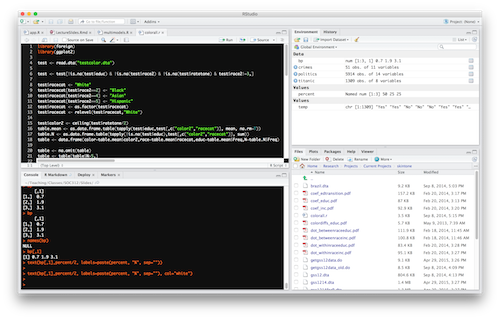

<style type="text/css">
slides > slide:not(.nobackground):after {
  content: '';
}
</style>

#Course Structure
Introduction

##Learning Objectives {.smaller}

<div class="footer">
<body>Sociology 312, Introduction: Course Structure</body>
</div>

This course will teach the fundamentals of analyzing numerical data in a social science context. Students will learn effective ways of presenting informational summaries, the use of statistical inference from samples to populations, and the linear model that forms the basis of much social science research. Emphasis will be on an intuitive understanding of statistical results, and on their practical application.

>- Students will be able to describe the distribution of quantitative and categorical variables using graphical and numerical techniques.
>- Students will be able to describe the relationships between variables using two-way tables, mean differences, and regression models.
>- Students will be able to interpret OLS regression model results from real research, including the use of dummy variables, and interaction terms.
>- Students will be able to conduct and interpret tests of statistical inference.
>- Students will become familiar with performing analysis using the R and RStudio statistical software. 

##Course Organization

<div class="footer">
<body>Sociology 312, Introduction: Course Structure</body>
</div>

The course is divided into five major thematic modules on ***Understanding Data***, ***The Distribution of a Variable***, ***Measuring Association***, ***Statistical Inference***, and ***Building Better Models***.  

>- Within each of these modules, there are multiple sections where each section focuses on a specific concept. Lectures in class will explain the concepts in each section with supplemental information provided on Canvas.
>- At the conclusion of each section, there will be an online quiz in Canvas. 

##Quizzes

<div class="footer">
<body>Sociology 312, Introduction: Course Structure</body>
</div>

>- Quizzes are completed online through Canvas.
>- Quizzes are due by 11:59pm on Tuesday or Friday.
>- Tenative due dates are currently posted on Canvas but may change depending on the speed of lecture. 
>- The quizzes have no time limit, so you may begin them at any time and come back and finish them later. 
>- Answers will be posted on Canvas after the due date of the quiz.
>- Quizzes may be completed up to one cycle late with a 20% penalty to the grade. Quizzes that are more than one cycle late will be assigned a grade of zero.

##Participation

<div class="footer">
<body>Sociology 312, Introduction: Course Structure</body>
</div>

>- Throughout the term, there will be in-class exercises in which the instructor will hand out worksheets to be completed by hand.
>- Students will complete these worksheets, sign them, and return them in class. 
>- Students will be graded for partipation rather than for getting the correct answers. 
>- You may miss up to three participation exercises without a negative effect on your grade. 

##Putting It All Together

<div class="footer">
<body>Sociology 312, Introduction: Course Structure</body>
</div>

 >- Throughout the term, we will be looking at a specific research question. This term we will be examining how academic achievement and substance abuse affect high school students' popularity. 
 >- At the conclusion of each module, there will be a 1-2 page single-spaced report due that uses the tools and techniques of that module to analyze the data for our chosen research question. 
 >- This set of assignments will help you become familiar with how to do a full analysis so you are better prepared for the final research report. 

##Research Report

<div class="footer">
<body>Sociology 312, Introduction: Course Structure</body>
</div>

>- Students will choose a research question from a list of two available options. 
>- Each research question has a "challenging" option. Students choosing to do a challenging research question will earn an extra 15 points (out of 100). This can potentially bring their total on the research report above 100. 
>- At the end of the term, students will submit a final 3-5 page research report with accompanying figures and tables and R code.

##Course Evaluation

<div class="footer">
<body>Sociology 312, Introduction: Course Structure</body>
</div>

- The three lowest quiz grades will be dropped (but not initially). 
- The final grade may be adjusted (in a way that is good for you).

```{r fig.align='center', out.width='600px', out.height='400px', dpi=300, dev.args = list(bg = 'transparent'), echo=FALSE}
percent <- c(45,20,20,15)
names(percent) <- c("Quizzes","Putting It\nAll Together", "Report", "Participation")
par(mar=c(5,4,1,0.1), las=1)
bp <- barplot(percent, col="blue", ylab="Percent of final grade")
text(bp[,1],percent/2, labels=paste(percent, "%", sep=""), col="white")
```

##Feeling Anxious? {.smaller}

<div class="footer">
<body>Sociology 312, Introduction: Course Structure</body>
</div>

Lots of students struggle with statistics. You are not alone. I will do my best to help all students, but you must be your own advocate if you are having difficulty.

>- Do not miss class. Each concept we cover will build on prior ones. It is vital that you do not miss class if you can absolutely avoid it.
>- Keep up with the work. If you get behind on the assignments and readings, the amount of work can seem insurmountable.
>- Get help when you need it. If you do not understand something presented in class or on Canvas, then come see me in office hours.
>- Don’t be afraid to ask questions in class. It may seem intimidating to admit that you don’t understand something, but there are likely many other students who feel the same way.
>- Don't try to memorize. Work on understanding concepts.
>- Expect that this course will be more work than may be typical. This is a core course that defines you as a Sociology major. 

#Using R and RStudio
Introduction

##Using Statistical Software
<div class="footer">
<body>Sociology 312, Introduction: Using R and RStudio</body>
</div>

Many of the assignments will require the use of a statistical software program called *R*. We will use *R* through another "wrapper" program called *RStudio* that makes R easier to use. There are several important benefits of using these programs. 

>- R will do much of the boring calculation stuff for us. This will allow us to spend our time interpreting and understanding the results, which is a more efficient division of labor for the 21st century. 
>- We can use large datasets as examples because the computer can perform calculations for these datasets very quickly. 
>- You will learn some basic skills in programming and working with scripts. These are marketable skills!

##Getting to know R and RStudio {.smaller}
<div class="footer">
<body>Sociology 312, Introduction: Using R and RStudio</body>
</div>

<div class="columns-2">
[R](https://www.r-project.org) is an open-source free statistical analysis software that will run on Windows, Mac, and UNIX systems. R is very powerful and can be very complex. However, we will only be using its basic functionality. You will need to download and install R, but we will not be using it directly.

[RStudio](https://www.rstudio.com) is an open-source free "wrapper" application that makes it easier to use R. We will be running R through RStudio. Neither R nor RStudio are GUI (graphical user interface) oriented programs. You will not be running analyses by clicking buttons and dropping down menus. You will be running analyses by typing in commands that R will then run. 


</div>

##Getting started with R and RStudio
<div class="footer">
<body>Sociology 312, Introduction: Using R and RStudio</body>
</div>

>- The Canvas course site has a section which describes [How to Use R and RStudio](https://canvas.uoregon.edu/courses/77641/pages/how-to-use-r-and-rstudio). You **must** read this section.
>- We will run R through RStudio, but you need to install both R and RStudio onto your computer using the instructions in the link above.
>- If you don't have access to a computer that you can install R onto, you can use any of the [academic workstations](https://library.uoregon.edu/systems/pubinfo/academic.html) in the UO libraries which should have RStudio installed or you can use the computer labs in SSIL (located on the fourth floor of McKenzie).

##Difficulty of the Course

<div class="footer">
<body>Sociology 312, Introduction: Using R and RStudio</body>
</div>

```{r fig.align='center', out.width='750px', out.height='500px', dpi=300, dev.args = list(bg = 'transparent'), echo=FALSE}
par(mar=c(3,3,0.1,0.1))
x <- seq(from=-6,to=6,by=0.1)
y <- .7 /(1+exp(-x))+.15
plot(x, y, type="l", ylim=c(0,1),
     ylab="difficulty", yaxt="n",
     xaxt="n", xlab="time", bty="l", lwd=2, col="blue")
lines(x,1-y, lwd=2, col="red")
legend(-6,1,lty=1, lwd=2, col=c("blue","red"),
       legend=c("statistical concepts","learning R/RStudio"), ncol = 2)
title(xlab="time",line=1)
title(ylab="difficulty", line=1)
```

##Getting help with R and RStudio {.smaller}
<div class="footer">
<body>Sociology 312, Introduction: Using R and RStudio</body>
</div>

Unless you are familiar with programming it is natural that you will initially struggle and perhaps be frustrated with using RStudio. This is a normal part of the learning curve with a new technical skill. 

>- Some of the module sections on Canvas also provide a tutorial video which describes how to use RStudio to do the things described in the module and the quizzes. 
>- I will also often show how to do things in RStudio in class. You are welcome to bring laptops to class with you to follow along. 
>- On many of the slides themselves I will show you the code and output of R, so you can always look at slides to see examples of code.
>- The Discussions page on the Canvas site has a specific [Help with R](https://canvas.uoregon.edu/courses/77641/discussion_topics/285981) discussion forum where you can ask questions and get help from either myself or the GTF for the class. 
>- R has an internal help system. The help tab in RStudio will give you a basic help page in RStudio with information about how to get started with R. 
>- There are a variety of online resources with basic R tutorials. There are various videos on [youtube](https://www.youtube.com/results?search_query=R+tutorial). UCLA also maintains a really nice [online resource](http://www.ats.ucla.edu/stat/r/) on the basics of R. 
>- If all else fails, come to office hours.

##Example of embedded R code {.smaller}
<div class="footer">
<body>Sociology 312, Introduction: Using R and RStudio</body>
</div>

```{r fig.align='center', out.width='600px', out.height='400px', dpi=300, dev.args = list(bg = 'transparent')}
load("../ExampleDatasets/movies.RData")
plot(movies$Runtime,movies$TomatoMeter, pch=21, col="black", bg="red", 
     xlab="Runtime (in minutes)", ylab="Tomato Meter", main="Scatterplot of Runtime and Tomato Meter")
abline(lm(movies$TomatoMeter~movies$Runtime), lwd=2)
```

