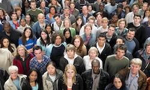
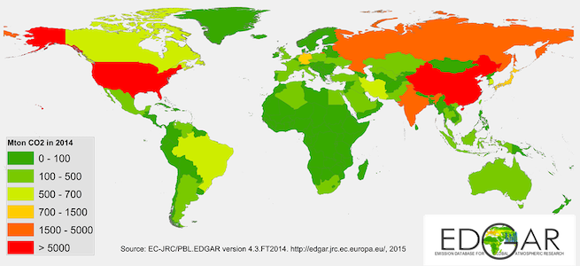
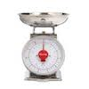

```{r child="setup_chunks.Rmd"}
```


class: inverse, center, middle

background-image: url(images/markus-spiske-666905-unsplash.jpg)
background-size: cover

# What Does Data Look Like?

---

## Most data looks like a spreadsheet

```{r titanic-passengers, echo=FALSE}
knitr::kable(titanic[c(13, 1238, 2, 306),], row.names=FALSE, format="html",
             caption="Four passengers on the Titanic")
```

--

- **Observations** are on the rows. Observations are the units from which you are taking measurements.

--

- **Variables** are on the columns. Variables measure specific attributes of your observations.

---

## The unit of analysis identifies the kind of observation

The **unit of analysis** simply tells you what your observations actually are. We can collect data on many different types of units.

.center[Some examples, but the possibilities are endless]

|  Individual People | Countries | Corporations | Universities |
| --- | ----------- | ------ | 
|  |  |  | |


---

## What is the unit of analysis in each case?

1. Titanic data on passengers?
2. Cross-national data on CO2 emissions?

--

.pull-left[
### Titanic data


.center[
**Individual Passengers** 

]
] 


--

.pull-right[
### Cross-national data

.center[
**Countries**

]
]

---

## Quantitative variables measure quantities

A quantitative variable measures quantities of something. A quantitative variable is always represented as a number. There are two types of quantitative variables.

--

.pull-left[
### Discrete

.center[] 

A **discrete** variable can only take certain values within a range. 

- Number of children ever had
- Number of violent crimes committed
- Number of siblings
- Number of Youtube views
]

--

.pull-right[
### Continous 

.center[] 

A **continuous** variable can take any value within a given range. 

- Age
- Height
- GDP per capita
- CO2 emissions


]

???

- The most common case of a discrete variable is a  count of things and thus can only be represented by positive whole numbers. 

- In practice, we often only measure these variables to a certain decimal level (half inches for height, whole numbers for age), but we could theoretically measure them more precisely with better instruments. 


---

## Categorical variables specify a category

Categorical variables indicate which category an observation belongs to from a mutually exclusive set of categories. There are also two types of categorical variables:

--

.pull-left[
### Ordinal

.center[] 

An **ordinal** variable is a categorical variables whose values have a clear ordering. 

- Highest degree earned
- passenger class on the Titanic
- level of support with an opinion statement
]

--


.pull-right[
### Nominal

.center[] 

A **nominal** variable is a categorical variable whose values are unordered. 

- Gender
- Race
- Political party

]

---

## What type of variables do we have here?

```{r echo=FALSE}
knitr::kable(titanic[c(13, 1238, 2, 306),], row.names=FALSE,
             format="html", caption="four passengers on the Titanic")
```

--
- **survival:** survival is a nominal variable.

--
- **sex:** sex is a nominal variable.

--
- **age:** age is a continuous variable.

--
- **agegroup:** age group is an ordinal variable.

--
- **pclass:** Passenger class is an ordinal variable.

--
- **fare:** fare paid is a continuous variable (sort of). 

--
- **family:** number of family members is a discrete variable.

---

class: inverse, middle

.left-column[## `r icon::fa("pen-square")` Your Turn]
.right-column[

### Think of a dataset measuring something you might care about.

- What are the units of analysis?
- What might a continuous variable in this dataset be?
- What might a discrete variable in this dataset be?
- What might a nominal variable in this dataset be?
- What might an ordinal variable in this dataset be?
]

---

class: center, middle

<iframe src="https://aarongullickson.shinyapps.io/datasets/">

</iframe>

---

layout: false
class: middle, center, inverse
background-image: url(images/isaac-smith-1182057-unsplash.jpg)
background-size: cover

# What Can We Do With Data?

---

## We can look at the distribution of a variable

--

.pull-left[
```{r dist-variable1, echo=FALSE}
ggplot(popularity, aes(x=indegree))+
  geom_histogram(col="grey20",fill="darkgreen")+
  labs(x="number of friend nominations received",
       title="The distribution of a quantitative variable",
       caption = "Add Health data, 1997")
```
]

--

.pull-right[
```{r dist-variable2, echo=FALSE}
ggplot(subset(politics, president!="No Vote"), aes(x=president, y=..prop.., group=1))+
  geom_bar(fill="goldenrod")+
  scale_y_continuous(labels = scales::percent)+
  labs(x="presidential choice among voters", y=NULL,
       title="The distribution of a categorical variable",
       caption="ANES data, 2016")
```
]


???

In some cases, I might simply be interested in the **distribution** of a variable. We refer to these kinds of measures as **univariate statistics** where "univariate" is a fancy way to say "one variable."

- How much variability is there in the amount of money that movies make?
- What percent of passengers survived the Titanic disaster?
- What is the average age of voters in the United States?

---

## We can look at association between variables

--

.pull-left[
```{r measure-assoc1, echo=FALSE}
ggplot(crimes, aes(x=Poverty/100, y=Property))+
  geom_point()+
  geom_smooth(method="lm", se=FALSE)+
  scale_x_continuous(labels = scales::percent)+
  labs(x="state poverty rate",
       y="property crimes per 100,000 population",
       title="Crime rates and poverty",
       caption = "FBI crime data and Census data, 2010")
```
]

--

.pull-right[
```{r measure-assoc2, echo=FALSE}
ggplot(subset(politics, gender!="Other" & president!="No Vote"), 
       aes(x=president, y=..prop.., group=1))+
  geom_bar(aes(fill=gender))+
  facet_wrap(~gender)+
  scale_y_continuous(labels=scales::percent)+
  scale_fill_discrete(guide=FALSE)+
  labs(x="presidential choice", y=NULL,
       title="Gender and presidential choice",
       caption="ANES data, 2016")
```
]

???

We are generally most interested in questions about the relationship or association between two or more variables than in a single variable itself. There are multiple ways to measure this association, depending on the type of variables involved. 

- Did the probability of surviving the Titanic depend on passenger class?
- Do the earnings of movies vary by genre?
- Is income inequality in a state related to its crime rate?

---

## We can make statistical inferences

--

.pull-left[
```{r stat-infer1, echo=FALSE}
ggplot(crimes, aes(x=Poverty/100, y=Property))+
  geom_point()+
  geom_smooth(method="lm", se=TRUE)+
  scale_x_continuous(labels = scales::percent)+
  annotate(geom="text", x=0.21, y=3800,
           label="95% confidence\ninterval")+
  labs(x="state poverty rate",
       y="property crimes per 100,000 population",
       title="Confidence inteval on a slope",
       caption = "FBI crime data and Census data, 2010")
```
]

--

.pull-right[
```{r stat-infer2, echo=FALSE}
p <- prop.table(table(politics$president, politics$gender)[1:3,],2)["Trump",c("Male","Female")]
n <- table(politics$gender)[c("Male","Female")]
se <- sqrt(p*(1-p)/n)

president <- data.frame(gender=c("Male","Female"),
                        percent=p*100,
                        se=c(se)*100)

ggplot(president, aes(x=gender, y=percent))+
  geom_linerange(aes(ymin=percent-1.96*se, ymax=percent+1.96*se),
                 color="blue", size=2)+
  geom_point(size=4)+
  geom_hline(yintercept=50, linetype=2)+
  coord_flip()+
  labs(x=NULL, y="Percent of voters voting for Trump",
       title="Confidence intervals on voting by gender",
       caption="ANES data, 2016")
```
]

???

- If I told you that in a sample of twenty people, brown-eyed individuals made $5 more an hour than people with other eye color, would you believe that I had found an important source of inequality? 
- Probably not, because with a sample that small, its possible to get unusual results like this just because of the sample you happened to draw. 
- Statistical inference is the technique of quantifying how uncertain we are about our statistical results. It allows us not only to summarize our data, but give a sense of how well we think that data might represent the larger population from which we drew our sample. 

---

## We can build models

--

.center[

```{r build-models, echo=FALSE, fig.width=12}
model <- lm(Property~Poverty, data=crimes)
df <- predict(model, newdata=data.frame(Poverty=c(15,20)))

ggplot(crimes, aes(x=Poverty/100, y=Property))+
  geom_point()+
  geom_smooth(method="lm", se=FALSE, fullrange=TRUE)+
  scale_x_continuous(labels = scales::percent)+
  geom_segment(x = 0.15, y = df[1], xend = 0.2, yend =df[1])+
  geom_segment(x = 0.2, y = df[1], xend = 0.2, yend =df[2])+
  geom_hline(yintercept=0, linetype=2)+
  geom_vline(xintercept=0, linetype=2)+
  ylim(0,5000)+
  annotate(geom="text",
           x=0.18, df[1]*0.95, label="Run")+
  annotate(geom="text",
           x=0.185, df[1]*1.07, label="Slope")+
  annotate(geom="text",
           x=0.2*1.01, df[1]+(df[2]-df[1])/2, label="Rise", hjust=0)+
  annotate(geom="text",
           x=0, y=coef(model)[1]*0.92, label="Y-intercept", hjust=0)+
  annotate(geom="text",
           x=.025, y=4250, hjust=0,
           label=TeX("$\\hat{y}_i=1337.8+108.5x_i$"), parse=TRUE,
           size=10, color="red")+
  labs(x="state poverty rate",
       y="property crimes per 100,000 population",
       title="A simple model",
       caption = "FBI crime data and Census data, 2010")
```

]

???

In the last module of the course we will expand on what we have learned previously to build **statistical models** that can help us better understand relationships we observe in the data. 

Statistical models allow us to examine relationships between multiple variables using more complex mathematical specifications. We use these models to address two types of questions: 

- Do I observe a relationship between two variables, even after controlling for potential 
confounders? 
- Does the relationship between two variables differ depending on the context of a third variable? 

---

## Models can get more complex

--

.pull-left[
```{r confounders, echo=FALSE}
set.seed(7)
x_group1 <- rnorm(200, 10, 4)
x_group2 <- rnorm(200, 18, 4)
#y=5+2*x+4*group2
df <- data.frame(x=c(x_group1, x_group2),
                 group=factor(c(rep("Group 1",200),
                                rep("Group 2",200))))
df$y <- 5-0.2*df$x+8*(df$group=="Group 2")+rnorm(400, 0, 3)

ggplot(df, aes(x=x, y=y))+
  geom_point(aes(color=group))+
  geom_smooth(method="lm", se=FALSE)+
  geom_smooth(method="lm", aes(color=group), se=FALSE)+
  labs(x="Some explanatory variable of interest",
       y="Some outcome variable of interest",
       title="The problem of confounding")

```
]

--

.pull-right[
```{r interactions, echo=FALSE}
x_group1 <- rnorm(200, 10, 4)
x_group2 <- rnorm(200, 20, 4)
#y=5+2*x+4*group2
df <- data.frame(x=c(x_group1, x_group2),
                 group=factor(c(rep("Group 1",200),
                                rep("Group 2",200))))
df$y <- 5+-0.25*df$x+12*(df$group=="Group 2")+0.5*df$x*(df$group=="Group 2")+rnorm(400, 0, 3)

ggplot(df, aes(x=x, y=y))+
  geom_point(aes(color=group))+
  geom_smooth(method="lm", aes(color=group), se=FALSE)+
  labs(x="Some explanatory variable of interest",
       y="Some outcome variable of interest",
       title="Interactions")

```
]

???

Confounders are variables that might account for the relationship between two other variables and thus produce a **spurious** non-causal relationship. Some real questions we might ask:

- Does the gender advantage in surviving the Titanic hold even after accounting for differences in gender and survival by passenger class? 
- Do racial differences in the probability of being shot by the police hold even after accounting for situational factors such as the type of violation, time of day, place of interaction? 
- Are differences in sexual frequency by marital status a product of age differences by marital status?

We can also go beyond simple statements about the association between two variables and begin to ask how the association between two variables might differ depending on the level or value of a third variable. Some real questions we might ask:

- Does the female advantage in survival on the Titanic get smaller or larger by the class of the passenger?
- Does the relationship between age and support for gay marriage differ by political party affiliation? 
- Does the effect of movie runtime on box office returns vary by the genre of the movie? 

---

## Two views on using observational data

Most of the data we use in the social sciences is **observational** rather than **experimental**. We observe what actually happens rather than manipulate "treatments" in order to observe a response. 

There are two different views of exactly what the use of statistics contributes to observational data analysis:

--

.pull-left[
### `r icon::fa("flask")` Pseudo-Experimental

- We use statistical modeling to try to mimic the stronger causal claims of experimental research. 
- This can be as simple as "controlling" for other variables to mimic random assignment of a treatment, to the use of "natural" experiments.
]

--

.pull-right[
### `r icon::fa("binoculars")` Formal Description

- We use statistical modeling to describe what we observe in the data in a formal, systematic, and replicable way. 
- We show how the data are either consistent or inconsistent with certain views of a social process as derived from theory. 
]