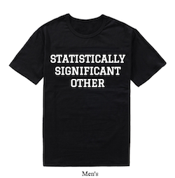

```{r child="setup_chunks.Rmd"}
```

class: inverse, center, middle

background-image: url(images/tim-bennett-EoC_IuYmtug-unsplash.jpg)
background-size: cover

# The Problem of Statistical Inference

---

## What percent of Americans favor ending birthright citizenship?

--

We can look at the results from our politics dataset: 

```{r}
100*round(prop.table(table(politics$brcitizen)),3)
```

About 31.7% of respondents to the American National Election Study (ANES) favored ending birthright citizenship.

--

* Is the percent of *all* Americans also 31.7%? 

--

* The ANES is a **sample** of the US voting age **population**. How confident can we be that the sample percent is close to the true population percent?

---

## Drawing a statistical inference

```{r echo=FALSE, fig.width=10}
par(mar=c(0,0,0,0))
plot(-2,-2, xlim=c(0,10), ylim=c(0,10), xaxt="n", yaxt="n", bty="n", xlab="", ylab="")
rect(6,1,10,9, col="skyblue")
text(8,5,"US Population", cex=1.2)
text(8,4,expression(rho=="?"))
```

---

## Drawing a statistical inference

```{r echo=FALSE, fig.width=10}
par(mar=c(0,0,0,0))
plot(-2,-2, xlim=c(0,10), ylim=c(0,10), xaxt="n", yaxt="n", bty="n", xlab="", ylab="")
rect(6,1,10,9, col="skyblue")
text(8,5,"US Population", cex=1.2)
text(8,4,expression(rho=="?"))
rect(0,3,4,7, col="yellow")
text(2,5,"ANES Sample", cex=1.2)
text(2,4,expression(hat(p)==0.317))
arrows(6,4,4,4)
text(5,3.5,"Draw a sample", cex=1)
```

---

## Drawing a statistical inference

```{r echo=FALSE, fig.width=10}
par(mar=c(0,0,0,0))
plot(-2,-2, xlim=c(0,10), ylim=c(0,10), xaxt="n", yaxt="n", bty="n", xlab="", ylab="")
rect(6,1,10,9, col="skyblue")
text(8,5,"US Population", cex=1.2)
text(8,4,expression(rho%~~%0.317))
rect(0,3,4,7, col="yellow")
text(2,5,"ANES Sample", cex=1.2)
text(2,4,expression(hat(p)==0.317))
arrows(6,4,4,4)
text(5,3.5,"Draw a sample", cex=1)
arrows(4,6,6,6)
text(5,5.5,"Infer from sample", cex=1)
```

---

## Parameters and statistics

.pull-left[
### Parameters

* Parameters represent unknown measures in the population, such as the population mean or proportion
* Parameters are represented by Greek letters (e.g. the population mean is $\mu$)

### Statistics

* Statistics represent known measurements from the sample that estimate the unknown population parameters.
* Statistics are represented by roman letters (e.g. the sample mean $\bar{x}$)

]

.pull-right[

| Measure             | Parameter | Statistic |
|:-------------------:|:---------:|:---------:|
| mean                | $\mu$     | $\bar{x}$ |
| proportion          | $\rho$    | $\hat{p}$ |
| standard deviation  | $\sigma$  | $s$       | 

]

---

## When samples go bad `r emo::ji("imp")`

--

.pull-left[
### Systematic Bias

.center[]

Something about our data collection procedure biases our results systematically.

* We made a mistake in our research design. 
* Statistical inference cannot fix this mistake.

]

--

.pull-right[
### Random Bias

.center[]

Just by random chance we happened to draw a sample that is very different from the population on the parameter we care about.

* We didn't do anything wrong! We just had bad luck.
* Statistical inference addresses this form of bias.
]

???

* Even though we know random bias *might* have caused our sample statistic to be different from the population mean, we can't know for sure if this happened or not because we don't know the true population parameter!
* This is what statistical inference is all about. Even though we can never say for certain that our results are close or far away from the true value, we can quantify our uncertainty about how different the sample statistic could potentially be from the population parameter.

---

class: inverse, center, middle

background-image: url(images/kai-pilger-qHfJPxOnXi4-unsplash.jpg)
background-size: cover

# The Sampling Distribution

---

## Three kinds of distributions

You draw a simple random sample of 100 people from the US population and calculate their mean years of education. There are three kinds of distributions involved in this process:

--

.pull-left[
### Population Distribution

* The distribution of years of education for the whole US population. 
* Its mean is given by $\mu$. 
* The population mean and distribution are unknown. 
]

--

.pull-right[
### Sample Distribution

* The distribution of years of education in your sample. 
* The mean is given by $\bar{x}$. 
* The mean and distribution are known and hopefully approximate the population distribution. 
]

--

### Sampling Distribution

* The distribution of the sample mean $\bar{x}$ in all possible samples of size 100. 
* We can't know this distribution exactly, but it turns out that we know its general shape. 

---

## Example: Height in our class

.pull-left[
* Lets treat our class of `r sum(!is.na(students$height))` students as the population. I want to estimate the average height of the class. 
* In this case, I am omnipotent - I know the population distribution because I collected data for the whole class on Canvas.
]

.pull-right[
```{r echo=FALSE}
ggplot(students, aes(x=height))+
  geom_histogram(binwidth=1, fill="grey", color="grey20")+
  geom_vline(xintercept = mean(students$height), size=2, color="red")+
  annotate("label", x=67.7, y=7, label="mu==66.52", parse=TRUE)+
  labs(x="student height in inches", 
       title="Distribution of student height in the class")
```
]

---

## How many samples of size 2 are possible?

Lets say I wanted to sample two students to estimate class height. In a class of `r sum(!is.na(students$height))` students, how many unique samples of size 2 exist?

--

* On the first draw, I have `r sum(!is.na(students$height))` possibilities.

--

* On the second draw, I have `r sum(!is.na(students$height))-1` possibilities because I am not putting my first draw back.

--

* I therefore have $42*41=1722$ possible samples. 

--

* However, half of these samples are just duplicates of the other half, but sampled in the other order. In one sample, I samples John and Then Kate and in another I sampled Kate and then John.

--

* Therefore the true number of unique samples is: $$42*41/2=861$$

--

* What if I calculated the sample mean in all 861 samples and looked at the distribution of these sample means?

---

## The sampling distribution

```{r hist-samplingd-size2, echo=FALSE, fig.width=12}
ggplot(data.frame(means2), aes(x=means2))+
  geom_histogram(fill="grey", color="grey20", breaks=seq(from=58,to=76, by=1))+
  labs(x="mean height in samples of size 2",
       title="Sampling distribution of mean student height from samples of size 2")+
  xlim(58, 76)+
  theme_bw()
```

---

## Sampling distributions for different $n$

```{r compare-density, echo=FALSE, fig.width=12}
temp <- data.frame(size=c(rep("n=2", length(means2)),
                          rep("n=3", length(means3)),
                          rep("n=4", length(means4)),
                          rep("n=5", length(means5))),
                   means=c(means2, means3, means4, means5))

ggplot(temp, aes(x=means, y=..density.., fill=size))+
  geom_density(data=subset(temp, size=="n=5"), alpha=0.6)+
  geom_density(data=subset(temp, size=="n=4"), alpha=0.6)+
  geom_density(data=subset(temp, size=="n=3"), alpha=0.6)+
  geom_density(data=subset(temp, size=="n=2"), alpha=0.6)+
  geom_vline(xintercept = mean(students$height), color="red", size=2, alpha=0.7)+
  labs(x="mean height", 
       title="The shape is becoming more bell-curved and narrower")+
  xlim(58, 76)+
  annotate("label", x=66.6, y=0.175, label="mu", parse=TRUE, size=10, color="red")
```

---

## What is the mean of the sampling distributions?

```{r echo=FALSE}
knitr::kable(cbind('Distribution'=c("Population Distribution","Sampling Distibution (n=2)",
                       "Sampling Distribution (n=3)", "Sampling Distribution (n=4)",
                       "Sampling Distribution (n=5)"),
      'Mean'=round(sapply(list(students$height, means2, means3, means4, means5), mean),2),
      'Standard Deviation'=round(sapply(list(students$height, means2, means3, means4, means5),
                                        sd), 2)),
      align=c("l","r","r"))
```

---

## Its the Central Limit Theorem!

.pull-left[
As the sample size increases, the sampling distribution of a sample mean becomes a **normal** distribution.

* The normal distribution is a bell-shaped curve with two characteristics: center and spread. 
* Centered on $\mu$, which is the true value in the population.
* With a spread (standard deviation) of $\sigma/\sqrt{n}$, where $\sigma$ is the standard deviation in the population. 
* The center of the sampling distribution is the true value of the parameter and the spread of the sampling distribution shrinks as the sample grows larger. 
]

.pull-right[
```{r echo=FALSE}
x <- seq(from=-5,to=5,by=0.1)
y <- (1/(sqrt(2*pi)))*exp(-1*(x)^2/(2^2))
par(mar=c(6,0.1,4,0.1))
plot(x,y, type="l", lwd=3, yaxt="n", xlab="",
     ylab="", xaxt="n",
     main="Sampling distribution of sample mean")
axis(1, at=c(-3,-1.96,-1,0,1,1.96,3), cex=0.8, las=3,
     labels=c(expression(mu-3*sigma/sqrt(n)),
              expression(mu-1.96*sigma/sqrt(n)),
              expression(mu-1*sigma/sqrt(n)),
              expression(mu),
              expression(mu+1*sigma/sqrt(n)),
              expression(mu+1.96*sigma/sqrt(n)),
              expression(mu+3*sigma/sqrt(n))))
polygon(c(x[21],x[21:81], x[81]),c(0,y[21:81],0), col="grey80")
polygon(c(x[31],x[31:71],x[71]),c(0,y[31:71],0), col="grey50")
polygon(c(x[41],x[41:61],x[61]),c(0,y[41:61],0), col="grey30")
abline(v=0, lwd=3, lty=2, col="red")
text(0,max(y)*0.9, expression(mu), col="red", cex=2, pos=4)
arrows(x[41],max(y)*0.5,x[61],max(y)*0.5, code=3, length=0.1)
arrows(x[31],max(y)*0.3,x[71],max(y)*0.3, code=3, length=0.1)
arrows(x[21],max(y)*0.05,x[81],max(y)*0.05, code=3, length=0.1)
text(0, max(y)*0.5, label="68%", col="white", pos=3)
text(1.5, max(y)*0.3, label="95%", col="white", pos=3)
text(2.5, max(y)*0.05, label="99.7%", col="black", pos=3)
```
]

---

## The Standard Error

There are three different kinds of standard deviations involved here, one that corresponds to each of the types of distributions. 

| Distribution   | Notation | Description | 
|----------------|----------|-------------|
| Population     | $\sigma$ | Unknown population standard deviation |
| Sample         | $s$ | Known sample standard deviation that hopefully approximates $\sigma$ |
| Sampling       | $\sigma/\sqrt{n}$ | **Standard error**: Standard deviation of the sampling distribution |

The standard error gives us an estimate of the strength of potential random bias in our sample. 

---

## Sampling distributions are the `r emo::ji("key")` concept 

.pull-left[
* When we draw a sample and calculate the sample mean we are effectively drawing a value from the sampling distribution for the sample mean. 
* If we know what that distribution looks like then we can know the probability of drawing a sample close to or far from the true population parameter. 
]

.pull-right[
```{r echo=FALSE}
ggplot(data.frame(means5), aes(x=means5))+
  geom_histogram(fill="grey", color="grey20", breaks=seq(from=58,to=76, by=1))+
  geom_vline(xintercept = mean(means5), size=2, color="red")+
  labs(x="mean height in samples of size 5",
       title="Sampling distribution of mean height")+
  xlim(58, 76)+
  annotate("label", x=66.5, y=50000, label="most sample means\nwill be close to\nthe true value\nin the population")+
  annotate("label", x=75, y=15000, label="but a few will\nbe far away")+
  annotate("label", x=66.6, y=150000, label="mu", parse=TRUE, size=5, color="red")
```
]

---

## But there is a catch!

* The shape of the sampling distribution is determined by:

  * the population mean, $\mu$
  * the population standard deviation, $\sigma$

--

* But these values are unknown! `r emo::ji("open_mouth")` 

--

.pull-left[
### First Fix

* We can substitute the sample standard deviation $s$ from our sample for the population standard deviation $\sigma$. 
* This has consequences. Because we are using a sample value which can also be subject to random bias, this substitution creates greater uncertainty in our estimate which we will address later. 
]
  
--

.pull-right[
### Second Fix

* **Confidence Intervals**: Provide a range of values within which you feel confident that the true population mean resides. 
* **Hypothesis tests**: Play a game of make believe. If the true population mean was a given value, what is the probability that I would get the sample mean value that I actually did? 
]  

---

class: inverse, center, middle

background-image: url(images/yogi-purnama-en7G3hTSjBQ-unsplash.jpg)
background-size: cover

# Confidence Intervals

---

## Consider this statement

.pull-left[
```{r echo=FALSE}
x <- seq(from=-5,to=5,by=0.1)
y <- (1/(sqrt(2*pi)))*exp(-1*(x)^2/(2^2))
par(mar=c(4,0.1,0.1,0.1))
plot(x,y, type="l", lwd=3, yaxt="n", xlab="",
     ylab="", xaxt="n")
axis(1, at=c(-2,0,2), cex=0.7,
     labels=c(expression(mu-1.96*sigma/sqrt(n)),
              expression(mu),
              expression(mu+1.96*sigma/sqrt(n))))
polygon(c(x[31],x[31:71],x[71]),c(0,y[31:71],0), col="grey")
text(0, max(y)/3, "95% probability that I will\ndraw a sample mean\nthat is within two (1.96)\nstandard deviations of\nthe true population mean")
```
]

--

.pull-right[
### Reverse the Logic

If I construct the following interval:

$$\bar{x}\pm1.96*\sigma/\sqrt{n}$$
95% of *all possible samples* that I could have drawn will contain the true population mean $\mu$ within this interval. 

```{r echo=FALSE, fig.height=3}
par(mar=c(0,0,0,0))
plot(-2,-2, xlim=c(-1,20), ylim=c(-4,5.1), xaxt="n", yaxt="n", bty="n", xlab="", ylab="", cex.main=1.5)
x <- rnorm(19,0,1)
while(sum(abs(x)>1.96)>0) {
  x[abs(x)>1.96] <- rnorm(sum(abs(x)>1.96),0,1) 
}
x <- c(x[1:10],-2.3,x[11:19])
upper <- x + 1.96
lower <- x - 1.96
abline(h=0, lwd=3, col="blue")
segments(1:20,lower,1:20,upper)
segments(11,lower[11],11,upper[11], col="red", lwd=2)
points(1:20, x, pch=19, cex=1.2)
text(0,0, expression(mu), col="blue", cex=2, pos=3)
legend(0,5.1,legend=c("sample mean", "confidence interval"), pch=c(19,NA), lty=c(NA,1), bty="n")
```
]

---

## Confidence?

We call the interval of $\bar{x}\pm1.96*\sigma/\sqrt{n}$ the **confidence interval**. What does it mean?

--

.pull-left[
### Not a probability
* It is tempting to claim that there is a 95% probability that the true population mean is in this interval, but according to classic views of probability this is INCORRECT. 
* The true population mean does not vary. It just is what it is, even if it is unknown. Either your interval contains it or the interval does not contain it. There is no probability.
* The correct interpretation is that "95% of all possible confidence intervals will contain the true population mean."
]

--

.pull-right[

]

---

## Calculating the confidence interval

The confidence interval is given by $\bar{x}\pm1.96*\sigma/\sqrt{n}$.

But we don't know $\sigma$ because this is the population standard deviation. What can we do?

--

### Substitute the sample standard deviation

We *can* calculate $\bar{x}\pm1.96*s/\sqrt{n}$.

However, this equation is no longer correct because we need to adjust for the added uncertainty of using a sample statistic where we should use a population parameter.

--

### Use the t-statistic as a fudge factor

The actual formula we want is:

$$\bar{x} \pm t*s/\sqrt{n}$$

where $t$ is the **t-statistic** and will be a number somewhat larger than 1.96.


---

## `r  icon::fa("calculator")` Calculating the t-statistic

The t-statistic you get depends on two characteristics:

--

* What level of confidence you want. We will always use 95% confidence intervals for this class.

--

- The number of **degrees of freedom** for the statistic. This is largely a function of sample size. For the sample mean, the degrees of freedom are given by $n-1$. 

--

In *R*, you can calculate the t-statistic with the `qt` command. Lets say we wanted the t-statistic for our crime data with 51 observations:

```{r}
qt(.975, 51-1)
```

* Although we want the 95% confidence interval but we need to put in 0.975, because we are getting the upper tail of the distribution which has only 2.5% of the area above. 
* The second argument is the degrees of freedom. 

---

## Example: Property crime rates

.pull-left[
First we need to calculate all the statistics we need:
```{r}
mean(crimes$Property)
sd(crimes$Property)
nrow(crimes)
```

Now we can calculate the t-statistic and standard error:
```{r}
tstat <- qt(.975, 51-1)
se <- 641.5/sqrt(51)
```
]

--

.pull-right[
The upper limit is given by:
```{r}
2894+tstat*se
```

The lower limit is given by: 
```{r}
2894-tstat*se
```

We are 95% confident that the true mean property crime rate across states is between 2731.6 and 3074.4 crimes per 100,000. 
]

---

## `r emo::ji("thinking_face")` Wait, Does that even make sense?

> We are 95% confident that the true mean property crime rate across states is between 2731.6 and 3074.4 crimes per 100,000. 

We did the math right, but this statement is still nonsense. Why?

--

* The crime data are **not a sample**.  
* We have all fifty states plus the District of Columbia. So we have the entire population.
* There is nothing to infer. The mean crime rate across states of 2824 per 100,000 is already the population mean. 

--

### Statistical inference only makes sense for samples

.pull-left[
#### Proper sample
* Popularity data (Add Health)
* Politics data (ANES)
* Sexual frequency data (GSS)
* Earnings data (CPS)

]

.pull-right[
#### Not a sample
* Titanic
* Crimes
* Movies
]

---

## Example: Sexual frequency

.pull-left[
Calculate numbers that we need for later:
```{r}
xbar <- mean(sex$sexf)
s <- sd(sex$sexf)
n <- nrow(sex)
se <- s/sqrt(n)
t <- qt(.975, n-1)
```

```{r echo=FALSE}
results <- c(xbar, s, n, se, t)
names(results) <- c("sample mean","sample standard deviation","sample size (n)","standard error","t-statistic")
results <- round(results, 3)
knitr::kable(as.data.frame(results))
```
]

--

.pull-right[
Now calculate the interval:
```{r}
xbar+t*se
xbar-t*se
```

I am 95% confident that the mean sexual frequency in the US is between 47.8 and 52.4 times per year.
]

---

## General form of the confidence interval

We can construct confidence intervals for any statistic whose sampling distribution is a normal distribution. This includes:

* means
* mean differences
* proportions
* differences in proportions
* correlation coefficient

The general form of the confidence interval is given by:

$$\texttt{(sample statistic)} \pm t*(\texttt{standard error})$$ 

The only trick is knowing how to calculate the standard error and degrees of freedom for the t-statistic for each particular statistic.

---

## Cheat sheet for SE and df

| Type                    | SE                                                                               | df for $t$              |
| :---------------------- | :------------------------------------------------------------------------------- | :---------------------- |
| Mean                    | $s/\sqrt{n}$                                                                     | $n-1$                   |
| Proportion              | $\sqrt\frac{\hat{p}*(1-\hat{p})}{n}$                                             | $n-1$                   |
| Mean Difference         | $\sqrt{\frac{s_1^2}{n_1}+\frac{s_2^2}{n_2}}$                                     | min( $n_1-1$, $n_2-1$ ) |
| Proportion Difference   | $\sqrt{\frac{\hat{p}_1*(1-\hat{p}_1)}{n_1}+\frac{\hat{p}_2*(1-\hat{p}_2)}{n_2}}$ | min( $n_1-1$, $n_2-1$ ) |
| Correlation Coefficient | $\sqrt{\frac{1-r^2}{n-2}}$                                                       | $n-2$                   |

.center[### `r emo::ji("scream")` So many equations!?!
Don't panic; we will go through examples.]
 
---

## Proportion example

What proportion of voters support removing birthright citizenship?

.pull-left[
Use `prop.table` to get the sample proportion:
```{r}
prop.table(table(politics$brcitizen))
p <- 0.3171307
```

Calculate values:
```{r}
n <- nrow(politics)
se <- sqrt(p*(1-p)/n)
t <- qt(0.975, n-1)
```
]

.pull-right[
Get confidence intervals:
```{r}
p+t*se
p-t*se
```

I am 95% confident that the true proportion of American adults who support removing birthright citizenship is between 30.3% and 33.1%.
]

---
 
## Mean difference example

What is the difference in sexual frequency between married and never married individuals?

Use `tapply` to get means by groups and then calculate the difference you want:
```{r}
tapply(sex$sexf, sex$marital, mean)
diff <- 56.094106-53.617704
```

Use `tapply` again to calculate standard deviations by group for the SE calculation:
```{r}
#use tapply again to get sd by group
tapply(sex$sexf, sex$marital, sd)
sd1 <- 49.95361
sd2 <- 58.81459
```

---

## Mean difference example, continued

Use `table` to get sample size by group:
```{r}
table(sex$marital)
n1 <- 1052
n2 <- 514
```

.pull-left[
```{r}
se <- sqrt(sd1^2/n1+sd2^2/n2)
t <- qt(0.975,n2-1)
diff+t*se
diff-t*se
```
]

.pull-right[
I am 95% confident that, among American adults, married individuals have sex between 8.4 more times per year or 3.45 less times per year than never married individuals, on average. 
]

---

## Proportion difference example

What is the difference in support for removing birthright citizenship between those who have served in the military and those who have not? 

.pull-left[
Use `prop.table` to calculate proportions for each group:
```{r, highlight.output=5}
prop.table(table(politics$brcitizen, 
                 politics$military), 2)
p1 <- 0.3029902
p2 <- 0.4335512
diff <- p2-p1
```
]

.pull-right[
Use `table` to get sample sizes by group:

```{r}
table(politics$military)
n1 <- 3779
n2 <- 459
```
]

---

## Proportion difference example, continued


Calculate standard error and t-statistic:
```{r}
se <- sqrt(p1*(1-p1)/n1+p2*(1-p2)/n2)
t <- qt(0.975, n2-1)
```

Confidence intervals:
```{r}
diff-t*se
diff+t*se
```

I am 95% confident that the percent in support for removing birthright citizenship is between 8.3% and 17.8% higher among who have served in the military than those who have not. 

---

## Correlation coefficent example

What is the correlation between age and wages among US workers? 

.pull-left[
Use `cor` command to get the sample correlation coefficient:
```{r}
r <- cor(earnings$age, earnings$wages)
```

Use `nrow` to get sample size and then calculate standard error and t-statistic.
```{r}
n <- nrow(earnings)
se <- sqrt((1-r^2)/(n-2))
t <- qt(0.975, n-2)
```
]

.pull-right[
Calculate confidence intervals:
```{r}
r - t*se
r + t*se
```

I am 95% confident that the true correlation coefficient between age and wages among US workers is between 0.214 and 0.224. 
]

---

class: inverse, center, middle

background-image: url(images/chuttersnap-UmncJq4KPcA-unsplash.jpg)
background-size: cover

# Hypothesis Tests

---

## Game of make believe

.pull-left[
We know what the sampling distribution should look like, but we don't know its center (the true population parameter). 

So we set up a game of make-believe:

* Assume that the true parameter is some value.
* If assumption is correct, what is the probability that I would have gotten the sample statistic that I got?
* If this probability is really low, then I reject my assumption. 
]


.pull-right[

]

---

## An almost true story

.pull-left[

]

.pull-right[
Coca-Cola used to do promotionals where it claimed that 1 in 12 bottle caps (8.3%) on a Coca-Cola bottle would earn a free Coke.

When I was a busy assistant professor trying to get tenure, I bought 100 bottles of Coke from the downstairs vending machine and only got 5 winners (5%). (The number is not true, but it is nice and round)

Does the difference between my winning percentage and that claimed by Coca-Cola show that they were lying?
]

---

## Lets set up a null hypothesis

--

.pull-left[
### In English
* The **null hypothesis** ( $H_0$ ) is your assumption about the true parameter value. It is your prior assumption unless the data can prove you wrong. 

* I assume that Coca-Cola is telling the truth, until I can prove them wrong, so my null hypothesis is that the true percentage of winning bottlecaps is 8.3%. 
]

--

.pull-right[
### Mathematical symbols

$$H_0: \rho=0.083$$

I use the Greek $\rho$ to indicate the population proportion of winners. I will use $\hat{p}$ later to represent the proportion observed in my sample. 
]

---

## Assuming the null hypothesis is true, what is the sampling distribution of my sample proportion?

.pull-right[
```{r echo=FALSE}
x <- seq(from=-0.02,to=0.2,by=0.001)
p <- 0.083
se <- sqrt(p*(1-p)/100)
y <- (1/(se*sqrt(2*pi)))*exp(-1*(x-p)^2/(2*se^2))

plot(x,y,type="l",xlab="sample proportion of winning bottlecaps",yaxt="n",ylab="", main="Sampling distribution for sample proportion\nassuming null hypothesis is true", col="white")
text(p,8,"?", cex=10)
```
]

---

## Assuming the null hypothesis is true, what is the sampling distribution of my sample proportion?

.pull-left[

* With a sample size of 100, it should be normally distributed.
]

.pull-right[
```{r echo=FALSE}
x <- seq(from=-0.02,to=0.2,by=0.001)
p <- 0.083
se <- sqrt(p*(1-p)/100)
y <- (1/(se*sqrt(2*pi)))*exp(-1*(x-p)^2/(2*se^2))

plot(x,y,type="l",xlab="sample proportion of winning bottlecaps",yaxt="n",ylab="", main="Sampling distribution for sample proportion\nassuming null hypothesis is true")
```
]

---

## Assuming the null hypothesis is true, what is the sampling distribution of my sample proportion?

.pull-left[

* With a sample size of 100, it should be normally distributed.

* The center of the distribution is the true population parameter assuming $H_0$ is true. In this case, that is 0.083.
]

.pull-right[
```{r echo=FALSE}
x <- seq(from=-0.02,to=0.2,by=0.001)
p <- 0.083
se <- sqrt(p*(1-p)/100)
y <- (1/(se*sqrt(2*pi)))*exp(-1*(x-p)^2/(2*se^2))

plot(x,y,type="l",xlab="sample proportion of winning bottlecaps",yaxt="n",ylab="", main="Sampling distribution for sample proportion\nassuming null hypothesis is true")
abline(v=p,lwd=4,col="blue")
text(p,3,"true proportion = 0.083", col="blue", pos=4)
```
]

---

## Assuming the null hypothesis is true, what is the sampling distribution of my sample proportion?

.pull-left[

* With a sample size of 100, it should be normally distributed.

* The center of the distribution is the true population parameter assuming $H_0$ is true. In this case, that is 0.083.

* As we learned in the previous section, the standard error is given by: $$\sqrt\frac{0.083*(1-0.083)}{100}=0.0276$$
]

.pull-right[
```{r echo=FALSE}
x <- seq(from=-0.02,to=0.2,by=0.001)
p <- 0.083
se <- sqrt(p*(1-p)/100)
y <- (1/(se*sqrt(2*pi)))*exp(-1*(x-p)^2/(2*se^2))

plot(x,y,type="l",xlab="sample proportion of winning bottlecaps",yaxt="n",ylab="", main="Sampling distribution for sample proportion\nassuming null hypothesis is true")
abline(v=p,lwd=4,col="blue")
arrows(p,1,p-se,1)
arrows(p,1,p+se,1)
text(p,3,"true proportion = 0.083", col="blue", pos=4)
text(p+se,1,"standard error = 0.0276", col="red", pos=4)
```
]

---

## Is the actual sample proportion unusual?

.pull-left[
```{r echo=FALSE}
x <- seq(from=-0.02,to=0.2,by=0.001)
p <- 0.083
se <- sqrt(p*(1-p)/100)
y <- (1/(se*sqrt(2*pi)))*exp(-1*(x-p)^2/(2*se^2))

plot(x,y,type="l",xlab="sample proportion",yaxt="n",ylab="", main="Sampling distribution for sample proportion\nassuming null hypothesis is true")
abline(v=p,lwd=4,col="blue")
text(p,1,"true proportion = 0.083", col="blue", pos=4)
abline(v=0.05,lwd=4,col="red")
text(0.05,1,"our sample      \nproportion = 0.05", col="red", pos=2)
arrows(p,1,0.05,1)
```
]

.pull-right[
#### How far is our sample proportion from where the center would be if the null hypothesis was true?

* If our sample proportion is far way and unlikely to be drawn, then we **reject the null hypothesis**.
* If our sample proportion is not far away and reasonably likely to be drawn, then we **fail to reject the null hypothesis**.
]

---

## How far is far enough?

.pull-left[
* We determine how far our sample proportion is from the center in terms of the number of standard errors. $$\frac{\hat{p}-\rho}{SE}=\frac{0.05-0.083}{0.028}=-1.18$$
]

.pull-right[
```{r echo=FALSE}
x2 <- (x-p)/se
plot(x2,y,type="l",xlab="sample proportion",yaxt="n",ylab="", main="Game of make believe")
abline(h=0)
abline(v=-1.18,lwd=4,col="red")
```
]


---

## How far is far enough?

.pull-left[
* We determine how far our sample proportion is from the center in terms of the number of standard errors. $$\frac{\hat{p}-\rho}{SE}=\frac{0.05-0.083}{0.028}=-1.18$$
* What proportion of sample proportions are this low or lower?
]

.pull-right[
```{r echo=FALSE}
x2 <- (x-p)/se
plot(x2,y,type="l",xlab="sample proportion",yaxt="n",ylab="", main="Game of make believe")
abline(h=0)
polygon(c(x2[1:71],-1.18),c(y[1:71],0), col="grey")
abline(v=-1.18,lwd=4,col="red")
arrows(-3,3,-1.5,2)
text(-2.5,3.5,"0.12 (12%)",pos=3)
```
]

---

## How far is far enough?

.pull-left[
* We determine how far our sample proportion is from the center in terms of the number of standard errors. $$\frac{\hat{p}-\rho}{SE}=\frac{0.05-0.083}{0.028}=-1.18$$
* What proportion of sample proportions are this low or lower?
* We also need to take account of sample proportions this far away in the opposite direction. This is called a **two-tailed test**.
]

.pull-right[
```{r echo=FALSE}
x2 <- (x-p)/se
plot(x2,y,type="l",xlab="sample proportion",yaxt="n",ylab="", main="Game of make believe")
abline(h=0)
polygon(c(x2[1:71],-1.18),c(y[1:71],0), col="grey")
polygon(c(x2[221:137],1.18),c(y[221:137],0), col="grey")
abline(v=-1.18,lwd=4,col="red")
abline(v=1.18,lwd=4,col="red")
arrows(-3,3,-1.5,2)
text(-2.5,3.5,"0.12 (12%)",pos=3)
arrows(3,3,1.5,2)
text(2.5,3.5,"0.12 (12%)",pos=3)
```
]

---

## How far is far enough?

.pull-left[
* We determine how far our sample proportion is from the center in terms of the number of standard errors. $$\frac{\hat{p}-\rho}{SE}=\frac{0.05-0.083}{0.028}=-1.18$$
* What proportion of sample proportions are this low or lower?
* We also need to take account of sample proportions this far away in the opposite direction. This is called a **two-tailed test**.
* The area in the tails is called the **p-value**.
]

.pull-right[
```{r echo=FALSE}
x2 <- (x-p)/se
plot(x2,y,type="l",xlab="sample proportion",yaxt="n",ylab="", main="Game of make believe")
abline(h=0)
polygon(c(x2[1:71],-1.18),c(y[1:71],0), col="grey")
polygon(c(x2[221:137],1.18),c(y[221:137],0), col="grey")
abline(v=-1.18,lwd=4,col="red")
abline(v=1.18,lwd=4,col="red")
arrows(-3,3,-1.5,2)
text(-2.5,3.5,"0.12 (12%)",pos=3)
arrows(3,3,1.5,2)
text(2.5,3.5,"0.12 (12%)",pos=3)
arrows(-2.5,4.5,-0.5,10)
arrows(2.5,4.5,0.5,10)
text(0,11,"p-value=0.12+0.12=0.24 (24%)",pos=3)
```
]

---

## The p-value is the endgame

.pull-left[
### Interpretation
The p-value tells you the probability of getting a statistic this far away or farther from the the assumed true population parameter, assuming the null hypothesis is true.

In my case:
> Assuming the null hypothesis is true, there is a 24% probability that I would have gotten a sample proportion (0.05) this far or farther from the true poplation paramter (0.083).

]

--

.pull-right[
### `r icon::fa("calculator")` Calculation

We use the `pt` command to get the area in the lower tail and multiply by two to get both tails:

```{r}
2*pt(-1.18,99)
```

* The first argument is always the **negative version** of the number of standard errors.
* The second argument is the degrees of freedom to adjust for the fact that we use sample standard deviations to get standard errors. 
]

---

## The critical value


.left-column[

]

.right-column[
* We will reject the null hypothesis if our p-value is low enough. 
* The **critical value** is the benchmark for how low our p-value has to be to reject. 
  * We will reject the null hypothesis if the p-value is lower than or equal to the critical value.
  * We will fail to reject the null hypothesis if the p-value is higher than the critical value.
* The standard but entirely arbitrary critical value used across the sciences is 0.05 (5%).
* For the Coca-Cola bottlecap case, the p-value is 0.24, so we fail to reject the null hypothesis that Coca-Cola's claim was truthful.
]


---

## The general procedure of hypothesis testing

--

1. State a **null hypothesis**.

--

2. Calculate a **test statistic** that tells you how different your sample is from what you would expect under the null hypothesis. For our purposes, this test statistic is always the number of standard errors above or below the center of the sampling distribution. 

--

3. Calculate the **p-value** for the given test statistic.

--

4. Based on the p-value, either **reject** or **fail to reject** the null hypothesis.

---

## Hypothesis tests of relationships

The hypothesis test we are most interested in is whether the association we observe between two variables in our sample holds in the population. 

--

* Mean/proportion differences: Are the means/proportions between two groups in the population different? In other words, is the mean/proportion difference non-zero?

--

* Correlation coefficient: is the correlation coefficient in the population non-zero? 

--

### Statistical Significance

.left-column[

]

.right-column[
If you reject the null hypothesis of "no association," then the association you observe in the sample is said to be **statistically significant**.


* Don't confuse statistical and substantive significance. In a large sample, even very small substantive associations can be found to be statistically significant. On the flip side, in small samples, very large substantive associations can fail to be statistically significant.
]

---

## Example: Mean differences

Is there a difference in sexual frequency between married and never married individuals? Formally, my null hypothesis is:

$$H_0: \mu_M-\mu_N=0$$

Where $\mu_M$ is the population mean sexual frequency of married individuals and $\mu_N$ is the population mean sexual frequency of never-married individuals.

--

```{r}
tapply(sex$sexf, sex$marital, mean)
diff <- 56.094106-53.617704
diff
```

In my sample, married individuals have sex about 2.5 more times per year than never-married individuals, on average. Is this difference far enough from zero to reject the null hypothesis? 

---

## Example: Mean differences, continued

I calculate the standard error of the sample mean difference, as per the formula in the previous section, which requires the sample SD's and sample size of both groups.

```{r}
tapply(sex$sexf, sex$marital, sd)
sd1 <- 49.95361
sd2 <- 58.81459
table(sex$marital)
n1 <- 1052
n2 <- 514
se <- sqrt(sd1^2/n1+sd2^2/n2)
```

---

## Example: Mean differences, continued

I can now calculate how many standard errors my sample mean difference is from zero

```{r}
diff/se
```

I then feed the negative version of this number into the `pt` formula and multiply by two to get my p-value:

```{r}
2*pt(-0.8208,n2-1)
```

Assuming that the true sexual frequency difference between married and never-married individuals is zero in the population, there is a 41.2% chance of observing a sample sexual frequency difference of 2.5 years or larger in a sample of this size. Thus, I **fail to reject** the null hypothesis there there is no difference in the average sexual frequency between married and never-married individuals in the US. 

---

## Example: Proportion differences

Is there a difference in support for removing birthright citizenship between those who have served in the military and those who have not? 

--

.pull-left[
```{r, highlight.output=5}
prop.table(table(politics$brcitizen, 
                 politics$military), 2)
p1 <- 0.303
p2 <- 0.434
```

```{r}
diff <- p2-p1
diff
```
]

--

.pull-right[
```{r}
table(politics$military)
n1 <- 3778
n2 <- 460
se <- sqrt(p1*(1-p1)/n1+p2*(1-p2)/n2)
diff/se
pt(-5.391824, n2-1)
```
]

---

## `r emo::ji("thinking_face")` A p-value of 5.591127e-08?

* What does the value of 5.591127e-08 mean? 

--

* The number is so small that R is reporting it using scientific notation: $$5.591127 x 10^{-8}$$

--

* That means we need to move the decimal place over 8 spaces to the left. So the number is really 0.00000005591127. So I would interpret my result as: 

--

> Assuming that there is no difference in the US population between those who have served in the military and those who have not in support for removing birthright citizenship, there is less than a 0.000006% chance of observing a sample difference in proportion of 13.1% or greater by random chance in a sample of this size. Thus, I **reject** the null hypothesis there there is no difference in support for removing birthright citizenship between those who have served in the military and those who have not. 

---

## Example: Correlation coefficient

Is there a relationship between a person's age and their wages in the US? 

--

.pull-left[
```{r}
r <- cor(earnings$age, earnings$wages)
r
n <- nrow(earnings)
se <- sqrt((1-r^2)/(n-2))
r/se
pt(-85.46473, n-2)
```
]

--

.pull-right[
Assuming no association between a person's age and their wage in the US, there is almost 0% chance of observing a correlation coefficient between age and wages of 0.219 or larger in absolute magnitude in a sample of this size. Therefore, I **reject** the null hypothesis that there is no relationship between a person's age and their wages in the US population.
]


