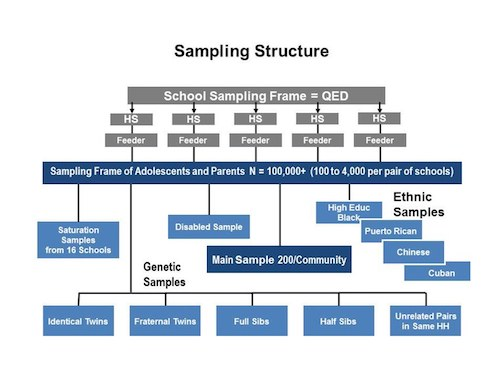

<style type="text/css">
slides > slide:not(.nobackground):after {
  content: '';
}
</style>

```{r loaddata, echo=FALSE, message=FALSE, error=FALSE}
library(stargazer)
library(ggplot2)
library(ggrepel)
library(gapminder)
library(pander)
library(broom)
load("example_datasets/movies/movies.RData")
load("example_datasets/sex/sex.RData")
load("example_datasets/crimes/crimes.RData")
load("example_datasets/titanic/titanic.RData")
load("example_datasets/politics/politics.RData")
load("example_datasets/add_health/addhealth_missing.RData")
load("example_datasets/nyc_nonprofit/nyc.RData")
load("example_datasets/misc/relig.RData")
load("example_datasets/esping_anderson/espinganderson.RData")
load("example_datasets/earnings/earnings.RData")
```

# The Linear Model, Revisited
Model Complications

## Linear model as a partition of variance {.smaller}

<div class="footer">
<body>Sociology 513, Model Complications: The Linear Model, Revisited</body>
</div>

We can think about the linear model as a partition of the variance in a set of observed values for a **dependent** variable into a component that is accounted for by some function of **independent** variables and a random part that is not accounted for by the independent variables:

$$observed = structural + stochastic$$

- The observed portion of this equation is the actual values of y, or $y_i$. 
- The structural part is the predicted value of $y_i$, $\hat{y}_i$, from the functional relationship to the independent variables (typically linear). 
- The stochastic component is the leftover residual or error component, $\epsilon_i$. 

So, we can write this conceptual equation more formally as:

$$y_i=\hat{y}_i+\epsilon_i$$

## The linear functional form {.smaller}

<div class="footer">
<body>Sociology 513, Model Complications: The Linear Model, Revisited</body>
</div>

The term $\hat{y}_i$ in the equation below is the "model" part of our equation because it predicts $y$ by $x$ through some functional form. 

$$y_i=\hat{y}_i+\epsilon_i$$

What is this functional form? Typically, we assume a linear relationship such that:

$$\hat{y}_i=\beta_0+\beta_1x_{i1}+\beta_2x_{i2}+\ldots+\beta_2x_{ip}$$
Substituting this equation for $\hat{y}_i$ above gives us the full linear model formula:

$$y_i=\beta_0+\beta_1x_{i1}+\beta_2x_{i2}+\ldots+\beta_2x_{ip}+\epsilon_i$$

## What is the linear model really doing

<div class="footer">
<body>Sociology 513, Model Complications: The Linear Model, Revisited</body>
</div>

Depending on disciplinary norms, there are different conceptual ways to view the basic relationship of:

$$observed = structural+stochastic$$

- **Description:** observed = summary + residual
- **Prediction:** observed = predicted + error
- **Causation:** observed = true process + disturbance

Mathematically, these are all identical. The baggage about what the math *means* is all in your head. 

## What we know how to do {.smaller}

<div class="footer">
<body>Sociology 513, Model Complications: The Linear Model, Revisited</body>
</div>

$$y_i=\beta_0+\beta_1x_{i1}+\beta_2x_{i2}+\ldots+\beta_2x_{ip}+\epsilon_i$$

Given this basic equation, we have learned how to:

>- Interpret the meaning of the $\beta$ coefficients (intercepts and slopes)
>- Partition the variance in $y$ to the proportions accounted for and not accounted for by the $x$'s. (i.e. $R^2$)
>- Include categorical variables as independent variables
>- Include interaction terms between independent variables

## Jow are linear model parameters estimated?
<div class="footer">
<body>Sociology 513, Model Complications: The Linear Model, Revisited</body>
</div>

>- We have simple formulas for the slope and intercept for the case of a single independent variable. 
>- With multiple independent variables, a simple formula will not suffice.
>- To estimate model parameters with multiple independent variables we need to use some matrix algebra.
>- What follows is math heavy, but is not something you need to use everyday. However, I want you to know what R is doing when it estimates model parameters. 

## The matrix algebra approach to linear models {.smaller}
<div class="footer">
<body>Sociology 513, Model Complications: The Linear Model, Revisited</body>
</div>

We can use matrix algebra to represent our linear regression model equation using one-dimensional **vectors** and two-dimensional **matrices**. 

$$\mathbf{y}=\mathbf{X\beta+\epsilon}$$

$\begin{gather*}
\mathbf{y}=\begin{pmatrix}
y_{1}\\
y_{2}\\
\vdots\\
y_{n}\\
\end{pmatrix}
\end{gather*}$,
$\begin{gather*}
\mathbf{X}=
\begin{pmatrix}
1 & x_{11} & x_{12} & \ldots & x_{1p}\\
1 & x_{21} & x_{22} & \ldots & x_{2p}\\
\vdots & \vdots & \ldots & \vdots\\
1 & x_{n1} & x_{n2} & \ldots & x_{np}\\
\end{pmatrix}
\end{gather*}$,
$\begin{gather*}
\mathbf{\epsilon}=\begin{pmatrix}
\epsilon_{1}\\
\epsilon_{2}\\
\vdots\\
\epsilon_{n}\\
\end{pmatrix}
\end{gather*}$,
$\begin{gather*}
\mathbf{\beta}=\begin{pmatrix}
\beta_{1}\\
\beta_{2}\\
\vdots\\
\beta_{p}\\
\end{pmatrix}
\end{gather*}$

Where:

- $\mathbf{y}$ is a vector of known values of the independent variable of length $n$.
- $\mathbf{X}$ is a matrix of known values of the independent variables of dimensions $n$ by $p+1$.
- $\mathbf{\beta}$ is a vector of to-be-estimated values of intercepts and slopes of length $p+1$.
- $\mathbf{\epsilon}$ is a vector of residuals of length $n$ that will be equal to $\mathbf{y-X\beta}$.

## Using matrix algebra to estimate slopes and intercepts {.smaller}

<div class="footer">
<body>Sociology 513, Model Complications: The Linear Model, Revisited</body>
</div>

Our goal is to choose a $\mathbf{\beta}$ vector that minimizes the sum of squared residuals, $SSR$. In matrix form, $SSR$ can be represented as a function of $\mathbf{\beta}$, like so:

$$\begin{align*}
S(\beta)&=&(\mathbf{y}-\mathbf{X\beta})'(\mathbf{y}-\mathbf{X\beta})\\
&=&\mathbf{y}'\mathbf{y}-2\mathbf{y}'\mathbf{X\beta}+\mathbf{\beta}'\mathbf{X'X\beta}
\end{align*}$$

We want to choose a $\mathbf{\beta}$ to plug into this function that provides the smallest possible value (the minimum). It turns out that we can get this value by using calculus to get the derivative with respect to $\mathbf{\beta}$ and solving for zero:

$$0=-2\mathbf{X'y}+2\mathbf{X'X\beta}$$

Applying some matrix algebra will give us the estimator of $\mathbf{\beta}$:

$$\mathbf{\beta}=(\mathbf{X'X})^{-1}\mathbf{X'y}$$

## Estimating linear models manually {.smaller}

<div class="footer">
<body>Sociology 513, Model Complications: The Linear Model, Revisited</body>
</div>

```{r matrixreg}
X <- as.matrix(cbind(rep(1, nrow(movies)), movies[,c("Runtime","BoxOffice")]))
y <- movies$TomatoMeter
beta <- solve(crossprod(X))%*%crossprod(X,y)
beta
model <- lm(TomatoMeter~Runtime+BoxOffice, data=movies)
coef(model)
```

## Estimating standard errors using matrix algebra {.smaller}

<div class="footer">
<body>Sociology 513, Model Complications: The Linear Model, Revisited</body>
</div>

If we treat $\sigma^2$ as the variance of the error term $\epsilon$, then we can also use matrix algebra to calculate the **covariance matrix**:

$$\sigma^{2}(\mathbf{X'X})^{-1}$$

The values of this matrix give us information about the correlation between different independent variables. Most importantly, the square root of the diagonal values of this matrix are the standard errors for the estimated values of $\beta$. 

In practice, we don't have $\sigma^2$, but we can estimate from the fitted values of $y$ by:

$$s^2=\frac{\sum(y_i-\hat{y}_i)^2}{n-p-1}$$
We can then use these estimated standard errors to calculate t-statistics and p-values, confidence intervals, and so on. 

## Calculating SEs manually {.smaller}

<div class="footer">
<body>Sociology 513, Model Complications: The Linear Model, Revisited</body>
</div>

```{r matrixse}
y.hat <- X%*%beta
df <- length(y)-ncol(X)
s.sq <- sum((y-y.hat)^2)/df
covar.matrix <- s.sq*solve(crossprod(X))
se <- sqrt(diag(covar.matrix))
t.stat <- beta/se
p.value <- 2*pt(-1*abs(t.stat), df)
data.frame(beta,se,t.stat,p.value)
summary(model)$coef
```


## Assumptions of OLS regression models
<div class="footer">
<body>Sociology 513, Model Complications: The Linear Model, Revisited</body>
</div>

>- **Linearity**: the relationship between the $x$ variables and $y$ is best described as a linear function. It is often possible to correct for a non-linear functional form through the use of transformations or polynomial terms. Interaction terms can also be seen as a form of non-linearity. If you fit a model with the wrong functional form, it is considered a *specification error*. 
>- The error terms $\epsilon_i$ are **independent and identically distributed** or i.i.d. for short. The i.i.d. assumption is typically violated either by **heteroscedasticity** or **autocorrelation**. The consequence of violating the i.i.d. assumption is inefficient (larger SE than necessary) but still unbiased estimates of regression coefficients. 

# Modeling Non-linearity
Model Complications

## Linear models fit straight lines
<div class="footer">
<body>Sociology 513, Model Complications: Modeling Non-Linearity</body>
</div>

>- If you try to model a relationship using a straight line when that relationship is more complex (i.e. "bendy") then your model will not fit well and will not represent the relationship accurately. 
>- The technical way of saying this is that the functional form of the relationship is mis-specified in the model. 
>- The most common cases of non-linearity are **diminishing returns** and **exponential** relationships, although more complex forms of non-linearity are also possible. 

## A clear case of diminishing returns
<div class="footer">
<body>Sociology 513, Model Complications: Modeling Non-Linearity</body>
</div>

```{r life-exp-non-linear, echo=FALSE, fig.align="center", fig.width=10, fig.height=5, out.width='1000px', out.height='500px', dpi=300, dev.args = list(bg = 'transparent')}
library(gapminder)
library(ggrepel)
ggplot(subset(gapminder, year==2007), aes(x=gdpPercap, y=lifeExp))+
  geom_point(alpha=0.7)+
  geom_smooth(method="lm", se=FALSE)+
  geom_text_repel(data=subset(gapminder, year==2007 & gdpPercap>5000 & lifeExp<60), 
                  aes(label=country), size=2)+
  labs(x="GDP per capita", y="Life expectancy at birth", subtitle = "2007 data from Gapminder")+
  scale_x_continuous(labels=scales::dollar)+
  theme_bw()
```

## A not-so clear case of an exponential relationship
<div class="footer">
<body>Sociology 513, Model Complications: Modeling Non-Linearity</body>
</div>

```{r non-linear-movies, echo=FALSE, fig.align="center", fig.width=10, fig.height=5, out.width='1000px', out.height='500px', dpi=300, dev.args = list(bg = 'transparent')}
ggplot(movies, aes(x=TomatoRating, y=BoxOffice))+
  geom_jitter(alpha=0.2)+
  scale_y_continuous(labels = scales::dollar)+
  labs(x="Rotten Tomatoes Rating", y="Box Office Returns (millions)")+
  theme_bw()
```

## What is going on here?
<div class="footer">
<body>Sociology 513, Model Complications: Modeling Non-Linearity</body>
</div>

```{r non-linear-wages, echo=FALSE, fig.align="center", fig.width=10, fig.height=5, out.width='1000px', out.height='500px', dpi=300, dev.args = list(bg = 'transparent')}
ggplot(earnings, aes(x=age, y=wages))+
  geom_jitter(alpha=0.01, width=1)+
  scale_y_continuous(labels = scales::dollar)+
  labs(x="age", y="hourly wages")+
  theme_bw()
```

## Diagnosing non-linearity by smoothing
<div class="footer">
<body>Sociology 513, Model Complications: Modeling Non-Linearity</body>
</div>

>- A smoothing function uses the closest neighbors by $x$ for an observation to calculate a smoothed value of $y$ that will reduce extreme values. 
>- The smoothed values of $y$ can then be plotted along a line that will be smoother than the original scatterplot, but which makes no assumption about functional form. 
>- The simplest smoothing functions are running mean or running median calculations that just calculate the mean or median, respectively of all observations in a certain span from the focal observation.

## Median smoother example {.smaller}
<div class="footer">
<body>Sociology 513, Model Complications: Modeling Non-Linearity</body>
</div>

The table below shows the values of tomato rating and box office returns for *Rush Hour 3* and its two nearest neighbors above and below.

```{r rush-hour-three, echo=FALSE}
movies <- movies[order(movies$TomatoRating),]
i <- which(movies$Title=="Rush Hour 3")
temp <- movies[(i-2):(i+2),c("Title","TomatoRating","BoxOffice")]
rownames(temp) <- NULL
pander(temp)
```

The smoothed box office returns via a mean smoother would just be the mean of these five box office values which is \$32.8 million. That is considerably reduced from the \$140.1 million outlier value for *Rush Hour 3*. 

## Applying median smoother {.smaller}
<div class="footer">
<body>Sociology 513, Model Complications: Modeling Non-Linearity</body>
</div>

```{r median-smoothing, echo=FALSE, fig.align="center", fig.width=10, fig.height=4, out.width='1000px', out.height='400px', dpi=300, dev.args = list(bg = 'transparent')}
movies$BoxOffice.smooth1 <- runmed(movies$BoxOffice, 5)
movies$BoxOffice.smooth2 <- runmed(movies$BoxOffice, 501)
ggplot(movies, aes(x=TomatoRating, y=BoxOffice))+
  geom_point(alpha=0.2)+
  geom_line(col="grey", size=1, alpha=0.7)+
  geom_line(aes(y=BoxOffice.smooth1), col="blue", size=1, alpha=0.7)+
  geom_line(aes(y=BoxOffice.smooth2), col="red", size=1, alpha=0.7)+
  scale_y_continuous(labels = scales::dollar)+
  labs(x="Rotten Tomatoes Rating", y="Box Office Returns (millions)")+
  theme_bw()
```

- The blue line shows a median smoother with the nearest two neighbors above and below.
- The red line shows a median smoother with the nearest 250 neighbors above and below. 

## The LOESS smoother
<div class="footer">
<body>Sociology 513, Model Complications: Modeling Non-Linearity</body>
</div>

>- The LOESS (locally estimated scatterplot smoothing) smoother is a more sophisticated smoother than running means or medians. 
>- LOESS estimates a smoothed value from a regression model of the focal point and neighbors. This model includes polynomial terms (which we will learn later) and weights observations to have more influence when close to the focal point. 
>- LOESS tends to produce smoother plots than running means or medians.
>- LOESS can be estimated easily in `ggplot` by using `geom_smooth` and setting the method to "loess". 

## Using LOESS smoother {.smaller}
<div class="footer">
<body>Sociology 513, Model Complications: Modeling Non-Linearity</body>
</div>

```{r smooth-movies, message=FALSE, fig.align="center", fig.width=8, fig.height=3.5, out.width='800px', out.height='350px', dpi=300, dev.args = list(bg = 'transparent')}
ggplot(movies, aes(x=TomatoRating, y=BoxOffice))+theme_bw()+
  geom_jitter(alpha=0.2)+
  geom_smooth(method="lm", color="red", se=FALSE)+
  geom_smooth(se=FALSE, method="loess")+
  labs(x="Rotten Tomatoes Rating", y="Box Office Returns (millions)")
```

## LOESS is computationally demanding
<div class="footer">
<body>Sociology 513, Model Complications: Modeling Non-Linearity</body>
</div>

>- For large datasets, LOESS can be computationally demanding to compute.
>- For example, for the 145,647 observations in the earnings data, LOESS would break my computer before it finished.
>- For cases such as this, `geom_smooth` will default instead to using a general additive model (GAM) for smoothing. GAM smoothing is complex and we won't go into the details here, but it generally produces smoothing similar to LOESS with much less computational costs. 

## Using a GAM smoother {.smaller}
<div class="footer">
<body>Sociology 513, Model Complications: Modeling Non-Linearity</body>
</div>

```{r smooth-wages, message=FALSE, fig.align="center", fig.width=8, fig.height=3.5, out.width='800px', out.height='350px', dpi=300, dev.args = list(bg = 'transparent')}
ggplot(earnings, aes(x=age, y=wages))+theme_bw()+
  geom_jitter(alpha=0.01, width=1)+
  geom_smooth(method="lm", color="red", se=FALSE)+geom_smooth(se=FALSE)+
  scale_y_continuous(labels = scales::dollar)+
  labs(x="age", y="hourly wages")
```

## Residual plots
<div class="footer">
<body>Sociology 513, Model Complications: Modeling Non-Linearity</body>
</div>

>- A scatterplot of the residuals vs. the fitted values from a model can also be useful for detecting non-linearity.
>- If the relationship is linear, then we should expect to see no sign of a relationship in this plot. The scatterplot should just look like a cloud of points centered around the zero residual line. 
>- In order to plot a residual vs. fitted value plot, we need to be able to extract information about the fitted values and residuals from our model object. This can be done easily with the `augment` function in the `broom` package.

## Using `broom` to get model data {.smaller}
<div class="footer">
<body>Sociology 513, Model Complications: Modeling Non-Linearity</body>
</div>

```{r augment-broom}
library(broom)
model <- lm(lifeExp~gdpPercap, data=subset(gapminder, year==2007))
augment(model)
```

## Creating a residual plot {.smaller}
<div class="footer">
<body>Sociology 513, Model Complications: Modeling Non-Linearity</body>
</div>

```{r resid-fitted, message=FALSE, fig.align="center", fig.width=8, fig.height=3.5, out.width='800px', out.height='350px', dpi=300, dev.args = list(bg = 'transparent')}
ggplot(augment(model), aes(x=.fitted, y=.resid))+theme_bw()+
  geom_point()+
  geom_hline(yintercept = 0, linetype=2)+
  geom_smooth(se=FALSE)+
  labs(x="fitted values of life expectancy", y="model residuals")
```

## The relationship is non-linear, now what? 
<div class="footer">
<body>Sociology 513, Model Complications: Modeling Non-Linearity</body>
</div>

>- If you have identified non-linearity in the relationship that you are modeling, there are several options that may allow you to fit it within the linear model framework.
>- The most common approach is to apply a **transformation**, most likely to the log transformation, to either your dependent variable, independent variable, or both.
>- Another popular approach is to fit **polynomial** terms to your model that allow for curves.
>- A third and less common approach is to apply a **spline** to your model. 

## Transforming variables
<div class="footer">
<body>Sociology 513, Model Complications: Modeling Non-Linearity</body>
</div>

A transformation is a mathematical function that changes the value of a quantitative variable. There are many transformations that one could apply, but we will focus on one - the **log** transformation. This is the most common transformation used in the social sciences. 

Transformations are popular because they can solve multiple problems:

>- A transformation can make a non-linear relationship look linear. 
>- A transformation can make a skewed distribution more symmetric. 
>- A transformation can reduce the impact of extreme outliers. 

## The power of transformations {.smaller}
<div class="footer">
<body>Sociology 513, Model Complications: Modeling Non-Linearity</body>
</div>

The `scale_x_log10` command changes the scale of the x-axis to a log base 10 scale. Think the Richter scale. The use of the log transformation on GDP per capita completely wiped out the non-linearity.

```{r gapminder-log-scale, message=FALSE, fig.align="center", fig.width=8, fig.height=3, out.width='800px', out.height='300px', dpi=300, dev.args = list(bg = 'transparent')}
ggplot(subset(gapminder, year==2007), aes(x=gdpPercap, y=lifeExp))+geom_point(alpha=0.7)+
  geom_smooth(se=FALSE)+labs(x="GDP per capita", y="Life expectancy at birth")+
  scale_x_log10(labels=scales::dollar)+theme_bw()
```

## The Natural Log
<div class="footer">
<body>Sociology 513, Model Complications: Modeling Non-Linearity</body>
</div>

Although `ggplot` uses log base 10, we usually use the natural log transformation in practice. Both transformations have the same effect on the relationship, but the natural log provides results that are easier to interpret. In R, it is easy to take the natural log of a number by just using the `log` command. Any positive number can be logged. 

```{r}
log(5)
```

The natural log of 5 is 1.609, but what does this mean? The natural log of any number is the power that you would have to raise the constant $e$ to in order to get the original number back.

## The Natural Log, continued {.smaller}
<div class="footer"  style="top:575px;"> 
<body>Sociology 312, Building Models: Transformations</body>
</div>

$$log(x)=a$$
$$e^a=x$$

$e$ is a universal constant like $\pi$. The details of its meaning do not concern us here, but you can raise $e$ to the power of some number $a$ in *R* with the `exp` command. Lets take the log of 5 and then raise $e$ by that number.

```{r}
a <- log(5)
exp(a)
```

We get back the original value of 5, as we would expect given the definition of the natural log. 

## Properties of the natural log
<div class="footer">
<body>Sociology 513, Model Complications: Modeling Non-Linearity</body>
</div>

The most important feature of the natural log for our purposes is that it converts multiplicative relationships into additive relationships. 

$$e^a*e^b=e^{a+b}$$
$$log(x*y)=log(x)+log(y)$$

```{r}
log(5*4)
log(5)+log(4)
```

## log transformations make relationships relative
<div class="footer">
<body>Sociology 513, Model Complications: Modeling Non-Linearity</body>
</div>

>- The slopes in our linear models up to this point have modeled the absolute change in units of $y$ for an absolute increase of one unit of $x$. 
>- The log transformation implicitly converts our relationship to a *relative* change in the variable that is transformed. A relative change means a percent change rather than a change in absolute unit.
>- For example, an absolute change in wages would be a change of $5. A relative change in wages would be a 5% increase in wages. 

## Logging box office returns {.smaller}
<div class="footer">
<body>Sociology 513, Model Complications: Modeling Non-Linearity</body>
</div>

```{r log-scale-movies, message=FALSE, fig.align="center", fig.width=8, fig.height=3.5, out.width='800px', out.height='350px', dpi=300, dev.args = list(bg = 'transparent')}
ggplot(movies, aes(x=TomatoRating, y=BoxOffice))+theme_bw()+
  geom_jitter(alpha=0.2)+
  geom_smooth(method="lm", color="red", se=FALSE)+
  scale_y_log10(labels = scales::dollar)+
  labs(x="Rotten Tomatoes Rating", y="Box Office Returns (millions)")
```


## Calculating the model
<div class="footer">
<body>Sociology 513, Model Complications: Modeling Non-Linearity</body>
</div>

```{r}
model <- lm(log(BoxOffice)~TomatoRating, data=movies)
coef(model)
```

How do we interpret the results? 

## Interpreting models with logged $y$
<div class="footer">
<body>Sociology 513, Model Complications: Modeling Non-Linearity</body>
</div>

Because of the transformation, we have to adjust our interpretation of the resulting slope and intercept. Our model is now:

$$\log(\hat{returns}_i)=0.973+0.241(rating_i)$$

>- We could literally interpret the intercept and slope in terms of predicted values and changes in the log of box office returns, but that is not very useful. 

>- Knowing that one point increase in the tomato rating is associated with an increase of 0.241 in the log of box office returns is not intuitive. 

## Converting back to original scale
<div class="footer">
<body>Sociology 513, Model Complications: Modeling Non-Linearity</body>
</div>

To get back to the original scale of box office returns for the dependent variable, we need to exponentiate both side side of the regression equation by $e$:

$$e^{\log(\hat{returns}_i)}=e^{0.973+0.241(rating_i)}$$

On the left hand side, I will get back predicted box office returns by the definition of logs. On the right hand side, I can apply some of the mathematical properties of logarithms and powers. 

$$\hat{returns}_i=(e^{0.973})(e^{0.241})^{rating_i}$$

## A multiplicative relationship {.smaller}
<div class="footer">
<body>Sociology 513, Model Complications: Modeling Non-Linearity</body>
</div>

$$\hat{returns}_i=(e^{0.973})(e^{0.241})^{rating_i}$$

The values $e^{0.973}$ and and $e^{0.241}$ can be calculated in *R*:
```{r}
exp(0.973)
exp(0.241)
```

I now have:
$$\hat{returns}_i=(2.65)(1.27)^{rating_i}$$

The relationship between box office returns is no longer an additive relationship, but rather a **multiplicative** relationship. 

## What does multiplicative mean? 
<div class="footer">
<body>Sociology 513, Model Complications: Modeling Non-Linearity</body>
</div>

Lets calculate predicted box office returns for Tomato Ratings of 0, 1, and 2. 

$\hat{returns}_i=(2.65)(1.27)^{0}=2.65$

## What does multiplicative mean? 
<div class="footer">
<body>Sociology 513, Model Complications: Modeling Non-Linearity</body>
</div>

Lets calculate predicted box office returns for Tomato Ratings of 0, 1, and 2. 

$\hat{returns}_i=(2.65)(1.27)^{0}=2.65$

$\hat{returns}_i=(2.65)(1.22)^{1}=2.65(1.27)$

## What does multiplicative mean? 
<div class="footer">
<body>Sociology 513, Model Complications: Modeling Non-Linearity</body>
</div>

Lets calculate predicted box office returns for Tomato Ratings of 0, 1, and 2. 

$\hat{returns}_i=(2.65)(1.27)^{0}=2.65$

$\hat{returns}_i=(2.65)(1.27)^{1}=2.65(1.27)$

$\hat{returns}_i=(2.65)(1.27)^{2}=2.65(1.27)(1.27)$

>- For each one unit increase in the independent variable, you multiply the previous predicted value by 1.27 to get the new predicted value. Therefore the predicted value increases by 27%.
>- The model predicts that movies with a zero Tomato rating make 2.65 million dollars, on average. Every one point increase in the Tomato rating is associated with a 27% increase in box office returns, on average. 

## General Form and Interpretation
<div class="footer">
<body>Sociology 513, Model Complications: Modeling Non-Linearity</body>
</div>

$$\log(\hat{y}_i)=b_0+b_1(x_i)$$

>- You must apply the `exp` command to your intercept and slopes in order to interpret them. 
>- The model predicts that the mean of $y$ when $x$ is zero will be $e^{b_0}$. 
>- The model predicts that each one unit increase in $x$ is associated with a multiplicative change of $e^{b_1}$ in $y$. It is often easiest to express this in percentage terms. 
>- An **absolute** change in $x$ is associated with a **relative** change in $y$.  

## Interpret these numbers
<div class="footer">
<body>Sociology 513, Model Complications: Modeling Non-Linearity</body>
</div>

$$\log(ret\hat{u}rns_i)=3.22+0.50(G_i)-0.24(PG13_i)-1.93(R_i)$$

>- $e^{3.22}=25$: PG-rated movies make 25 million dollars on average.
>- $e^{0.5}=1.64$: G-rated movies make 64% more than PG-rated movies, on average.
>- $e^{-0.24}=0.79$: PG-13 rated movies make 79% as much as (or 21% less than) PG-rated movies, on average. 
>- $e^{-1.93}=0.14$: R-rated movies make 14% as much as (or 86% less than) PG-rated movies, on average. 

## The Taylors series expansion {.smaller}
<div class="footer">
<body>Sociology 513, Model Complications: Modeling Non-Linearity</body>
</div>

The value $e^x$ can be represented as a Taylor expansion like so:

$$e^x=1+x-\frac{x^2}{2!}+\frac{x^3}{3!}-\frac{x^4}{4!}+\ldots$$

This expansion can be useful because it shows that when $x$ is small, the later terms in this model will get small very quickly. In such cases:

$$e^x\approx1+x$$

We can use this to get a rough approximation for the effect of a variable when the slope is small. 


## Approximating effects {.smaller}
<div class="footer">
<body>Sociology 513, Model Complications: Modeling Non-Linearity</body>
</div>

```{r}
model <- lm(log(BoxOffice)~Runtime, data=movies)
coef(model)
exp(coef(model))
```

>- If we do the full exponentiating, we can see that a one minute increase in runtime is associated with a 4.1% increase in box office returns.
>- The actual percentage increase is very close to what we got for the slope of the non-exponentiated slope (0.0402). This is because for small values of $x$, $e^x\approx1+x$. So, you can often get a ballpark estimate without having to exponentiate. This breaks down around $x=0.2$. 


## Logging the independent variable
<div class="footer">
<body>Sociology 513, Model Complications: Modeling Non-Linearity</body>
</div>

Lets return to the relationship between GDP per capita and life expectancy that fit well as a linear relationship when we logged GDP per capita. Lets run the model:

```{r log-gdp-model}
model <- lm(lifeExp~log(gdpPercap), data=subset(gapminder, year==2007))
round(coef(model), 5)
```

How do we interpret these results? This case requires something different than the case where we logged the dependent variable. 

## Interpreting results in models with logged $x$ {.smaller}
<div class="footer">
<body>Sociology 513, Model Complications: Modeling Non-Linearity</body>
</div>

Our basic model for life expectancy by GDP per capita is:

$$\hat{y}_i=4.9+7.2\log{x_i}$$

What is the predicted value of life expectancy at $1 GDP?

$$\hat{y}_i=4.9+7.2\log{1} = 4.9+7.2 * 0=4.9$$

What happens when we increase GDP per capita by 1% (from 1 to 1.01)?

$$\hat{y}_i=4.9+7.2\log{1.01} = 4.9+7.2 * 0.01=4.9+0.072$$

Predicted life expectancy increases by 0.072 years. 

## General Form and Interpretation
<div class="footer">
<body>Sociology 513, Model Complications: Modeling Non-Linearity</body>
</div>

$$\hat{y}_i=b_0+b_1\log(x_i)$$

>- A one percent increase in $x$ is associated with a $b_1/100$ unit change in $y$, on average.
>- A **relative** change in $x$ is associated with an **absolute** change in $y$.

## Logging both variables {.smaller}
<div class="footer">
<body>Sociology 513, Model Complications: Modeling Non-Linearity</body>
</div>

```{r transform-wages, message=FALSE, fig.align="center", fig.width=8, fig.height=3.5, out.width='800px', out.height='350px', dpi=300, dev.args = list(bg = 'transparent')}
ggplot(earnings, aes(x=age, y=wages))+theme_bw()+
  geom_jitter(alpha=0.01, width=0.1)+geom_smooth(se=FALSE, method="lm")+
  scale_y_log10(labels = scales::dollar)+scale_x_log10()+
  labs(x="age", y="hourly wages")
```

## The elasticity model
<div class="footer">
<body>Sociology 513, Model Complications: Modeling Non-Linearity</body>
</div>

```{r elasticity-model}
model <- lm(log(wages)~log(age), data=earnings)
coef(model)
```

>- This is actually the easiest model to interpret. We can interpret the slope directly as the percentage change in $y$ for a one percent change in $x$. This is what economists call an **elasticity** so this model is often called an **elasticity** model.

>- The model predicts that a one percent increase in age is associated with a 0.51% increase in wages, on average. 

## A cheat sheet
<div class="footer">
<body>Sociology 513, Model Complications: Modeling Non-Linearity</body>
</div>

| Which variable logged | Non-linear shape   | Change in x | Change in y | Interpret $\beta_1$ |
|-----------------------|--------------------|-------------|-------------|---------------------|
| Independent variable  | diminishing returns| relative    | absolute    | $\beta_1/100$       |
| Dependent variable    | exponential        | absolute    | relative    | $e^{\beta_1}$       |
| Both variables        | both types         | relative    | relative    | $\beta_1$           |

## The square/cube root transformations
<div class="footer">
<body>Sociology 513, Model Complications: Modeling Non-Linearity</body>
</div>

>- The log of zero is negative infinity. Therefore, the log transformation can only work on variables that take positive non-zero values. This can be problematic for cases where zero is a legitimate value, or where negative values are possible. 
>- The square root transformation has a similar effect to the log transformation but can include zero values. The cube root transformation can include negative values. 
>- The downside of square/cube root transformations is that values are less easy to interpret. 

## Square root transformation of $x$ {.smaller}
<div class="footer">
<body>Sociology 513, Model Complications: Modeling Non-Linearity</body>
</div>

```{r sqrt-transform, message=FALSE, fig.align="center", fig.width=8, fig.height=3.5, out.width='800px', out.height='350px', dpi=300, dev.args = list(bg = 'transparent')}
ggplot(movies, aes(x=TomatoMeter, y=BoxOffice))+theme_bw()+
  geom_vline(xintercept = 0, linetype=2)+geom_jitter(alpha=0.5)+
  scale_y_log10()+scale_x_sqrt()+
  geom_smooth(se=FALSE)+
  labs(x="Tomato Meter (square root scale)", y="Box Office Returns (log scale)")
```

## Polynomial models
<div class="footer">
<body>Sociology 513, Model Complications: Modeling Non-Linearity</body>
</div>

A **polynomial** expression is one that adds together terms involving multiple powers of a single variable. From basic algebra, you are most likely familiar with the formula for a parabola, which is a polynomial expression:

$$y=a+bx+cx^2$$

We can fit such a parabola in a linear model by including a new variable that is simply the square of the original variable:

$$\hat{y}_i=\beta_0+\beta_1x_i+\beta_2x_i^2$$


## Estimating polynomial model
<div class="footer">
<body>Sociology 513, Model Complications: Modeling Non-Linearity</body>
</div>

It is usually a good idea to re-center any variable that will be squared on a value close to the mean to avoid collinearity of terms. 

```{r quadratic-model}
model <- lm(wages~I(age-40)+I((age-40)^2), data=earnings)
coef(model)
```

Our model is:

$$\hat{y}_i=26.9+0.3171x_i-0.0178x_i^2$$

How do we interpret the results?

## Calculating marginal effects
<div class="footer">
<body>Sociology 513, Model Complications: Modeling Non-Linearity</body>
</div>

>- In order to understand our result, it will be easier to convert it into a **marginal effect**. 
>- The marginal effect is simply the predicted change in $y$ for a one unit increase in $x$ from its current value, holding all else constant.
>- If this sounds familiar, it is because this is simply the interpretation of the slope in most of the linear models that we have been estimating. However, because of the squared term, we can no longer just look at the linear term. We need to also account for the squared term. 
>- We calculate marginal effects by taking the derivative of our model equation with respect to $x$.  This gives use the **tangent line** for the curve at any value of $x$. I don't expect you to know how to do this for our class, but it is a good skill to learn. 

## Marginal effects in the polynomial model
<div class="footer">
<body>Sociology 513, Model Complications: Modeling Non-Linearity</body>
</div>

The marginal effect of $x$ in a polynomial model with a squared term is:

$$\beta_1+2\beta_2x$$

In our case this is:

$$0.3171+2*-0.0178x=0.3171-0.0356x$$

At age 40 (the zero value), a one year increase in age is associated with a salary increase of \$0.32, on average. For every age over 40, this increase is smaller by \$0.0356. For every age younger than 40, this increase is larger by \$0.0356.

## Finding the inflection point
<div class="footer">
<body>Sociology 513, Model Complications: Modeling Non-Linearity</body>
</div>

If the effect of age on wages goes down by \$0.0356 for every year over 40, then at some point the positive effect of age on wages will become negative. We can figure out the value of age at this **inflection point** by setting the effect to zero and solving for $x$. In general, this will give us:

$$\beta_1/(-2*\beta_2)$$

In our case, we get: 

$$0.3171/(-2*-0.0178)=0.3171/0.0356=8.91$$

So the model predicts that the effect of age on wages will shift from positive to negative at age 48.91. 

## Plotting a polynomial fit {.smaller}
<div class="footer">
<body>Sociology 513, Model Complications: Modeling Non-Linearity</body>
</div>

In `geom_smooth` you can use `method="lm"` and `formula=y~x+I(x^2)` to specify a polynomial fit.

```{r parabola-wages, fig.align="center", fig.width=8, fig.height=3.5, out.width='800px', out.height='350px', dpi=300, dev.args = list(bg = 'transparent')}
ggplot(earnings, aes(x=age, y=wages))+theme_bw()+labs(x="age", y="hourly wages")+
  geom_jitter(alpha=0.01, width=1)+geom_vline(xintercept = 48.91, linetype=2, color="red")+
  geom_smooth(se=FALSE, method="lm", formula=y~x+I(x^2))
```

## Higher order terms {.smaller}
<div class="footer">
<body>Sociology 513, Model Complications: Modeling Non-Linearity</body>
</div>

Polynomial models can include higher order terms to get more "wiggly."

```{r cubic-gapminder, fig.width=8, fig.height=3.5, out.width='800px', out.height='350px', dpi=300, dev.args = list(bg = 'transparent'), fig.align="center"}
ggplot(subset(gapminder, year==2007), aes(x=gdpPercap, y=lifeExp))+theme_bw()+
  geom_point()+labs(x="GDP per capita", y="life expectancy")+
  geom_smooth(se=FALSE, method="lm", formula=y~x+I(x^2)+I(x^3))
```

## Spline models
<div class="footer">
<body>Sociology 513, Model Complications: Modeling Non-Linearity</body>
</div>

>- Splines in linear models can get quite complex and here we are only going to touch on the most basic form of a spline model. 
>- The basic idea of a spline model is to allow the slope of the relationship between $x$ and $y$ to be different at different cutpoints or "hinge" values of $x$. These cutpoints create segments within the range of $x$.
>- Within each segment, we estimate a different linear effect. 
>- We will look at the case of one hinge value which gives us an overall slope that looks like a "broken arrow."

## Creating the spline variable
<div class="footer">
<body>Sociology 513, Model Complications: Modeling Non-Linearity</body>
</div>

The relationship between age and wages suggests that the relationship shifts considerably around age 35. To model this we will create a spline variable like so:

$$spline_i=\begin{cases}
  age-35 & \text{if age>35}\\
  0 & \text{otherwise}
  \end{cases}$$

We can then add this variable to our model
  
```{r spline} 
  earnings$age.spline <- ifelse(earnings$age<35, 0, earnings$age-35)
model <- lm(wages~age+age.spline, data=earnings)
coef(model)
```

How do we interpret the results?

## Interpreting results in spline model
<div class="footer">
<body>Sociology 513, Model Complications: Modeling Non-Linearity</body>
</div>

$$\hat{wages}_i=-6.04+0.9472(age_i)-0.9549(spline_i)$$

>- Up to age 35, the spline variable is zero, so the relationship between age and wages is given by the slope of age. Therefore, the model predicts that for individuals age 35 and under, a one year increase in age is associated with a $0.9472 increase in wages, on average. 
>- After age 35, the spline variable increases by one every time age increases by one, so the effect of age is given by the two effects combined (0.9472-0.9539=-0.0077). Therefore, the model predicts that for individuals over age 35, a one year increase in age is associated with a $0.0077 reduction in wages, on average. 
>- Note that all of these interpretations depend on age 35 being the best hinge point for the model. 

## Plotting the spline model
<div class="footer">
<body>Sociology 513, Model Complications: Modeling Non-Linearity</body>
</div>

>- We can plot the fit of the spline model as well. However, this time we can't use `geom_smooth`. 
>- First, we need to calculate the predicted value of wages for a range of age values based on the model.
>- Second, we can fit the results as a line in our `ggplot` command using `geom_line`. 
>- The easiest way to get new predicted values from a model is to use the `predict` command.

## The `predict` command {.smaller}
<div class="footer">
<body>Sociology 513, Model Complications: Modeling Non-Linearity</body>
</div>

The `predict` command takes two important arguments:

- The first argument is the model object we want to get predicted values for. I created this already for the spline model and called it "model". 
- The second argument is a new dataset that contains all the same independent variables that are in the model. In this case, I just need an age variable and a spline variable. I will create a new "toy" dataset that just contains a person of each age from 18 to 65, by one year intervals.
- The result of the `predict` command is the fitted values, which I will add to the new dataset.

```{r use-predict-spline}
predict_df <- data.frame(age=18:65)
predict_df$age.spline <- ifelse(predict_df$age<35, 0, predict_df$age-35)
predict_df$wages <- predict(model, newdata=predict_df)
head(predict_df, n=4)
```

## Adding the spline fit to ggplot {.smaller}
<div class="footer">
<body>Sociology 513, Model Complications: Modeling Non-Linearity</body>
</div>

To add the spline fit, we just add a `geom_line` command and feed in our `predict_df` dataset to it. 

```{r spline-wages, fig.align="center", message=FALSE, fig.width=8, fig.height=3.5, out.width='800px', out.height='350px', dpi=300, dev.args = list(bg = 'transparent')}
ggplot(earnings, aes(x=age, y=wages))+theme_bw()+
  geom_jitter(alpha=0.01, width = 1)+geom_smooth(se=FALSE)+
  geom_line(data=predict_df, color="red", size=1.5)
```

# The IID Violation and Robust Standard Errors
Model Complications

##  The IID assumption {.smaller}

<div class="footer">
<body>Sociology 513, Model Complications: The IID Violation and Robust Standard Errors</body>
</div>

Think of linear model as data-generating process

$$y_i=\hat{y}_i+\epsilon_i$$

>- To figure out values of $y_i$, you feed in values of $x_i$ to your linear model and spit back out a predicted $\hat{y_i}$ value.
>- You then reach into some distribution to grab a random value of $\epsilon_i$ that you add to your predicted value to get an actual value of $y_i$. 
>- What distribution are you reaching into when you grab $\epsilon_i$? Some books will tell you a normal distribution, but this is not a necessary assumption. The only assumptions that are required for efficiency are that:
>- The number you pull out each time doesn't depend on other numbers that you pull out (**independence**)
>- You reach into the same distribution for all observations (**identical distribution**)

## Heteroscedasticity {.smaller}

<div class="footer">
<body>Sociology 513, Model Complications: The IID Violation and Robust Standard Errors</body>
</div>

Heteroscedasticity means that the variance of the residuals is not constant but depends on the values of $x_i$, and therefore, implicitly, $\hat{y}_i$. A classic example of heteroscedasticity is a cone shape in a residual by fitted value plot. You can see this cone shape in the residual plot from a model predicting movie box office returns by tomato rating. At higher predicted values of box office returns, the variance of the residuals is much larger. 

```{r heteroscedasticity, echo=FALSE, fig.width=6, fig.height=3.5, fig.align='center', out.width='600px', out.height='350px', dpi=300, dev.args = list(bg = 'transparent')}
model <- lm(BoxOffice~TomatoRating, data=movies)
par(mar=c(4,4,1,1))
plot(model$fitted.values, model$residuals, pch=21, bg="grey",
     xlab="fitted values of box office returns by Tomato Rating",
     ylab="Model residuals")
arrows(20,-40,20,80, col="red", lwd=3, code=3, length=0.1)
arrows(40,-60,40,200, col="red", lwd=3, code=3, length=0.1)
arrows(60,-80,60,340, col="red", lwd=3, code=3, length=0.1)
```


## Autocorrelation

<div class="footer">
<body>Sociology 513, Model Complications: The IID Violation and Robust Standard Errors</body>
</div>

Violation of independence occurs when the residuals are correlated across observations in some patterned way. The two most common ways that this happens are:

>- **serial autocorrelation** in time series where sequential observations are likely to either be highly positively or negatively correlated. In this case, when one year has a higher or lower than expected value, the next and previous years are also likely to have a higher or lower than expected value. 
> - **repeated observations** are drawn on the same unit (i.e. multilevel or clustered data). Examples would include students within the same schools, children within the same families, or longitudinal data on the same respondents. We will learn more about dealing with this type of data in a later module this term. 

##  Serial autocorrelation example {.smaller}

<div class="footer">
<body>Sociology 513, Model Complications: Violation of Assumptions and Robust Standard Errors</body>
</div>

As an example of serial autocorrelation, I will use the `longley` time series dataset in R to fit the following model predicting the number of people employed by GNP and population size from 1947 to 1962 (n=16):

```{r longley}
model <- lm(Employed~GNP+Population, data=longley)
```

I can then plot the residuals values from years 1947 to 1961  by the residual values for years 1948 to 1962. The positive correlation in the residuals here suggests serial autocorrelation.

```{r searialautocor, echo=FALSE, fig.width=6, fig.height=3, fig.align='center', out.width='600px', out.height='300px', dpi=300, dev.args = list(bg = 'transparent')}
par(mar=c(4,4,1,1))
plot(model$residuals[1:15],model$residuals[2:16], pch=21, bg="blue",
     xlab="residuals, 1947-1961", ylab="residuals, 1948-1962")
abline(lm(model$residuals[2:16]~model$residuals[1:15]))
text(0.2, 0.5, labels=paste("r=",round(cor(model$residuals[2:16],model$residuals[1:15]),3),sep=""))
```

##  Correcting for i.i.d. violations

<div class="footer">
<body>Sociology 513, Model Complications: The IID Violation and Robust Standard Errors</body>
</div>

Violating the i.i.d. assumption does not bias your results, but it will lead to inefficient estimates and poorly estimated standard errors. There are a number of potential solutions to the i.i.d. problem. These include:

>- **Transformations** (particularly the log transformation) can often solve the problem of heteroscedasticity. 
>- **Weighted least squares** models can correct for i.i.d. when the nature of the violation is understood. 
>- **Robust standard errors** can be used as a crude brute-force solution when the nature of the violation is not well understood. I would recommend that this only be done for diagnostic reasons. 
>- In general, the best approach is to re-think your model. If you have an i.i.d. violation then you are probably not applying the best type of model to the problem at hand. 

##  Fixing heteroscedasticity with a transformation {.smaller}

<div class="footer">
<body>Sociology 513, Model Complications: The IID Violation and Robust Standard Errors</body>
</div>

```{r heteroscedasticityfix, echo=FALSE, fig.width=8.5, fig.height=4, fig.align='center', out.width='850px', out.height='400px', dpi=300, dev.args = list(bg = 'transparent')}
model <- lm(BoxOffice~TomatoRating, data=movies)
par(mar=c(4,4,1,1), mfrow=c(1,2))
plot(model$fitted.values, model$residuals, pch=21, bg="grey",
     xlab="fitted values of box office returns by Tomato Rating",
     ylab="Model residuals", cex.lab=0.8, main="original scale")
model2 <- lm(log(BoxOffice)~TomatoRating, data=movies)
plot(model2$fitted.values, model2$residuals, pch=21, bg="grey",
     xlab="fitted values of log box office returns by Tomato Rating",
     ylab="Model residuals", cex.lab=0.8, main="log transformed")
```


##  Using Weighted Least Squares {.smaller}

<div class="footer">
<body>Sociology 513, Model Complications: The IID Violation and Robust Standard Errors</body>
</div>

The weighted least squares technique uses a weighting matrix $\mathbf{W}$ in its calculation of regression slopes like so:


$$\mathbf{\beta}=(\mathbf{X'W^{-1}X})^{-1}\mathbf{X'W^{-1}y}$$
$$SE_{\beta}=\sqrt{\sigma^{2}(\mathbf{X'W^{-1}X})^{-1}}$$

The exact form of this weighting matrix depends on the nature of the i.i.d. violation, but in general it is used to represent the covariance between residuals. Values in the diagonal cells adjust for heteroscedasticity and values in other cells adjust for autocorrelation. This technique is used routinely in time series analysis to adjust for serial autocorrelation. 

##  GLS Example {.smaller}

<div class="footer">
<body>Sociology 513, Model Complications: The IID Violation and Robust Standard Errors</body>
</div>

We can use the `gls` command in the `nmle` package to adjust for serial autocorrelation in the prior model.We will assume that the autocorrelation follows an "AR1" pattern in which each subsequent residual is only correlated with its immediate predecessor (AR1 stands for auto-regressive 1, where 1 indicates the lag). 

```{r longleyar1}
summary(lm(Employed~GNP+Population, data=longley))$coef
library(nlme)
model.ar1 <- gls(Employed~GNP+Population, correlation=corAR1(form=~Year),data=longley)
summary(model.ar1)$tTable
```

## Robust Standard Errors {.smaller}

<div class="footer">
<body>Sociology 513, Model Complications: The IID Violation and Robust Standard Errors</body>
</div>

Robust standard errors have become popular in recent years, partly due (I believe) to how easy they are to add to standard regression models in Stata. We won't delve into the math behind the robust standard error, but the general idea is that robust standard errors will give you "correct" standard errors even when the model is mis-specified due to issues such a non-linearity, heteroscedasticity, and autocorrelation. 

The problem with robust standard errors is that the "robust" does not necessarily mean "better." Robust standard errors will still be inefficient. Intuitively, it would be better to fit the right model with regular standard errors than the wrong model with robust standard errors. From this perspective, robust standard errors can be an effective diagnostic tool. 

Robust standard errors can be estimated in R using the `sandwich` and `lmtest` packages, and specifically with the `coeftest` command. Within this command, it is possible to specify different types of robust standard errors, but we will use the "HC1" version which is equivalent to the robust standard errors produced in Stata by default. 

## Robust SE Example: box office returns {.smaller}

<div class="footer">
<body>Sociology 513, Model Complications: The IID Violation and Robust Standard Errors</body>
</div>

```{r robustse, message=FALSE, error=FALSE}
library(sandwich)
library(lmtest)
model <- lm(BoxOffice~TomatoRating, data=movies)
summary(model)$coef
```

We already know this model suffers from heteroscedasticity so that its estimates are unbiased but inefficient, and it may produce incorrect standard errors. 

## Robust SE Example: box office returns {.smaller}

<div class="footer">
<body>Sociology 513, Model Complications: The IID Violation and Robust Standard Errors</body>
</div>

Lets apply robust standard errors to the model

```{r robustse2}
coeftest(model, vcov=vcovHC(model, "HC1"))
```

Note that the estimates are the same, but the robust standard errors are considerably larger. That difference in magnitude is telling us that our basic regression model is problematic. In this case, we already know that the problem is heteroscedasticity.

##  Robust SE Example: box office returns {.smaller}

<div class="footer">
<body>Sociology 513, Model Complications: The IID Violation and Robust Standard Errors</body>
</div>

```{r robustse3}
model <- lm(log(BoxOffice)~TomatoRating, data=movies)
summary(model)$coef
coeftest(model, vcov=vcovHC(model, "HC1"))
```

When log-transformed, the robust SE are no longer larger than the regular SE, indicating that we may have eliminated problems of mis-specification. 


# Sample Design and Weighting
Model Complications

##  The reality of survey sampling

<div class="footer">
<body>Sociology 513, Model Complications: Sample Design and Weighting</body>
</div>

>- We have treated all of our sample data as if it was collected using simple random sampling (SRS) where every possible combination of $n$ respondents from the population had an equally likely chance of being drawn. In this case, all of the statistics (e.g. means, proportions, regression slopes) we calculate should be representative of the population of interest, except for random sampling bias. 
>- In practice, large-scale surveys never use SRS for pragmatic and design reasons. This means that in order to get statistics representative of the population and correct measures of inference, we typically need to make adjustments for sample design.
>- The primary ways in which sample design affects estimation are **clustering**, **stratification**, and **weighting**.

##  Clustering

<div class="footer">
<body>Sociology 513, Model Complications: Sample Design and Weighting</body>
</div>

>- When you take a cluster or multi-stage sample, you first aggregate observations into larger groupings identified as the Primary Sampling Unit (PSU) and then sample some of these PSUs before sampling individual observations within the sampled PSUs.
>- The GSS, for example, uses Metropolitan Statistical Areas (MSA) and non-metropolitan counties as the PSU. In each year, it draws a sample of these areas and then samples respondents within each sampled area.
>- In most cluster samples, PSUs are sampled with probabilities proportional to cluster size so that every unit in the population has an equal likelihood of being selected. In this case, summary statistics on the sample should be representative. 
>- When the variable of interest is distributed differently across clusters, the sampling variability will be higher than an SRS even if every observation has an equally likely chance of being drawn. 

##  What percent of the US population is Mormon? {.smaller} 

<div class="footer">
<body>Sociology 513, Model Complications: Sample Design and Weighting</body>
</div>

Because the GSS takes a first stage sample of MSAs and rural counties and Mormons are heavily concentrated in certain places, the percent of Mormons from year to year varies substantially by whether certain PSUs were sampled or not. Red lines indicate expected 95% interval for sampling variability without clustering, assuming the average percent across all years (dotted line).

```{r mormons, echo=FALSE, fig.width=7, fig.height=3.5, fig.align='center', out.width='700px', out.height='350px', dpi=300, dev.args = list(bg = 'transparent')}
relig$mormon <- !is.na(relig$other) & relig$other=="mormon"
relig$mormon[is.na(relig$relig)] <- NA
mormons <- tapply(relig$mormon, relig$year, mean, na.rm=TRUE)
par(mar=c(4,4,0.5,0.5))
plot(as.numeric(names(mormons)), mormons*100, type="b", 
     ylim=c(0,3), xlab="year", ylab="Percent Mormon",
     las=1, pch=21, bg="darkgreen", lwd=2)
mormonmean <- mean(relig$mormon, na.rm=TRUE)
errormargin <- sqrt((mormonmean*(1-mormonmean))/table(relig$year))
abline(h=100*mormonmean, lty=2)
lines(as.numeric(names(mormons)), 100*(mormonmean+2*errormargin), col="red")
lines(as.numeric(names(mormons)), 100*(mormonmean-2*errormargin), col="red")
```

##  Stratification {.smaller}

<div class="footer">
<body>Sociology 513, Model Complications: Sample Design and Weighting</body>
</div>

>- Stratification in sampling operates in a manner somewhat similar to cluster sampling except that once the observations are aggregated into strata by some characteristic (e.g. income, race, age), observations are sampled from *every* stratum. 
>- Stratification is typically done to ensure that various sub-populations are present within the sample. 
>- Different strata may be sampled with different probabilities. The most common approach is to take an **oversample** of a small group in order to ensure that effective comparisons can be made between that group and other groups. The 1982 and 1987 GSS, for example, each took an oversample of blacks. 
>- In practice, stratification is often done by first screening potential respondents for stratum characteristics.
>- If strata are sampled with different probabilities, then summary statistics for the full sample will not be representative without weight adjustments. 
>- Unlike clustering, greater similarity on a characteristic of interest within strata can actually reduce the sampling variability for that characteristic relative to an SRS. 

##  Weighting {.smaller}

<div class="footer">
<body>Sociology 513, Model Complications: Sample Design and Weighting</body>
</div>

>- Numerous factors can lead to a sample being unrepresentative such as sampling strata with different probabilities, differential non-response rates, and a lack of fit between sample frame and population. 
>- **Sampling weights** allow researchers to correct summary statistics from the sample so that they are representative of the population. 
>- The sampling weight for an observation should be $1/p_i$ where $p_i$ is the probability of being sampled. The sampling weight indicates the number of observations in the population that observation $i$ in the sample represents.
>- Calculating sampling weights can be quite complex. In some cases, researchers may know $p_i$ from the study design. In other cases, researchers may create **post-stratification** weights by comparing the sample to some other data source (e.g. census, school records) for a set of demographic characteristics and applying weights to make the sample align with the other data source.
>- When sampling weights are present in a dataset, they must be used to generate statistics representative of the population.
>- Variation in sampling weights will increase sampling variability above and beyond that expected for an SRS.

##  Weights in Sneetchville {.smaller}

<div class="footer">
<body>Sociology 513, Model Complications: Sample Design and Weighting</body>
</div>

In Sneetchville, there are 3 star-bellied and 7 regular sneetches. Lets say I take a stratified sample of two star-bellied and two regular sneetches. Here is the population data:

```{r starbellied1}
sneetches <- data.frame(type=factor(c(rep("Star-bellied", 3),rep("Regular",7))),
                       income=c(3,7,6,2,1,4,5,0,2,1))
sneetches$prob <- c(rep(2/3,3),rep(2/7,7))
sneetches
```

##  Weights in Sneetchville {.smaller}

<div class="footer">
<body>Sociology 513, Model Complications: Sample Design and Weighting</body>
</div>

```{r starbellied2}

sneetch.sample <- sneetches[c(sample(1:3,2),sample(4:10,2)),]
sneetch.sample$weight <- 1/sneetch.sample$prob
sneetch.sample
x <- c(mean(sneetches$income), mean(sneetch.sample$income), 
  weighted.mean(sneetch.sample$income, sneetch.sample$weight))
names(x) <- c("population","sample.unweighted","sample.weighted")
x
```

##   The consequences of survey design

<div class="footer">
<body>Sociology 513, Model Complications: Sample Design and Weighting</body>
</div>

+------------------+--------------------------+----------------------------------+
| Design issue     |  Representative?         |  Design effect (change to SE)    | 
+==================+==========================+==================================+
| Clustering       | Yes, if PSUs are         | Increases with difference        |
|                  | proportionally drawn.    | between clusters.                |
|                  | Otherwise, weighting     |                                  |
|                  | necessary.               |                                  |
+------------------+--------------------------+----------------------------------+
| Stratification   | Yes, if strata are       | Decreases with homogeneity       |
|                  | sampled with same        | within strata                    |
|                  | probability. Otherwise   |                                  |
|                  | weighting necessary.     |                                  |
+------------------+--------------------------+----------------------------------+
| Weights          | Only if weights are      | Increases with the variance      |
|                  | applied.                 | of the weights.                  |
|                  |                          |                                  |
+------------------+--------------------------+----------------------------------+


##  Correcting for survey design 

<div class="footer">
<body>Sociology 513, Model Complications: Sample Design and Weighting</body>
</div>

>- R and Stata both have syntax in many commands to apply sampling weights to get representative statistics (e.g. `weighted.mean`, the `weight` option in the `lm` command), but this approach will not correctly adjust standard errors for design effects. 
>- The `survey` package in R and the `svy*` commands in Stata will allow you to specify design and correctly adjust standard errors. 
>- Robust standard errors will also correct standard errors for weights, but not for clustering and stratification design effects. 
>- To illustrate the process, I will use the Add Health data from last term to estimate the relationship between sports participation (number of sports) and popularity (friend nominations), but this time I have added additional information on clustering and weights. 

## Add Health survey design {.centered}

<div class="footer">
<body>Sociology 513, Model Complications: Sample Design and Weighting</body>
</div>



##  Add Health survey design {.smaller}

<div class="footer">
<body>Sociology 513, Model Complications: Sample Design and Weighting</body>
</div>

>- A sampling frame was developed of 26,666 U.S. high schools from the Quality Education Database. 
>- Schools were stratified by region, urbanicity, school type, ethnic mix, and size. 
>- Schools became the primary PSU in a cluster sampling technique.
>- Students within schools were further stratified by grade and sex and then sampled.
>- Several oversamples were conducted of ethnic groups and genetically related pairs of students, as well as saturated samples from 16 schools. 
>- Poststratification adjustments were made to sampling weights to account for region of the country. 
>- Multiple waves of data with different attrition rates for various groups. 
>- This is a very complex design involving weights and design effects from both clustering and stratification. 
>- The Add Health documentation indicates that the REGION variable should be applied as a stratification variable but this variable is not available in the public release data so we will focus on the design effects of weights and clustering. 

##  Variability in Add Health weights

<div class="footer">
<body>Sociology 513, Model Complications: Sample Design and Weighting</body>
</div>

```{r addhealthweight_dist, echo=FALSE, fig.width=8, fig.height=5, fig.align='center', out.width='800px', out.height='500px', dpi=300, dev.args = list(bg = 'transparent')}
hist(addhealth$sweight, xlab="sampling weights",las=1, main="Distribution of Add Health Sampling Weights",
     col="lightblue")
```

##  Add Health example, naive approach {.smaller}

<div class="footer">
<body>Sociology 513, Model Complications: Sample Design and Weighting</body>
</div>

Lets start with a model that makes no adjustment.

```{r addhealthweights1}
model.basic <- lm(indegree~nsports, data=addhealth)
summary(model.basic)$coef
```

Because I am not using weights, this value will not be representative of all American high school students in 1994-95. I can add the weights provided by Add Health to make this representative:

```{r addhealthweights2}
model.weight <- update(model.basic, weight=sweight)
summary(model.weight)$coef
```

##  Add Health example, robust SE approach {.smaller}

<div class="footer">
<body>Sociology 513, Model Complications: Sample Design and Weighting</body>
</div>

Adding weights to the `lm` command gives me representative values for the slope and intercept, but my SEs do not correct for the substantial variation in weights. I can correct for this design issue by using robust standard errors:

```{r addhealthweights_robust, message=FALSE, error=FALSE}
library(sandwich)
library(lmtest)
model.robust <- coeftest(model.weight, vcov=vcovHC(model.weight, "HC1"))
model.robust
```

Estimates are identical but standard errors are slightly larger. However, this technique still does not correct for clustering.

##  Add Health example, using `survey` library {.smaller}

<div class="footer">
<body>Sociology 513, Model Complications: Sample Design and Weighting</body>
</div>

I can use the `svydesign` command in the `survey` package to correctly specify both the weights and the clustering in Add Health. The `ids` argument expects a variable name that identifies the clusters by id (in this case, the school id) and the `weight` argument expects a variable name for the weights used. 

```{r addhealthweight_survey, message=FALSE, error=FALSE}
library(survey)
addhealth.svy <- svydesign(ids=~cluster, weight=~sweight, data=addhealth)
model.svy <- svyglm(indegree~nsports, design=addhealth.svy)
summary(model.svy)$coef
```

Estimates are identical to the weighted regression model before, but standard errors have increased due to variation in weights and the cluster design effect. 

##  Comparison of methods

<div class="footer">
<body>Sociology 513, Model Complications: Sample Design and Weighting</body>
</div>

<div class="stargazer">
```{r addhealthweight_compare, echo=FALSE, message=FALSE, error=FALSE, results="asis"}
addhealth.svy2 <- svydesign(ids=~1, weight=~sweight, data=addhealth)
model.svy2 <- svyglm(indegree~nsports, design=addhealth.svy2)
stargazer(model.basic, model.weight, model.robust, model.svy2, model.svy, type="html",
          keep.stat = c("n"), covariate.labels = "# of sports",
          dep.var.caption = "Number of friend nominations",
          column.labels=c("unweighted  ","weighted  ","robust SE  ","weights  ","weights+cluster"),
          dep.var.labels.include = FALSE,
          model.numbers=FALSE, notes=c(""), notes.append=FALSE, star.cutoffs = c(NA,NA,NA))
```
</div>

>- All models except the unweighted version produce the same estimates of slope and intercept based on the weights.
>- The survey weighted and robust SE models both produce the same standard errors. This is because both models account for the design effect of weight heterogeneity but not clustering. 

# Missing Data
Model Complications

##  The reality of missing data

<div class="footer">
<body>Sociology 513, Model Complications: Missing Data</body>
</div>

>- Missing data exists in most real-world data sets. Therefore, its important to know how to handle missing data in order to know how to properly conduct an analysis.
>- Its important to distinguish valid missing values in your data from **item non-response**.
>- Valid missing values most commonly arise when a follow-up question is only asked of respondents who gave a certain response to the initial question. Individuals who did not give that response to the initial question are considered **valid skips**. If you construct a variable correctly, valid skips should not be considered missing values.
>- Item non-response occurs when respondents fail to respond to a specific question. This may be because they don't know the correct response or they do not feel comfortable answering the question. 

##  Example of a valid skip {.smaller}

<div class="footer">
<body>Sociology 513, Model Complications: Missing Data</body>
</div>


The GSS uses three variables to determine respondents' religious affiliation. The first question `relig` asks for major religious affiliations such as Catholic, Protestant, Jewish, Muslim, etc. If respondents indicate they are Protestant, they are asked a follow up question recorded in `denom` which asks for their specific denomination. This question only lists major Protestant denominations. If the respondent say something else, their specific response is recorded in a third variable titled `other`. 

```{r gssdenom}
summary(relig[,c("relig","denom","other")])
```

There are a lot of missing values for `denom` and `other`, but these are all valid skips based on prior responses. The only true missing values in this set of variables are the 23 respondents who did not respond to the initial question on religion. 

##  Kinds of missingness {.smaller}

<div class="footer">
<body>Sociology 513, Model Complications: Missing Data</body>
</div>

>- A variable is **missing completely at random** (MCAR) if every observation has the same probability of missingness. In other words, the missingness of a variable has no relationship to other observed or unobserved variables. If this is true, then removing observations with missing values will not bias results. Of course, this is highly unlikely to be true.
>- A variable is **missing at random** (MAR) if the different probabilities of missingness can be fully accounted for by other observed variables in the dataset. If this is true, then various techniques can be used to produce unbiased results by **imputing** values for the missing values. This is also unlikely to be exactly true in practice, but it may result in minimal bias in many cases with small numbers of missing values and/or lots of other predictor variables. 
>- A variable is **not missing at random** (NMAR) if the different probabilities of missingness depend both on observed and unobserved variables. For example, some respondents may not provide income data because they are just naturally more *suspicious*. This variation in suspiciousness among respondents is not observed directly and may be correlated with income and other characteristics. In this case, there is no way to correct for bias that might result from missing data. 
>- In practice, its impossible to distinguish perfectly between MAR and NMAR. If we use many predictors to impute a moderate number of missing values for a case then the MAR assumption is reasonable in the sense that the remaining bias will likely be minimal. 

##  Add Health income example

<div class="footer">
<body>Sociology 513, Model Complications: Missing Data</body>
</div>

As an example, I will use parental income from the Add Health data to predict popularity. Income is recorded in thousands of dollars, and I have top-coded the values to \$200,000. Income is notorious as a variable that will typically have a high non-response rate. The Add Health data are no different:

```{r addhealth_incomesummary}
summary(addhealth$parentinc)
mean(is.na(addhealth$parentinc))
```

Income is missing for 1027 cases which is roughly a quarter of the dataset. 

##  Removing cases {.smaller}

<div class="footer">
<body>Sociology 513, Model Complications: Missing Data</body>
</div>


>- A simple approach to dealing with missing values is to throw out any case that has a missing value. This is the default behavior in R when using the `lm` command or the `na.rm=TRUE` option.
>- Case deletion assumes MCAR, which is unlikely to be true. For very small numbers of missing values, this assumption may be a reasonable option, but is problematic when the number of missing values is significant.
>- Even if each variable is missing only a small number of observations, it is possible to lose a large number of observations when a model has many variables, because an entire case is removed when it is missing a value on just one variable, even if all the other variables have valid values. This technique therefore wastes a lot of valid data. 
>- In **complete-case analysis** (also called **listwise deletion**), all cases that have missing values on any of the variables that will be used at some point in the analysis are removed from the start, so that all models have the same sample size.
>- In **available-case analysis** (also called **pairwise deletion**) cases are removed model by model or statistic by statistic when the variables used in that particular statistic or model have missing values. This is by default what will happen in R across different `lm` models with different variables. This approach allows the researcher to use more data, but different statistics and models will use different subsets of the full data which make comparability problematic. 

##  Removing cases, Add Health example {.smaller}

<div class="footer">
<body>Sociology 513, Model Complications: Missing Data</body>
</div>

**Available-Case analysis**

This is what happens by default when you just run nested models in R

```{r addhealth_avaliablecase}
model1.avail <- lm(indegree~nsports, data=addhealth)
model2.avail <- update(model1.avail, .~.+alcoholuse+smoker)
model3.avail <- update(model2.avail, .~.+parentinc)
```

**Complete-Case analysis**

To do this, we need to use `na.omit` on the Add Health variables that will be in the most complex model to make sure all models work with the same subset. 

```{r addhealth_completecase}
addhealth.complete <- na.omit(addhealth[,c("indegree","nsports","alcoholuse","smoker","parentinc")])
model1.complete <- lm(indegree~nsports, data=addhealth.complete)
model2.complete <- update(model1.complete, .~.+alcoholuse+smoker)
model3.complete <- update(model2.complete, .~.+parentinc)
```

##  Available-Case Results {.smaller}

<div class="footer">
<body>Sociology 513, Model Complications: Missing Data</body>
</div>

<div class="stargazer">
```{r addhealth_availableresults, echo=FALSE, message=FALSE, error=FALSE, results="asis"}
stargazer(model1.avail, model2.avail, model3.avail, type="html",
          keep.stat=c("n"),
          covariate.labels = c("Number of sports","Drinker","Smoker","Parental income (1000s)"),
          dep.var.caption = "Friend nominations", dep.var.labels.include = FALSE)
```
</div>

>- Note the changing number of observations across models. This is due to missing values on the variables added to later models. The drop is particularly large for model 3 because of all the missing values on parental income. 
>- The effect of smoking doubles from model 2 to model 3. Is this a result of controlling for parental income or is it a result of eliminating so many cases?

##  Complete-Case Results {.smaller}

<div class="footer">
<body>Sociology 513, Model Complications: Missing Data</body>
</div>

<div class="stargazer">
```{r addhealth_completeresults, echo=FALSE, message=FALSE, error=FALSE, results="asis"}
stargazer(model1.complete, model2.complete, model3.complete, type="html",
          keep.stat=c("n"),
          covariate.labels = c("Number of sports","Drinker","Smoker","Parental income (1000s)"),
          dep.var.caption = "Friend nominations", dep.var.labels.include = FALSE)
```
</div>

>- The number of observations is now the same across all models and is equivalent to the most complex model for the available-case analysis.  
>- We can now see that the effect of smoking in model 2 is similar to the effect in model 3. Therefore, the increase we observed in the available-case analysis was due to the difference in subsets and not a result of controlling for income. 

##  Imputation {.smaller}

<div class="footer">
<body>Sociology 513, Model Complications: Missing Data</body>
</div>

>- Imputation typically improves on case deletion because it allows you to use more data and, depending on how it is done, may move from the assumption of MCAR to MAR. The cost is the extra labor involved, although some poor imputation techniques may actually increase bias as well. 
>- Imputations vary by whether or not they use other predictors in the data to assign imputed values to missing values. When other predictors are used, the assumption is MAR, rather than MCAR. Predictive imputations are typically either done by regression models or by some form of non-parametric matching (also known as *hot-decking*).
>- Imputations also vary by whether or not they include a random component or are purely deterministic. Deterministic imputation techniques will underestimate variance in the imputed variable and will therefore underestimate standard errors. Imputation techniques with randomization will better estimate the variance of the imputed variable. However, the use of randomization reveals another source of variation (imputation variation) which can only be fully addressed through the technique of **multiple imputation**.
>- **Multiple imputation** by some form of non-parametric matching is the gold standard but is also the most labor intensive technique. Even in this case, we are still assuming MAR. 

##  Some Imputation Techniques

<div class="footer">
<body>Sociology 513, Model Complications: Missing Data</body>
</div>

+-------------------+------------------+---------------------+
|                   | Deterministic    | Random              |
+===================+==================+=====================+
| Non-predictive    | - Mean           | - Random assignment |
|                   | - Mean with dummy|                     |
+-------------------+------------------+---------------------+
| Predictive        | - Regression     | - Random Regression |
|                   |                  | - Chained Equations |
+-------------------+------------------+--------------------+

##  Mean and Random Imputation

<div class="footer">
<body>Sociology 513, Model Complications: Missing Data</body>
</div>

A very simple (and poor) technique would be just to substitute the mean for valid responses for all missing values. 

```{r meanimpute}
addhealth$parentinc.meani <- addhealth$parentinc
addhealth$incmiss <- is.na(addhealth$parentinc)
addhealth$parentinc.meani[addhealth$incmiss] <- mean(addhealth$parentinc, 
                                                       na.rm=TRUE)
```

Another similar technique that allows for more randomness is just to sample a random valid response on the same variable for each missing value. 

```{r randomimpute}
addhealth$parentinc.randi <- addhealth$parentinc
addhealth$parentinc.randi[addhealth$incmiss]<-sample(addhealth$parentinc[!addhealth$incmiss], 
                                               sum(addhealth$incmiss))
```

##  Mean and Random Imputation, Add Health

<div class="footer">
<body>Sociology 513, Model Complications: Missing Data</body>
</div>

```{r meanimpute_plot, echo=FALSE, fig.width=8.5, fig.height=4.5, fig.align='center', out.width='850px', out.height='450px', dpi=300, dev.args = list(bg = 'transparent')}
par(mfrow=c(1,2), mar=c(4,4,3,1))
plot(addhealth$parentinc, addhealth$indegree, pch=21, bg="grey", col=NULL,
     xlab="parental income", ylab="friend nominations", las=1,
     main="Mean imputation")
with(subset(addhealth,incmiss), points(parentinc.meani, indegree, pch=21, bg="red", cex=0.5))
plot(addhealth$parentinc, addhealth$indegree, pch=21, bg="grey", col=NULL,
     xlab="parental income", ylab="friend nominations", las=1,
     main="Random assignment")
with(subset(addhealth,incmiss), points(parentinc.randi, indegree, pch=21, bg="red", cex=0.5))
```

##  Mean and Random Imputation == Bad

<div class="footer">
<body>Sociology 513, Model Complications: Missing Data</body>
</div>

| Sample              | $r$ (indegree and income) | SD (income)        |
|:--------------------|--------------------------:|-------------------:|
| Valid cases         |  `r cor(addhealth$parentinc, addhealth$indegree, use="complete.obs")` | `r sd(addhealth$parentinc, na.rm=TRUE)`|
| Valid cases +mean imputed |  `r cor(addhealth$parentinc.meani, addhealth$indegree, use="complete.obs")` | `r sd(addhealth$parentinc.meani, na.rm=TRUE)`|
| Valid cases +random imputed |  `r cor(addhealth$parentinc.randi, addhealth$indegree, use="complete.obs")` | `r sd(addhealth$parentinc.randi, na.rm=TRUE)`|

>- Both techniques will systematically underestimate correlation.
>- Mean imputation will underestimate the variance of the imputed variable. 

##  Quick and Dirty Method {.smaller}

<div class="footer">
<body>Sociology 513, Model Complications: Missing Data</body>
</div>

If I do a mean imputation, I can also add the boolean variable indicating missingness as a predictor in my model. When I do this, the effect of the imputed variable will be the same as if if I had thrown out missing values (because we are controlling for missingness), but I can use the full data. 

```{r missingdummy}
summary(lm(indegree~parentinc, data=addhealth))$coef
summary(lm(indegree~parentinc.meani+incmiss,data=addhealth))$coef
```

This model assumes MCAR and slightly underestimates the standard error. Its primary advantage is that it is a quick method to avoid having to throw out cases that have valid data on other important variables.

##  Mean imputation with dummy, Add Health {.smaller}

<div class="footer">
<body>Sociology 513, Model Complications: Missing Data</body>
</div>

The coefficient on the missingness dummy tells me how far the mean indegree value for missing cases was from what I would have expected it to be for someone at the mean parental income. 

```{r missingdummy_plot, echo=FALSE, fig.width=8, fig.height=4, fig.align='center', out.width='800px', out.height='400px', dpi=300, dev.args = list(bg = 'transparent')}
par(mar=c(4,4,1,1))
model.missdummy <- lm(indegree~parentinc.meani+incmiss,data=addhealth)
plot(addhealth$parentinc, addhealth$indegree, pch=21, bg=NULL, col=NULL,
     xlab="parental income", ylab="friend nominations", las=1, xlim=c(43,47), ylim=c(4,5))
abline(v=mean(addhealth$parentinc, na.rm=TRUE), lty=2)
abline(h=mean(addhealth$indegree[addhealth$incmiss]), lty=3)
abline(coef(model.missdummy)["(Intercept)"], coef(model.missdummy)["parentinc.meani"], 
       lwd=2, col="green")
#abline(coef(model.missdummy)["(Intercept)"]+coef(model.missdummy)["incmissTRUE"],
#       coef(model.missdummy)["parentinc.meanimp"], 
#       lwd=2, col="red")
arrows(mean(addhealth$parentinc, na.rm=TRUE),mean(addhealth$indegree[addhealth$incmiss]),
       mean(addhealth$parentinc, na.rm=TRUE),mean(addhealth$indegree[!addhealth$incmiss]),
       code=3, length=0.1, col="red")
text(mean(addhealth$parentinc, na.rm=TRUE)*1.01, 
     mean(addhealth$indegree[!addhealth$incmiss]+0.5*coef(model.missdummy)["incmissTRUE"]),
     labels=paste(round(coef(model.missdummy)["incmissTRUE"], 3)), col="red")
legend(43,5, cex=0.7,
       legend=c("Mean of parental income for valid cases", "Mean of indegree for missing cases"),
       lty=2:3)
```

##  Regression Imputation {.smaller}

<div class="footer">
<body>Sociology 513, Model Complications: Missing Data</body>
</div>

First, I predict the value of parental income by other independent variables (but never the dependent variable) using a regression model. In this case, I will transform parental income by the square root as well since it is heavily right skewed. Then, I use the `predict` command to get predicted values for all observations and impute the predicted values (or their square, technically) for missing values. 

```{r regimpute}
addhealth$parentinc.regi <- addhealth$parentinc
model <- lm(sqrt(parentinc)~race+pseudoGPA+honorsociety+alcoholuse+smoker
            +bandchoir+academicclub+nsports, data=addhealth)
predicted <- predict(model, addhealth)
addhealth$parentinc.regi[addhealth$incmiss] <- predicted[addhealth$incmiss]^2
summary(addhealth$parentinc.regi)
```

I still have some missing values, because there were missing values on the variables I used to predict parental income.

##  Random Regression Imputation {.smaller}

<div class="footer">
<body>Sociology 513, Model Complications: Missing Data</body>
</div>

The previous model is deterministic, and will underestimate standard errors but I can add a random component to this by sampling from a normal distribution with a mean of zero and standard deviation equal to that of the model residuals. 

```{r randregimpute}
addhealth$parentinc.rregi <- addhealth$parentinc
addhealth$parentinc.rregi[addhealth$incmiss] <- (predicted[addhealth$incmiss]+
                                                   rnorm(sum(addhealth$incmiss), 0, sigma(model)))^2
sd(addhealth$parentinc, na.rm=TRUE)
sd(addhealth$parentinc.regi, na.rm=TRUE)
sd(addhealth$parentinc.rregi, na.rm=TRUE)
```


##  Regression Imputation, Add Health

<div class="footer">
<body>Sociology 513, Model Complications: Missing Data</body>
</div>

```{r regimpute_plot, echo=FALSE, fig.width=8.5, fig.height=4.5, fig.align='center', out.width='850px', out.height='450px', dpi=300, dev.args = list(bg = 'transparent')}
par(mfrow=c(1,2), mar=c(4,4,3,1))
plot(predicted^2, addhealth$parentinc.regi, pch=21, bg="grey80", col="grey",
     main="Deterministic",
       xlab="Predicted income from regression", ylab="Actual or imputed income", cex=0.5)
points(predicted[addhealth$incmiss]^2, addhealth$parentinc.regi[addhealth$incmiss], pch=21,
       bg="red", col="black", cex=0.5)
plot(predicted^2, addhealth$parentinc.regi, pch=21, bg="grey80", col="grey",
     main="Random",
       xlab="Predicted income from regression", ylab="Actual or imputed income",cex=0.5)
points(predicted[addhealth$incmiss]^2, addhealth$parentinc.rregi[addhealth$incmiss], pch=21,
       bg="red", col="black",cex=0.5)
```


##  Matching

<div class="footer">
<body>Sociology 513, Model Complications: Missing Data</body>
</div>

>- There are a variety of matching techniques, but the underlying rationale is the same for all of them. For a given missing value, find a non-missing observation that is similar on all of the other observed variables and replace the missing value with this value. 
>- Like the regression imputation technique, matching (or **hot decking**) takes account of other predictors and is therefore MAR. However, the matching technique is non-parametric which means that it does not assume a functional form to the relationship between predictors. 
>- Matching also preserves the variance in each variable. 
>- Matching works equally well with quantitative and categorical variables. 
>- We will use the matching technique of **chained equations** in the `mice` library. This will lead naturally into the next technique of multiple imputation.

##  Using `mice` to impute a single dataset {.smaller}

<div class="footer">
<body>Sociology 513, Model Complications: Missing Data</body>
</div>

The `mice` command will use chained equations to impute missing values on *all* variables when a dataset is fed in. I can then use the `complete` command to extract a full dataset with no missing values. 

```{r chainedequations}
library(mice)
imputed <- mice(addhealth[,c("indegree","race","sex","grade","pseudoGPA","honorsociety",
                             "alcoholuse","smoker","bandchoir","academicclub","nsports",
                             "parentinc")], m=1, print=FALSE)
addhealth.ce <- complete(imputed, 1)
apply(is.na(addhealth.ce), 2, sum)
```

I can then use this new dataset `addhealth.ce` to run my models. 

##  Comparison of methods {.smaller}

<div class="footer">
<body>Sociology 513, Model Complications: Missing Data</body>
</div>

<div class="stargazer">
```{r impute_compare, echo=FALSE, message=FALSE, error=FALSE, results="asis"}
addhealth$parentinc.chosen <- addhealth$parentinc
model1 <- lm(indegree~parentinc.chosen+smoker+alcoholuse+nsports, data=addhealth)
addhealth$parentinc.chosen <- addhealth$parentinc.meani
model2 <- lm(indegree~parentinc.chosen+smoker+alcoholuse+nsports, data=addhealth)
model3 <- lm(indegree~parentinc.chosen+smoker+alcoholuse+nsports+incmiss, data=addhealth)
addhealth$parentinc.chosen <- addhealth$parentinc.randi
model4 <- lm(indegree~parentinc.chosen+smoker+alcoholuse+nsports, data=addhealth)
addhealth$parentinc.chosen <- addhealth$parentinc.regi
model5 <- lm(indegree~parentinc.chosen+smoker+alcoholuse+nsports, data=addhealth)
addhealth$parentinc.chosen <- addhealth$parentinc.rregi
model6 <- lm(indegree~parentinc.chosen+smoker+alcoholuse+nsports, data=addhealth)
addhealth.ce$parentinc.chosen <- addhealth.ce$parentinc
model7 <- lm(indegree~parentinc.chosen+smoker+alcoholuse+nsports, data=addhealth.ce)
stargazer(model1, model2, model3, model4, model5, model6, model7, type="html",
          keep.stat=c("n"),
          column.labels=c("delete","mean","mean + dummy","random","regression",
          "random regression","chained equations"),
          covariate.labels = c("Parental income (1000s)", "Smoker", "Drinker", "Number of sports",
                               "Income missing"))
```
</div>

##  Multiple Imputation

<div class="footer">
<body>Sociology 513, Model Complications: Missing Data</body>
</div>

>- The methods of random imputation have the benefit of preserving the standard deviation of the imputed variable and therefore calculating correct standard errors, but they also introduce a new source of uncertainty. 
>- Each time I do an imputation with a random component (e.g. random regression, chained equation), I will get a somewhat different set of values. The results from any regression model will likewise be slightly different. Therefore, we now have **imputation variability** to add to our inferential concerns alongside **sampling variability**. 
>- It turns out that we can use **multiple imputation** to adjust our results for **imputation variability**.

## Multiple Imputation Process {.smaller}

<div class="footer">
<body>Sociology 513, Model Complications: Missing Data</body>
</div>

1. Use imputation process with random component to impute missing values and repeat this process to produce $m$ separate complete datasets. Each of these datasets will be somewhat different due to the randomization of imputation. Usually $m=5$ is sufficient.
2. Run $m$ separate parallel models on each imputed dataset. As a result, you will have $m$ sets of regression coefficients and standard errors. 
3. Pool the regression coefficients across datasets by taking the mean across all $m$ datasets. 
4. Pool standard errors by taking the average standard errors across all $m$ datasets *plus* the between model standard deviation in coefficients. The formula for the overall standard error is:

$$SE_{\beta}=\sqrt{W+(B+\frac{B}{m})}$$
Where $W$ is the squared average standard error across all $m$ datasets, and $B$ is the variance in coefficient estimates calculated across all $m$ models.

## Multiple imputation with the `mice` package {.smaller}

<div class="footer">
<body>Sociology 513, Model Complications: Missing Data</body>
</div>

This process may seem intimidating but it is actually ridiculously easy with the `mice` package and because of the object-oriented nature of R. The `mice` command that we ran before can generate multiple imputed datasets, like so:

```{r miceimputations}
imputations <- mice(addhealth, 5, printFlag=FALSE)
```

The imputations object now contains five fully complete imputed datasets. Its possible to extract any one of these datasets with the command `complete(imputations, i)` where `i` is replaced by a number between 1 and 5. We can now conduct our parallel analysis on these five datasets and combine results. There is easy and a hard way to do this. Its useful to know both. 


##  Easy way: let `mice` do the hard work {.smaller}

<div class="footer">
<body>Sociology 513, Model Complications: Missing Data</body>
</div>

The `mice` package has a lot of nice features, including an object specific function for the `with` command and a `pool` command that make multiple imputation as easy as falling off a log:

```{r easyway_mi}
model.mi <- pool(with(imputations, lm(indegree~parentinc+smoker+alcoholuse+nsports)))
summary(model.mi)
```

##  Hard way: for-loop {.smaller}

<div class="footer">
<body>Sociology 513, Model Complications: Missing Data</body>
</div>

The hard way isn't really that hard. It is useful to know for cases where the easy way won't work, such as when you need to run complicated models (using `svydesign` would be an example).

```{r forloop_mi}
b <- se <- NULL
for(i in 1:5) {
  imputation <- complete(imputations,i)
  model <- lm(indegree~parentinc+smoker+alcoholuse+nsports, data=imputation)
  b <- cbind(b, coef(model))
  se <- cbind(se, summary(model)$coef[,2])
}
b
```

The `b` and `se` objects are matrices that contain the coefficients and standard errors, respectively, for each model on the column.

##  Hard way: pool the results {.smaller}

<div class="footer">
<body>Sociology 513, Model Complications: Missing Data</body>
</div>

Now we can pool the results using the `b` and `se` matrices and some creative use of `apply` commands. 

```{r pool_forloop_mi}
b.pool <- apply(b,1,mean)
between.var <- apply(b,1,var)
within.var <- apply(se^2,1,mean)
se.pool <- sqrt(within.var+between.var+between.var/5)
t.pool <- b.pool/se.pool
pvalue.pool <- (1-pnorm(abs(t.pool)))*2
data.frame(b.pool, se.pool, t.pool, pvalue.pool)
```

# Multicollinearity and Scales

##  The problem of multicollinearity

<div class="footer">
<body>Sociology 513, Model Complications: Multicollinearity and Scales</body>
</div>

>- Given that adding more independent variables to your model allows you to account for potential omitted variable bias, why wouldn't you just put in as many variables as you can?
>- Because of **multicollinearity**. Multicollinearity occurs when there is moderate to high correlation between the independent variables in the model.
>- Intuitively, its easy to understand why multicollinearity is a problem. When two $x$ variables are highly correlated with one another, it becomes hard to separate out their effect on the $y$ variable. 
>- Technically, the effect of multicollinearity is to inflate standard errors and make coefficient estimates highly unstable across different combinations of highly collinear terms in the model. 

##  Two kinds of multicollinearity

<div class="footer">
<body>Sociology 513, Model Complications: Multicollinearity and Scales</body>
</div>

>- **Structural multicollinearity**: Structural multicollinearity occurs when one independent variable is completely determined by another independent variable or set of independent variables. This really isn't an issue with the data, but rather a specification error by the researcher. 
>- **Data-based multicollinearity**: Data-based multicollinearity occurs when a set of variables are highly but not perfectly correlated with one another in the empirical data. It is a hazard of using observational data where the characteristics for which you want to get separate effects are difficult to separate.

##  Example of structural multicollinearity {.smaller}

<div class="footer">
<body>Sociology 513, Model Complications: Multicollinearity and Scales</body>
</div>

Lets predict violent crime by % female and % male.

```{r structural_multicol}
crimes$PctFemale <- 100-crimes$PctMale
summary(lm(Violent~PctMale+PctFemale, data=crimes))
```


##  Singularity! Not as cool as it sounds. {.smaller}

<div class="footer">
<body>Sociology 513, Model Complications: Multicollinearity and Scales</body>
</div>

One of the terms was dropped from the model because the terms are perfectly collinear.

```{r perfectcollinear}
cor(crimes$PctFemale,crimes$PctMale)
```

This is not a problem of the model, but our thinking. Either term by itself will give you full information.

```{r structural_multicol2}
coef(lm(Violent~PctMale, data=crimes))
coef(lm(Violent~PctFemale, data=crimes))
```

##  Detecting Data-based Multicollinearity

<div class="footer">
<body>Sociology 513, Model Complications: Multicollinearity and Scales</body>
</div>

>- Standard errors increase substantially across nested models with more covariates. 
>- Regression coefficients are highly unstable across nested models. 
>- Examination of correlation matrix. 
>- Calculating variance inflation factors. 

##  Multicollinearity example: NYC non-profits {.smaller}

<div class="footer">
<body>Sociology 513, Model Complications: Multicollinearity and Scales</body>
</div>

For an example of multicollinearity, we will look at data collected by myself and Nicole Marwell on the spatial distribution of money for social services by the City of New York from 1997-2001. Money is distributed by contracting out social services to non-profit organizations. The unit of analysis is a NYC health area, which can loosely be thought of as a neighborhood. We are interested in the relationship between socioeconomic disadvantage and the amount of money provided to a neighborhood. The variables are:

- **amountcapita**: The dollar amount of money provided to the health area divided by the population size of the health area. This variable is heavily right-skewed, so we will log it. 
- **poverty**: percent of population below the poverty line in the health area. 
- **unemployed**: unemployment rate for the health area.
- **income**: median household income of the health area. This variable is also right-skewed, so we will log it. 

##  Building the models, NYC example

<div class="footer">
<body>Sociology 513, Model Complications: Multicollinearity and Scales</body>
</div>

```{r nycmodels}
nyc$lincome <- log(nyc$income)
model.pov <- lm(log(amtcapita)~poverty, data=nyc)
model.unemp <- update(model.pov,.~.-poverty+unemployed)
model.income <- update(model.pov,.~.-poverty+lincome)
model.povunemp <- update(model.pov, .~.+unemployed)
model.unempinc <- update(model.unemp, .~.+lincome)
model.povinc <- update(model.pov, .~.+lincome)
model.allthree <- update(model.povunemp, .~.+lincome)
```

## Model results, NYC example {.smaller}

<div class="footer">
<body>Sociology 513, Model Complications: Multicollinearity and Scales</body>
</div>

<div class="stargazer">
```{r nycmodel_table, echo=FALSE, message=FALSE, error=FALSE, results="asis"}
stargazer(model.pov, model.unemp, model.income, 
          model.povunemp, model.povinc, model.unempinc,
          model.allthree, 
          type="html",
          keep.stat=c("n","rsq"),
          covariate.labels = c("poverty rate", "unemployment rate", "median income (logged)"),
          dep.var.caption = "Social service funding per capita (logged)",
          dep.var.labels.include = FALSE)

```
</div>

The models exhibit classic signs of multicollinearity:

>- Highly unstable regression coefficients across models. Note how much the effects change in models 5 and 6 when median income is added. 
>- Increase in standard errors. The standard errors in the final model 7 are more than double the standard errors from bivariate models 1-3 and are also blown up in the intermediate models 4-6. 

##  The correlation matrix as diagnostic

<div class="footer">
<body>Sociology 513, Model Complications: Multicollinearity and Scales</body>
</div>

```{r correlation_nyc}
cor(nyc[,c("poverty","unemployed","lincome")])
```

The correlation between the three variables is very high, suggesting strong multicollinearity.

Note that, while the correlation matrix is often helpful, it may not reveal the full extent of multicollinearity because it only looks at bivariate relationships between the variables.

##  Variance inflation factors {.smaller}

<div class="footer">
<body>Sociology 513, Model Complications: Multicollinearity and Scales</body>
</div>

The **variance inflation factor** (VIF) is the multiplicative factor by which the variance in the estimation of any one coefficient from the current model is increased due to multicollinearity relative to variance in the estimation of that coefficient from the bivariate model. The square root of the VIF is roughly the expected factor increase in the standard error. It can be shown that the VIF for the $i$th variable is given by:

$$VIF_i=\frac{1}{1-R_i^2}$$
Where $R_i^2$ is the r-squared value when the given independent variable is predicted by all of the other independent variables in the model. For example, we could calculate the VIF for poverty in the full model by:

```{r vif_poverty}
1/(1-summary(lm(poverty~unemployed+lincome, data=nyc))$r.squared)
```

The square root of this VIF is 2.45, indicating that the standard error for poverty is almost tripled due to multicollinearity in the full model. 

##  Estimating VIF with the `vif` command

<div class="footer">
<body>Sociology 513, Model Complications: Multicollinearity and Scales</body>
</div>

We can also use the `vif` function in the `car` package to quickly estimate all VIFs for a given model:

```{r vif_full}
library(car)
vif(model.allthree)
```

The general rule of thumb is that a VIF over four is problematic enough that it needs to be addressed in some manner. Clearly, multicollinearity is a big problem here. 

##  What to do about multicollinearity? 

<div class="footer">
<body>Sociology 513, Model Complications: Multicollinearity and Scales</body>
</div>

>- A simple approach is to remove some of the highly correlated covariates. However, because the variables are not perfectly correlated, you are basically throwing out some information. 
>- Another approach is to run separate models with only one of the highly collinear variables in each model. This can also be unsatisfying because each of the models is underestimating the total effect of the variables collectively in terms of variance explained and in terms of controlling for other variables in the model. 
>- In cases where the collinear variables are all thought to represent the same underlying conceptual variable, another approach is to combine them into a single scale. 

##  Standardization and reverse ordering 

<div class="footer">
<body>Sociology 513, Model Complications: Multicollinearity and Scales</body>
</div>

>- In many cases, the variables that are thought to make up a scale might be measured in the same manner. This is true of many variables in psychological research (where scale construction was largely developed) where each item might be a likert scale variable or a simple yes/no variable. 
>- When variables are measured differently (as in our example), then they must be standardized in some way to make them comparable before scale construction and evaluation. The most common way to do this is by creating **z-scores** by subtracting by the mean and dividing by the standard deviation of each variable. 
>- Some variables may be positively related to the underlying concept while others may be negatively related. For example, poverty and unemployment are positively related to socioeconomic deprivation, but median income is negatively related to socioeconomic deprivation. It may be necessary to reverse the coding of a variable to make all variables positively related to the underlying concept. 

##  Standardization, NYC example

<div class="footer">
<body>Sociology 513, Model Complications: Multicollinearity and Scales</body>
</div>

The `scale` command will perform z-score standardization, but its also easy enough to do by hand. Note that I am multiplying the `lincome` result by -1 to reverse code it. 

```{r standardize_reversecode_nyc}
nyc$poverty.z <- (nyc$poverty-mean(nyc$poverty))/sd(nyc$poverty)
nyc$unemployed.z <- (nyc$unemployed-mean(nyc$unemployed))/sd(nyc$unemployed)
nyc$lincome.z <- -1*(nyc$lincome-mean(nyc$lincome))/sd(nyc$lincome)
```

##  Cronbach's Alpha {.smaller}

<div class="footer">
<body>Sociology 513, Model Complications: Multicollinearity and Scales</body>
</div>

Cronbach's Alpha ($\alpha$) is a statistic developed in psychology to test the degree to which different variables (or "items" in psych speak) measure the same underlying concept. It is thought of as a test of the *internal reliability* of a scale. You can think about it as a summary measure of the correlation matrix we saw earlier. It goes from 0 to 1, with 0 indicating no shared correlation, and 1 indicating perfect correlation between all items. The `pysch` package includes and `alpha` command that will calculate $\alpha$. Note that I need to standardize and reverse code my variables before entering them here. 

```{r cronbachalpha, error=FALSE, message=FALSE}
library(psych)
alpha(nyc[,c("poverty.z","unemployed.z","lincome.z")])$total
```

The $\alpha$ of 0.96 indicates a very high level of shared covariance between the three variables. We kind of already knew that, but this gives us a single summary measure.

##  Summated scale {.smaller}

<div class="footer">
<body>Sociology 513, Model Complications: Multicollinearity and Scales</body>
</div>

Once I have standardized and (if necessary) reverse coded all of the variables for my scale, I can create a simple scale (called a **summated scale**) by simply adding them up. I am also going to scale this variable with the `scale` command so that it has a mean of zero and a standard deviation of one. 

```{r summatedscale}
nyc$deprivation.summated <- scale(nyc$poverty.z+nyc$unemployed.z+nyc$lincome.z)
summary(lm(log(amtcapita)~deprivation.summated, data=nyc))$coef
```

A one standard deviation increase on my deprivation scale is associated with a 30% increase in the amount for social services in a neighborhood. Remember that because the dependent variable is logged and the slope is large, I need to exponentiate it to interpret the result. 


##  Factor Analysis {.smaller}

<div class="footer">
<body>Sociology 513, Model Complications: Multicollinearity and Scales</body>
</div>

Another approach to creating a scale is **factor analysis**. Factor analysis is a method to extract the underlying latent variables (the factors) from a set of observed variables. We will start with an example where we assume a single underlying latent factor. 

Lets say we have three variables $z_1$, $z_2$, and $z_3$ all measured as z-scores. We can construct a system of equations that relate each of these variables to a common shared factor $F$ (also on a standard scale with a mean of 0 and SD of 1) and three unique factors, $Q_1$, $Q_2$, and $Q_3$.

$$z_{i1}=b_1F_i+u_1Q_{i1}$$
$$z_{i2}=b_2F_i+u_2Q_{i2}$$
$$z_{i3}=b_3F_i+u_3Q_{i3}$$
The $F_i$ are called the **factor scores** and are the values of the common factor for each observation. The $b$ values are called the **factor loadings** and give the correlation ($r$) between each observed variable and the common factor. The unique factor components are not actually estimated in factor analysis but serve as the "residual" components. 

## Estimation in Factor Analysis

<div class="footer">
<body>Sociology 513, Model Complications: Multicollinearity and Scales</body>
</div>

The factor scores and factor loadings for a factor analysis can be estimated by mathematical manipulation of the observed correlation matrix between variables, but we won't get into the mathematical details here. 

There are several different related techniques for factor analysis estimation including:

- **principal component factor analysis**: In this form of factor analysis, all the variation in the observed variables is being analyzed in terms of producing factors and factor loadings. This is the kind of factor analysis we will be using. It can be estimated using the `principal` command in the `pysch` package.  
- **Principal axis factor analysis**: In this form of factor analysis, only the shared variation between variables is analyzed. This can be estimated in R with the `fa` command in the `psych` package and the option `fm="pa"`. 

##  PCF factor Analysis, NYC data 

<div class="footer">
<body>Sociology 513, Model Complications: Multicollinearity and Scales</body>
</div>

```{r factoranal_nyc}
factor.nyc <- principal(nyc[,c("poverty","unemployed","lincome")],1,
                        rotate="varimax")
```

The second argument specifies that we want only one common factor. It is not necessary to standardize or reverse-code variables prior to feeding them into `principal`.

We also need to specify a technique of *rotation* for the factor loadings because there are an infinite number of possible ways to express them. The varimax method is a standard approach that expresses factor loadings so that they are either high or close to zero for a given factor. 

The resulting object `factor.nyc` contains information about both the factor loadings and scores. 

## Factor Loadings {.smaller}

<div class="footer">
<body>Sociology 513, Model Complications: Multicollinearity and Scales</body>
</div>

```{r factorloading_nyc}
loadings(factor.nyc)
```

The bottom part shows that 92.5% of the variation in the three variables is accounted for by the common factor. 

The loadings themselves show the correlation coefficient ($r$) between each observed variable and the common factor. The weakest correlation is between `unemployed` and the common factor, but even in this case, its a very high correlation. 

##  Factor Scores

<div class="footer">
<body>Sociology 513, Model Complications: Multicollinearity and Scales</body>
</div>

I can easily extract my factor scores from the the factor analysis object and use them as my scale measure of deprivation. 

```{r factormodel_nyc}
nyc$deprivation.factor <- factor.nyc$scores
summary(lm(log(amtcapita)~deprivation.factor, data=nyc))$coef
```

A one standard deviation increase on my deprivation scale is associated with a 30% increase in the amount for social services in a neighborhood. The results here are virtually identical to those for my summated scale because the correlation between them is over 0.9999.

##  Using `pairs` to visualize correlations {.smaller}

<div class="footer">
<body>Sociology 513, Model Complications: Multicollinearity and Scales</body>
</div>

```{r pairs_example, fig.width=7.5, fig.height=4, fig.align='center', out.width='750px', out.height='400px', dpi=300, dev.args = list(bg = 'transparent')}
pairs(nyc[,c("poverty","unemployed","lincome",
             "deprivation.summated","deprivation.factor")])
```

##  Factor Analysis with Multiple Factors {.smaller}

<div class="footer">
<body>Sociology 513, Model Complications: Multicollinearity and Scales</body>
</div>

The previous example only used one factor and produced results that were virtually identical to a simple summated scale. However, it is also possible to use factor analysis to identify more than one common factor shared among a set of variables. 

The formulas for factor analysis above can be generalized to a set of $J$ observed variables and $m$ factors by a set of $J$ equations. For the $j$th observed variable:

$$z_{ji}=b_{j1}F_{1i}+b_{j2}F_{2i}+\ldots+b_{jm}F_{ji}+u_jQ_{ji}$$

There will be a set of $J$ factor loadings for each of the $m$ factors. The key question with this technique is what are the appropriate number of factors? This is typically determined by an analysis of:

- how much total variation is explained by a given number of factors.
- whether the factor loadings for a given number of factors make theoretical sense. 

##  Example: Esping-Anderson data {.smaller}

<div class="footer">
<body>Sociology 513, Model Complications: Multicollinearity and Scales</body>
</div>

Esping-Anderson has argued that modern welfare states can be divided into three different types that are driven by different logics. 
 
- **Liberal**: Driven by market demands and a weak state with a high level of privatization and strong means testing of programs. Archetype: USA
- **Conservatism**: Driven by a strong state that maintains status differentials between citizens but minimizes the role of privatization. Archetype: France
- **Social Democratic**: Principles of de-commidification and universalism are strong. Archetype: Sweden

Esping-Anderson developed a dataset of seven characteristics across 18 countries.

- Two characteristics, *corporatism* and *etatism* indicate conservatism. 
- Three characteristics, *means-testing*, *private pensions*, and *private health spending* indicate liberalism.
- One characteristic, *universalism* indicates social democratic ideology. 

We can use factor analysis to see if these six variables are well described by three common factors and if the factor loadings of those common factors correspond to Esping-Anderson's expectation. 

##  Correlation matrix of Esping-Anderson data {.smaller}

<div class="footer">
<body>Sociology 513, Model Complications: Multicollinearity and Scales</body>
</div>

```{r espinganderson_cormatrix}
round(cor(esping),3)
```

## Scree plot for Esping-Anderson data {.smaller}

<div class="footer">
<body>Sociology 513, Model Complications: Multicollinearity and Scales</body>
</div>

A **scree test** will show how much adding another factor will contribute to explaining the remaining variance. Values of y (eigenvalues) below one  account for less variance than a single observed variable and so the cutoff is usually made at this level.

```{r scree_espinganderson, fig.width=6, fig.height=3.5, fig.align='center', out.width='600px', out.height='350px', dpi=300, dev.args = list(bg = 'transparent')}
scree(esping, factors = FALSE)
```

## Factor loadings for Esping-Anderson data {.smaller}

<div class="footer">
<body>Sociology 513, Model Complications: Multicollinearity and Scales</body>
</div>

```{r loading_espinganderson}
fact.esping <- principal(esping, 3)
loadings(fact.esping)
```

Three factors explain 83% of the variance. The factor loadings correspond well to conservatism, liberalism, and social democracy, although there are a few discrepancies such as the high negative factor loading on pensions for the first (conservative) factor.

##  Visualization of countries by identified factors

<div class="footer">
<body>Sociology 513, Model Complications: Multicollinearity and Scales</body>
</div>

```{r espinganderson_3d, echo=FALSE, fig.width=8.5, fig.height=5, fig.align='center', out.width='850px', out.height='500px', dpi=300, dev.args = list(bg = 'transparent')}
esping <- cbind(esping, fact.esping$scores)
library(scatterplot3d)
s3d <- scatterplot3d(esping$RC1, esping$RC2, esping$RC3,
              pch=21, bg="red", type="h",
              xlab="Corporatist (factor 1)",ylab="Liberal (factor 2)",zlab="Social D (factor 3)")
s3d.coords <- s3d$xyz.convert(esping$RC1, esping$RC2, esping$RC3)
text(s3d.coords$x, s3d.coords$y, labels=rownames(esping),
     cex=0.5, pos=2)
```

##  Extending Factor Analysis

<div class="footer">
<body>Sociology 513, Model Complications: Multicollinearity and Scales</body>
</div>

>- Factor analysis is part of a larger family of methods that are often described as **data reduction** techniques: How can you reduce the amount of information in a given set of variables into a smaller set of variables. 
>- One important cousin of factor analysis is **latent class analysis** which can be used for categorical variables. 
>- The idea of factor analysis can be generalized to construct entire systems of equations that involve both latent and observed variables. This is called **structural equation modeling**. Typically, the researcher has a set of observed variables that measure a certain number of latent constructs and the researcher is really interested in the relationship between the latent constructs. 

##  Clustering on observations {.smaller}

<div class="footer">
<body>Sociology 513, Model Complications: Multicollinearity and Scales</body>
</div>

>- Factor analysis can also be thought of as a way to identify **clusters** of *variables* that are highly correlated across observations.
>- We can turn this around and also ask how observations might be clustered based on similar values on a set of variables. This approach is known as **cluster analysis**. 
>- The product of cluster analysis is often a **dendrogram** which is a tree-like branching plot showing the relative distance of observations based on the given variables. We can calculate these dendrograms in R with the `dist` and `hclust` command. 
>- The `dist` function will calculate the overall distance between each pair of observations from a set of variables. Its generally best to scale variables to a standard scale such as z-scores prior to computing the distance. 
>- The `hclust` command will attempt to sort observations into clusters based on the pairwise distances. There are multiple options for how this algorithm makes its clustering decision.

##  Dendrograms of Welfare States

<div class="footer">
<body>Sociology 513, Model Complications: Multicollinearity and Scales</body>
</div>

```{r dendrogram_espinganderson, fig.width=7, fig.height=4, fig.align='center', out.width='700px', out.height='400px', dpi=300, dev.args = list(bg = 'transparent')}
par(mar=c(1,4,1,1))
plot(hclust(dist(scale(esping)), method="complete"), main="complete method")
```

# Model Selection
Model Complications

##  Predicting violent crime rates

<div class="footer">
<body>Sociology 513, Model Complications: Model Selection</body>
</div>

Lets predict violent crime rates in US States by a variety of characteristics. Note that some of these models are **nested** within other models, meaning that the more complex models just add additional variables to earlier models. Other models are non-nested. 

```{r buildmodels}
model.demog <- lm(Violent~MedianAge+PctMale, data=crimes)
model.ineq <- update(model.demog,.~.+Gini)
model.pov <- update(model.ineq,.~.+Poverty)
model.unemp <- update(model.pov,.~.+Unemployment)
model.justunemp <- lm(Violent~Unemployment, data=crimes)
model.another <- update(model.justunemp,.~.+Gini+MedianAge)
```

## Which model is best? {.smaller}

<div class="footer">
<body>Sociology 513, Model Complications: Model Selection</body>
</div>

<div class="stargazer">
```{r modelcompare, echo=FALSE, message=FALSE, error=FALSE, results="asis"}
stargazer(model.demog, model.ineq, model.pov, model.unemp, 
          model.justunemp, model.another,
          keep.stat=c("n","rsq","adj.rsq"),
          type="html",digits=2,
          dep.var.caption = "Violent crimes per 100,000",
          dep.var.labels.include = FALSE,
          covariate.labels=c("Median Age", "Percent Male","Gini","Poverty Rate",
                             "Unemployment Rate"))
```
</div>

- Models 1-4 are nested. Models 5-6 are also nested. The two sets of models are not nested within one another. 
- Statistical significance comes and goes for most variables. 
- Some results are highly dependent on what else is in the model. 
- Multicollinearity is not the source of the problem except for possibly percent male. 

##  Accuracy vs. Parsimony

<div class="footer">
<body>Sociology 513, Model Complications: Model Selection</body>
</div>

>- We want our models to be accurate, or more formally we want them to have high **goodness of fit**. This is measured in OLS regression models primarily by the $R^2$ value. A more accurate model explains more of the variation in the dependent variable. 
>- We want our models to be parsimonious. They should account for variation in the dependent variable with a minimal number of explanatory variables. 
>- We can always add more variables, interactions, non-linear terms, and so forth to get a more accurate model, but this comes at the cost of parsimony. Ultimately, this would lead to us simply throwing up our hands and saying "everybody is different." We knew that already. Our goal is to see if a substantial part of the observed variation in outcome can be explained by a minimal set of predictors, in theoretically expected (or sometimes unexpected) ways.

##  How **Not** to Choose a Model

<div class="footer">
<body>Sociology 513, Model Complications: Model Selection</body>
</div>

>- **Do not** choose a model based on all of the coefficients being statistically significant. Thats a misuse of statistical inference based on an incorrect interpretation of a p-value.
>- **Do not** choose a model because it produces the results you like the best. Thats not science. 
>- **Do not** choose a model based on some purely mechanical algorithm. Model choice needs to be driven by what questions you want to ask as much as goodness of fit and parsimony. It might be better to control for that variable if it addresses a potential theoretical concern even if the model fit statistics say its not worth it. 
>- **Do not** choose a model based on $R^2$ values. And additional variable will make the $R^2$ value somewhat better, so there is no end to the complexity of the model you fit. 

##  Good Practices for Choosing a Model

<div class="footer">
<body>Sociology 513, Model Complications: Model Selection</body>
</div>

>- **Do** think theoretically about what is the best model for the question at hand. Maybe the control variable needs to be in there because prior work or theory says its important, regardless of what the model fit statistics say. Perhaps interactions need to be in the model because your key interest is in intersectionality. And so on. 
>- **Do** make use of model selection tools to help make a decision, but not in a mechanistic way. Use multiple tools. 
>- **Do** conduct and report sensitivity analyses showing how dependent your results is upon the selected model vs. other models. 
>- **Do** weigh both parsimony and accuracy, relative to the goals of your research question.

##  Some model selection tools

<div class="footer">
<body>Sociology 513, Model Complications: Model Selection</body>
</div>

- The F-Test
- Adjusted $R^2$
- Bayesian Information Criterion (BIC)
- Bayesian Model Averaging (BMA)

##  Null vs. saturated model

<div class="footer">
<body>Sociology 513, Model Complications: Model Selection</body>
</div>

>- Many model selection tools utilize a distinction between the **null model** and the **saturated model**.
>- The null model is the regression model with no predictors. In other words, predicting $y$ by $\bar{y}$ for all observations. This model is the most parsimonious, but the least accurate. 
>- The saturated model is a hypothetical model in which the number of predictors equals the number of observations and we fit each $y_i$ exactly. This model is the most accurate, but the least parsimonious. 

##  The F-Test {.smaller}

<div class="footer">
<body>Sociology 513, Model Complications: Model Selection</body>
</div>

The F-test is a classical hypothesis test for comparing two different models in which one model is nested within the other. This means that the second model includes all of the same independent variables as model 1 as well as an additional $g$ independent variables. The null hypothesis for the F-test is that the effects for all of the additional $g$ variables are zero. 

The F-test produces a test statistic called the **F-statistic**:

$$F=\frac{(SSR_1-SSR_2)/g}{SSR_2/(n-g-k-1)}$$
Where $SSR$ is the sum of squared residuals for a given model, $g$ is the additional terms added to the second model, and $k$ is the number of terms in the first model. The F-statistic is a ratio of the mean amount of variation explained by the new predictors in the second model (numerator) by the mean amount of variation unexplained per degree of freedom in the second model (denominator).

Assuming the null hypothesis is true, the F-statistic will come from an F-distribution with degrees of freedom equal to $g$ and $n-g-k-1$ (the F-distribution has two DF parameters). Thus, its possible to determine how far out in the tail of this distribution the estimated F-statistic is to calculate a p-value for the hypothesis test.


## Calculating F-statistic {.smaller}

<div class="footer">
<body>Sociology 513, Model Complications: Model Selection</body>
</div>

```{r ftest}
model.null <- lm(Violent~1, data=crimes)
SSR1 <- sum(model.null$residuals^2)
SSR2 <- sum(model.demog$residuals^2)
g <- length(model.demog$coef)-length(model.null$coef)
k <- length(model.null$coef)-1
n <- length(model.null$residuals)
Fstat <- ((SSR1-SSR2)/g)/(SSR2/(n-g-k-1))
Fstat
1-pf(Fstat, g, n-g-k-1)
```

The p-value for the hypothesis test is 0.094. So, I would likely not reject the null hypothesis and would prefer the null model to the model predicting violent crime by median age and percent male. 

##  F-distribution assuming $H_0$

<div class="footer">
<body>Sociology 513, Model Complications: Model Selection</body>
</div>

```{r anovaplot, echo=FALSE, fig.width=8, fig.height=5, fig.align='center', out.width='800px', out.height='500px', dpi=300, dev.args = list(bg = 'transparent')}
x <- seq(from=0,to=5,by=0.01)
y <- df(seq(from=0,to=5,by=0.01),g,n-g-k-1)
plot(x,y, type="l", lwd=2,
     xlab="F-statistic",yaxt="n", ylab="",
     main="F-distribution with 2 and 47 degrees of freedom")
abline(v=Fstat, lty=2)
polygon(c(x[250],x[250:501],x[501]),c(0,y[250:501],0), col="grey")
arrows(2.6,0.04,3,0.2, code=1, length = 0.05)
text(3,0.2,labels="p-value=0.094")
```

##  Using `anova` command for F-test

<div class="footer">
<body>Sociology 513, Model Complications: Model Selection</body>
</div>

Rather than do this by hand, you can feed both models into the `anova` command.

```{r ftest_anova}
anova(model.null, model.demog)
```

## Multiple model comparisons {.smaller}

<div class="footer">
<body>Sociology 513, Model Complications: Model Selection</body>
</div>

The `anova` command is not limited to two models. We can feed in a list of models **so long as they are nested models.**

```{r ftest_anova_nested}
anova(model.null, model.demog, model.ineq, model.unemp)
```

The F-statistic is somewhat different than the two model comparison because the denominator for each F-statistic always uses the most complex model. 

##  F-test for adding one variable {.smaller}

<div class="footer">
<body>Sociology 513, Model Complications: Model Selection</body>
</div>

```{r ftest_anova_onevar}
anova(model.demog, model.ineq)
summary(model.ineq)$coef["Gini",]
```

The p-value for an F-test where only one variable is added is identical to the p-value for a t-statistic of that particular regression coefficient. So, the F-test really only adds something when comparing across models where the more complex model adds multiple new variables. 

##  Limitations of the F-test

<div class="footer">
<body>Sociology 513, Model Complications: Model Selection</body>
</div>

>- The F-test can only be used to compare nested models. This limits its use substantially because we can imagine that it might be theoretically important to compare non-nested models. 
>- The F-test for adding a single variable is equal to the same t-test for the regression coefficient of that variable in the new model. If we just add each new variable sequentially to our nested models, the F-test adds nothing new. If we add in clusters of variables, the F-test does not help us distinguish which of the variables in the cluster were most important. 
>- The F-test is based on the logic of null hypothesis significance testing. That means it is largely driven by sample size. the preferred model by the F-test will differ across two different datasets if they vary in sample size but are the same otherwise. Shouldn't we be choosing models based on what we actually think is going on?

##  Methods for penalizing goodness of fit

<div class="footer">
<body>Sociology 513, Model Complications: Model Selection</body>
</div>

>- $R^2$ can be thought of as a goodness-of-fit statistic. It measures the accuracy of the model in predicting the dependent variable.
>- $R^2$ cannot be used directly to select models because it can only get bigger as more independent variables are added to the model. So, it will always prefer the more complex model unless there is literally zero correlation between the new independent variables and the dependent variable. 
>- Various techniques have been developed that apply a "parsimony penalty" to the goodness-of-fit statistic based on the number of independent variables in the model. This gives you a single measure that combines accuracy and parsimony. 
>- Techniques vary in how the weight between accuracy and parsimony is determined. 
>- We will look at the **adjusted $R^2$** and the **Bayesian Information Criterion** (BIC).

##  Adjusted $R^2$

<div class="footer">
<body>Sociology 513, Model Complications: Model Selection</body>
</div>

The formula for adjusted $R^2$ is:

$$R^2_{adj}=R^2-(\frac{p}{n-p-1})(1-R^2)$$

Where $p$ is the number of independent variables in the model. The subtracted part is the parsimony penalty and it is a function of the number of variables as a proportion of the sample size and the lack of goodness-of-fit ($1-R^2$).

This value is calculated by default by the `summary` command for a linear model in R. It also shows up in the default output to `stargazer`.

## Bayesian Information Criterion {.smaller}

<div class="footer">
<body>Sociology 513, Model Complications: Model Selection</body>
</div>

There are two common forms of BIC:

- BIC is implicitly compared to the saturated model. The `BIC` command in R will give you this value. 
- BIC' is implicitly compared to the null model.

The equation for BIC' for OLS regression models is most intuitive:

$$BIC'=n\log(1-R^2)+p\log(n)$$
Where $p$ is the number of independent variables in the model. The first component is the accuracy of the model and the second component is the parsimony penalty.

BIC is unusual in that lower values are better, and negative values are most preferred. A negative value means you prefer this model to its comparison (e.g. null or saturated model). 

You can directly compare the values of any two given models by BIC' or BIC, and you will prefer the model with the lower value. The models do not need to be nested. 

##  Calculating BIC' {.smaller}

<div class="footer">
<body>Sociology 513, Model Complications: Model Selection</body>
</div>

```{r bicfunction}
bic.null <- function(model) {
  rsq <- summary(model)$r.squared
  n <- length(model$resid)
  p <- length(model$coef)-1
  return(n*log(1-rsq)+p*log(n))
}
bic.null(model.demog)
BIC(model.demog)
BIC(model.demog)-BIC(model.null)
```

##  BIC or BIC' give the same difference

<div class="footer">
<body>Sociology 513, Model Complications: Model Selection</body>
</div>

```{r biccompare}
bic.null(model.unemp)-bic.null(model.demog)
BIC(model.unemp)-BIC(model.demog)
```

We slightly prefer the more complex model with unemployment, poverty, and gini in addition to the demographic characteristics. 

A general rule of thumb is that BIC differences less than two give weak preferences, while BIC differences greater than six give strong preferences, and BIC differences greater than ten give very strong preferences. 

## Model comparison {.smaller}

<div class="footer">
<body>Sociology 513, Model Complications: Model Selection</body>
</div>

<div class="stargazer">
```{r modelchoices, echo=FALSE, message=FALSE, error=FALSE, results="asis"}
bics <- sapply(list(model.null, model.demog, model.ineq, 
                    model.pov, model.unemp, 
                    model.justunemp, model.another), bic.null)
stargazer(model.null, model.demog, model.ineq, model.pov, model.unemp, 
          model.justunemp, model.another,
          keep.stat=c("n","rsq","adj.rsq"),
          add.lines = list(c("BIC'", round(bics,2))),
          type="html",digits=2,
          dep.var.caption = "Violent crimes per 100,000",
          dep.var.labels.include = FALSE,
          covariate.labels=c("Median Age", "Percent Male","Gini","Poverty Rate",
                             "Unemployment Rate"))
```

BIC prefers model 6, while adjusted $R^2$ prefers model 7 and is indifferent between models 5 and 6. 
</div>

## Model uncertainty

<div class="footer">
<body>Sociology 513, Model Complications: Model Selection</body>
</div>

>- Given a set of potential independent variables, there is a very large number of potential models that could be chosen, even if we don't consider added complications like interaction or polynomial terms. 
>- Generally, we select only one model from this full set. Even when we examine alternative models, we don't examine every possible set.
>- **Model averaging** techniques iteratively fit all or most models and use some algorithm to decide to average effects across these models.
>- The `BMA` package in R will do **Bayesian Model Averaging** which will provide an expected value for every coefficient across all possible models, as well as the probability a variable is in the model, and the top preferred models. 

## Bayesian Model Averaging {.smaller}

<div class="footer">
<body>Sociology 513, Model Complications: Model Selection</body>
</div>

```{r bma_input, message=FALSE, error=FALSE, eval=FALSE}
library(BMA)
model.bma <- bic.glm(crimes[,c("MedianAge","PctMale","PctLessHS","MedianIncomeHH",
                               "Unemployment","Poverty", "Gini")], 
                     crimes$Violent, glm.family=gaussian)
summary(model.bma)
```

```
  29  models were selected
 Best  5  models (cumulative posterior probability =  0.5217 ): 

                p!=0   EV       SD       model 1   model 2   model 3   model 4   model 5 
Intercept       100   -54.3247  858.601    58.711     9.610   565.958   112.820   432.648
MedianAge       25.8   -3.2599    6.918      .         .      -13.550      .      -11.076
PctMale         13.2    3.4006   14.069      .         .         .         .         .   
PctLessHS       49.2    8.0313   10.039      .       11.676      .       19.896     9.677
MedianIncomeHH  15.7    0.5853    2.228      .         .         .         .         .   
Unemployment    80.2   25.2981   16.451    36.220    24.508    36.452      .       26.702
Poverty         14.1    0.7423    7.776      .         .         .         .         .   
Gini             9.3    0.3648    4.671      .         .         .         .         .   
                                                                                         
nVar                                          1         2         2         1         3  
BIC                                      -139.138  -138.340  -138.186  -137.665  -136.314
post prob                                   0.173     0.116     0.108     0.083     0.042
```
