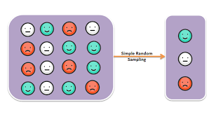

class: inverse, center, middle

background-image: url(images/cyril-saulnier-TsVN31Dzyv4-unsplash.jpg)
background-size: cover

# Sample Design and Weighting

---

##  The reality of survey sampling

--

.pull-left[
### The simple random sample

.center[]

- We have treated all of our sample data as if it was collected using simple random sampling (SRS). 
- In an SRS of size $n$, every possible combination of $n$ observations from the population has an equally likely chance of being drawn.
- In an SRS, every statistic (e.g. mean, proportions, linear slopes) should be representative of the population, except for random sampling bias.
]

--

.pull-right[
### Reality

.center[]

- In practice, large-scale surveys never use SRS for pragmatic and design reasons. 
- For correct statistical inference, we typically need to make adjustments for sample design.
- The primary ways in which sample design affects estimation are**clustering**, **stratification**, and **weighting**.
]

---

##  Cluster/Multistage sampling

.left-column[

]

.right-column[
Potential observations are aggregated into larger groupings identified as the Primary Sampling Unit (PSU) and then we sample some of these PSUs before sampling individual observations within the sampled PSUs.

- Cluster sampling is about efficiency and cost. Clusters are typically defined geographically, which then minimizes the cost of sampling individual observations. 

- If PSUs are sampled with probabilities proportional to cluster size, then every unit in the population has an equal likelihood of being selected. In this case, summary statistics on the sample should be representative. 

- When the variable of interest is distributed differently across clusters, the sampling variability will be higher than an SRS even if every observation has an equally likely chance of being drawn. 
]

---

##  What percent of the US population is Mormon?

.pull-left[
The General Social Survey uses Metropolitan Statistical Areas (MSA) and clusters of non-metropolitan counties as the PSU. In each year, it draws a sample of these areas and then samples respondents within each sampled PSU.

Because Mormons are heavily concentrated in certain places, percent Mormon in the GSS varies substantially from year to year by whether certain PSUs were sampled or not. Red band indicates expected 95% interval for sampling variability without clustering, assuming the average percent across all years (dotted line).
]

.pull-right[
```{r mormons, echo=FALSE}
relig$mormon <- !is.na(relig$other) & relig$other=="mormon"
relig$mormon[is.na(relig$relig)] <- NA
mormons <- tapply(relig$mormon, relig$year, mean, na.rm=TRUE)
mormons <- data.frame(year=as.numeric(rownames(mormons)), percent=mormons*100)
mormonmean <- mean(relig$mormon, na.rm=TRUE)
se <- sqrt((mormonmean*(1-mormonmean))/table(relig$year))*100
mormons$highmark <- 100*mormonmean+1.96*se
mormons$lowmark <- 100*mormonmean-1.96*se
ggplot(mormons, aes(x=year, y=percent))+
  geom_ribbon(aes(ymin=lowmark, ymax=highmark), 
              alpha=0.4, fill="red")+
  geom_line()+
  geom_point()+
  geom_hline(yintercept = mormonmean*100, linetype=2)+
  annotate("text", 1980, 1.5, label="expected 95% confidence\ninterval under SRS",
           color="red")+
  labs(x="year",
       y="sample percent Mormon",
       caption="Data: General Social Survey")
```
]

---

##  Stratification 

Stratification in sampling operates in a manner somewhat similar to cluster sampling except that once the observations are aggregated into strata by some characteristic (e.g. income, race, age), observations are sampled from *every* stratum. 

--

- Stratification is typically done to ensure that various sub-populations are present within the sample. 

--

- Different strata may be sampled with different probabilities. The most common approach is to take an **oversample** of a small group in order to ensure that effective comparisons can be made between that group and other groups.

--

- In practice, stratification is often done by first screening potential respondents for stratum characteristics.

--

- If strata are sampled with different probabilities, then summary statistics for the full sample will not be representative without weight adjustments. 

--

- Unlike clustering, greater similarity on a characteristic of interest within strata can actually **reduce** the sampling variability for that characteristic relative to an SRS. 

---

##  Weighting 

--

- Numerous factors can lead to a sample being unrepresentative such as sampling strata with different probabilities, differential non-response rates, and a lack of fit between sample frame and population. 

--

- **Sampling weights** allow researchers to correct summary statistics from the sample so that they are representative of the population. 

--

- The sampling weight for an observation should be $1/p_i$ where $p_i$ is the probability of being sampled. The sampling weight indicates the number of observations in the population that observation $i$ in the sample represents.

--

- Calculating sampling weights can be quite complex. In some cases, researchers may know $p_i$ from the study design. In other cases, researchers may create **post-stratification** weights by comparing the sample to some other data source (e.g. census, school records) for a set of demographic characteristics and applying weights to make the sample align with the other data source.

--

- When sampling weights are present in a dataset, they must be used to generate statistics representative of the population.

--

- Variation in sampling weights will increase sampling variability above and beyond that expected for an SRS.

---

##  Weights in Sneetchville


In Sneetchville, there are 3 star-bellied and 7 regular sneetches. Lets say I take a stratified sample of two star-bellied and two regular sneetches. Here is the population data:

```{r starbellied1}
sneetches <- data.frame(type=factor(c(rep("Star-bellied", 3),rep("Regular",7))),
                       income=c(3,7,6,2,1,4,5,0,2,1))
sneetches$prob <- c(rep(2/3,3),rep(2/7,7))
sneetches
```

---

##  Weights in Sneetchville 


```{r starbellied2}

sneetch.sample <- sneetches[c(sample(1:3,2),sample(4:10,2)),]
sneetch.sample$weight <- 1/sneetch.sample$prob
sneetch.sample
x <- c(mean(sneetches$income), mean(sneetch.sample$income), 
  weighted.mean(sneetch.sample$income, sneetch.sample$weight))
names(x) <- c("population","sample.unweighted","sample.weighted")
x
```

---

##   The consequences of survey design


| Design issue     |  Representative?                                                                |  Design effect (change to SE)               | 
|:-----------------|:--------------------------------------------------------------------------------|:--------------------------------------------|
| Clustering       | Yes, if PSUs are proportionally drawn. Otherwise, weighting necessary.          | Increases with difference between clusters. |
| Stratification   | Yes, if strata are sampled with same probability. Otherwise weighting necessary.| Decreases with homogeneity within strata    |
| Weights          | Only if weights are applied.                                                    | Increases with the variance of the weights. |

---

##  Correcting for survey design 

--

### Basic Weighting

R has syntax in many commands to apply sampling weights to get representative statistics (e.g. `weighted.mean`, the `weight` option in the `lm` command), but this approach will not correctly adjust standard errors for design effects. 

--

### Robust standard errors

Robust standard errors will correct standard errors for differential weights, but not for clustering and stratification design effects. 

--

### Survey package

The `survey` package in R will allow you to specify design and correctly adjust standard errors. 

---

## Add Health survey design 


.pull-left[

]

.pull-right[
- Schools were the primary PSU in a cluster sampling technique, but were also stratified by region, urbanicity, school type, ethnic mix, and size. 
- Students within schools were stratified by grade and sex and then sampled.
- Several oversamples were conducted of ethnic groups and genetically related pairs of students, as well as saturated samples from 16 schools. 
- Post-stratification adjustments were made to sampling weights to account for region of the country. 
- The Add Health documentation indicates that the REGION variable should be applied as a stratification variable but this variable is not available in the public release data so we will focus on the design effects of weights and clustering. 
]

---

##  Sample design variables

.pull-left[
```{r addhealth-designv}
head(popularity[,c("cluster","sweight")])
```
- `cluster` is a numeric id indicating the school the student was sampled from.
- `sweight` is the inverse of the probability of being sampled.
]


.pull-right[
```{r addhealthweight-dist, echo=FALSE}
ggplot(popularity, aes(x=sweight))+
  geom_histogram(fill="darkgreen", color="grey20")+
  labs(x="sampling weight",
       title="Not all respondents count equally")
```
]


---

##  Add Health example, naive approach

Lets start with a model that makes no adjustment.

```{r addhealthweights1}
model.basic <- lm(indegree~nsports, data=popularity)
summary(model.basic)$coef
```

--

Because I am not using weights, this value will not be representative of all American high school students in 1994-95. I can add the weights provided by Add Health to make this representative:

--

```{r addhealthweights2}
model.weight <- update(model.basic, weight=sweight)
summary(model.weight)$coef
```

---

##  Add Health example, robust SE approach

Adding weights to the `lm` command gives me representative values for the slope and intercept, but my SEs do not correct for the substantial variation in weights. I can correct for this design issue by using robust standard errors:

--

```{r addhealthweights-robust, message=FALSE, error=FALSE}
library(sandwich)
library(lmtest)
model.robust <- coeftest(model.weight, vcov=vcovHC(model.weight, "HC1"))
model.robust
```

Estimates are identical but standard errors are slightly larger. However, this technique still does not correct for clustering.

---

##  Add Health example, using `survey` library

I can use the `svydesign` command in the `survey` package to correctly specify both the weights and the clustering in Add Health. The `ids` argument expects a variable name that identifies the clusters by id (in this case, the school id) and the `weight` argument expects a variable name for the weights used. 

```{r addhealthweight-survey, message=FALSE, error=FALSE}
library(survey)
addhealth.svy <- svydesign(ids=~cluster, weight=~sweight, data=addhealth)
model.svy <- svyglm(indegree~nsports, design=addhealth.svy)
summary(model.svy)$coef
```

Estimates are identical to the weighted regression model before, but standard errors have increased due to variation in weights and the cluster design effect. 

---

##  Comparison of methods

.stargazer[
```{r addhealthweight-compare, echo=FALSE, message=FALSE, error=FALSE, results="asis"}
addhealth.svy2 <- svydesign(ids=~1, weight=~sweight, data=addhealth)
model.svy2 <- svyglm(indegree~nsports, design=addhealth.svy2)
htmlreg(list(model.basic, model.weight, model.robust, model.svy2, model.svy),
        head.tag = FALSE,
        doctype = FALSE,
        custom.model.names = c("unweighted  ","weighted  ","robust SE  ","survey: weights  ","survey: weights+cluster"),
        custom.coef.names = c("Intercept","Number of sports"),
        include.adjrs=FALSE, include.rmse=FALSE,
        include.deviance=FALSE, include.dispersion=FALSE,
        caption="Linear models predicting number of friend nominations by sports played",
        caption.above=TRUE,
        digits=3)
```
]

--

- All models except the unweighted version produce the same estimates of slope and intercept based on the weights.

--

- The survey weighted and robust SE models both produce the same standard errors. This is because both models account for the design effect of weight heterogeneity but not clustering. 
