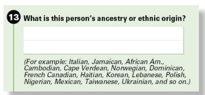

class: inverse, center, middle

background-image: url(images/serena-repice-lentini-IgoMDFTKF-U-unsplash.jpg)
background-size: cover

name: polytomous-models

# Models for Polytomous Outcomes

---

##  Predicting more than two categories

When we try to predict more than two categories, we have to think carefully about what *kind* of categorical variable we have:

--

.pull-left[
### Nominal

.center[] 

- If the categories of the dependent variable are unordered, we can use a **multinomial logit model**
- One category of the dependent variable will need to serve as the reference
- Model complexity increases rapidly with the number of categories

]


--

.pull-right[
### Ordinal

.center[] 

- If the categories of the dependent variable, are ordered we can use the **cumulative (ordered) logit model** or the **adjacent category logit model**
- Model complexity also increases rapidly with the number of categories, but we can apply constraints/assumptions that limit the complexity
]

???

- The complexity of the model increases rapidly with the number of categories. 

---

## American Community Survey data example

.pull-left[
### Race Question

]

.pull-right[
.center[
### Ancestry Question
]
]

---

## Race reporting by white/black ancestry individuals

.pull-left[
- We use a subset of data that includes all individuals who gave two ancestry responses that suggest both a white and black ancestry (e.g. "African American" and "Irish"). 
- We will consider three race responses for these individuals: 
    - white
    - black
    - white and black
- How does the decision to identify racially vary by college completion?
]

--

.pull-right[
```{r crosstab_racereport}
tab <- table(wbreport$racereport, 
             wbreport$college)
tab
prop.table(tab, 2)
```

]

???


College-educated respondents are much less likely to report as white and black and substantially more likely to report as black, and slightly more likely to report as white. 

---

##  Odds Ratios by College Completion

```{r crosstab_oddsratio, echo=FALSE}
tab[c(2:3,1),2:1]
```

--

- The odds of identifying as black rather than white and black are twice as high among college-educated individuals than among those without a college degree.

$$\frac{3993*32899}{2781*23374}=2.02$$

--

- The odds of identifying as white rather than white and black are 56% higher among college-educated individuals than among those without a college degree.

$$\frac{1598*32899}{2781*12112}=1.56$$

--

- The odds of identifying as black rather than white are 29.5% (1.56/2.02) higher among college-educated individuals than among those without a college degree.

---

##  Two pairwise comparisons

--

.pull-left[
### Black vs. Multi

```{r logistic_black}
model.b <- glm((racereport=="Black")~college, 
               data=subset(wbreport, 
                           racereport!="White"),
               family=binomial)
coef(model.b)
exp(coef(model.b))
```

The odds ratio of black vs. white/black identification is 2.02 $(e^{0.70355})$.
]

--

.pull-right[
### White vs. Multi

```{r logistic_white}
model.w <- glm((racereport=="White")~college, 
               data=subset(wbreport, 
                           racereport!="Black"),
               family=binomial)
coef(model.w)
exp(coef(model.w))
```

The odds ratio of white vs. white/black identification is 1.56 $(e^{0.44519})$.
]

???

The intercepts give the baseline odds of black and white identification vs. white/black identification, respectively, among the non-college educated. 

---

##  The multinomial logit model

.pull-left[
- The multinomial logit model accomplishes the same result as two separate logit models, but estimates parameters using a single MLE procedure. This allows for a single measure of model log-likelihood and deviance. 
- One of the categories of the dependent variable must serve as the reference category. In the example we are using, the white and black category served as the reference. The choice of reference is arbitrary. 
- For a model with $J$ categories of the dependent variable, we will get $J-1$ coefficients for each independent variable. 
- Multinomial logit models can be estimated in R with the `multinom` function in the `nnet` library. 
]

--

.pull-right[
```{r multinom_example, echo=TRUE, results="hide"}
library(nnet)
model <- multinom(racereport~college, 
                  data=wbreport)
```

```{r multinom_summary}
summary(model)
```
]

---

##  Formal multinomial model specification

$$\log(p_{ij}/p_{i1})=\beta_{0j}+\beta_{1j}x_{i1}+\beta_{2j}x_{i2}+\ldots+\beta_{pj}x_{ip}$$

--

- The model fits the log-odds of being in the $j$th outcome category relative to the reference outcome category as linear function of the independent variables.

--

- Each independent variable will have $J-1$ coefficients rather than a single coefficient. 

--

- Each $\beta_j$ gives the log odds ratio of being in the $j$th outcome category rather than the reference outcome category for a one unit change in the given independent variable. 

--

- The intercepts $\beta_{0j}$ give the baseline odds of being in the $j$th outcome category rather than the reference outcome category when all the independent variables are zero. 

---

##  Changing the reference category

If we want to change the reference category for the dependent variable, we can recalculate the regression coefficients as follows:

$$\beta_j-\beta_{j'}$$

Where $j'$ is the new category that we want to set as the reference. 

Lets try this out for our example, where we set the new reference to be identifying as black. 

```{r rebaseline}
coefs <- coef(model)
coefs.new <- rbind(c(0,0)-coefs[1,], coefs[2,]-coefs[1,])
rownames(coefs.new) <- c("White/Black", "White")
coefs.new
```

The white/black effects are just the inverse of the black effects. 

---

##  Estimating predicted probabilities

.pull-left[
Because there are multiple categories to consider, its often helpful to try to predict how the distribution of the dependent variable will change across different values of the independent variable. For a given set of independent variables $X$, the probability $P_i$ of being in category $i$ is:

$$P_i=\frac{exp(X\beta_i)}{\sum_Jexp(X\beta_j)}$$

The trick here is to remember that the reference category will always have $X\beta$ of zero which exponentiates to one. Therefore, the denominator will always include a one in the sum. 
]

--

.pull-right[
```{r calculateprobs_multinom}
temp <- rbind("White/Black"=c(0,0),
              coef(model))
temp
#For non-college
exp(temp[,1])/sum(exp(temp[,1]))
#for college
exp(temp[,1]+temp[,2])/
  sum(exp(temp[,1]+temp[,2]))
```
]

---

##  Using `predict` to estimate probabilities

You can also do this in R with the `predict` command where you feed in a new data set to get predicted values.

```{r calculateprobs_predict}
predicted.probs <- predict(model, newdata = data.frame(college=c("No","Yes")), type="probs")
predicted.probs
t(prop.table(tab, 2))
```

The results here are identical to the conditional distributions estimated by the two-way table. 

---

##  A full multinomial logit model

```{r multinom_full, results="hide"}
model.full <- multinom(racereport~college+poor+agectr+agectrsq+foreign+female, 
                       data=wbreport)
```

```{r multinom_full_summary}
round(coef(model.full),5)
```

--

- The effects of college are very different with controls. College now seems more likely to push respondents away from both single-race identifications towards multiracial identification, although the effect is weaker for pushing away from black-alone identification than white-alone identification. 

--

- How do we interpret the effects of age on racial identification? Age is centered on 22 years and a square is included, so its not easy to sort it out just from the coefficient values. 

---

##  Estimating the effect of age

Lets get predicted probabilities for the effect of age from 22 to 75. We will estimate probabilities for the reference categories of the other variables (non-college, non-poor, male, native-born).

In order to do this, we need to create a fake dataset where all values are held at the reference except for age and its square, and then feed this into the `predict` function. 

```{r fitage_multinom}
x <- 22:75
fakedata <- data.frame(college=rep("No",length(x)), 
                       poor=rep("No",length(x)), 
                       foreign=rep("No",length(x)), 
                       female=rep(0,length(x)),
                       agectr=x-22, agectrsq=(x-22)^2)
predicted.probs <- predict(model.full, fakedata, type="probs")
head(predicted.probs)
```

---

## Some data wrangling of `predict` output

To use `ggplot` on the predicted probabilities, we need it in a somewhat different form.

```{r data-wrangle-predict}
temp <- as.data.frame.table(predicted.probs)
colnames(temp) <- c("index","race_id","prob")
head(temp, n=3)
## temp has now stacked all three outcomes so we need to repeat
## fakedata three times and add to it
temp <- cbind(rbind(fakedata, fakedata, fakedata), temp[,2:3])
head(temp)
```

---

##  Two display techniques

.pull-left[
### Separate lines
```{r, fig.height=4}
ggplot(temp, aes(x=agectr+22, y=prob, 
                 color=race_id))+
  geom_line()+
  scale_y_continuous(labels=scales::percent)+
  labs(x="age", y="probability", 
       color="racial identification")
```
]

.pull-right[
### Stacked ribbons
```{r, fig.height=4}
ggplot(temp, aes(x=agectr+22, y=prob, 
                 fill=race_id))+
  geom_area()+
  scale_y_continuous(labels=scales::percent)+
  labs(x="age", y="probability", 
       fill="racial identification")
```
]

---

##  Paying attention to ordinal outcomes

Using the National Election Study data, lets look at attitudes toward gay marriage by whether a respondent completed a BA degree. 

```{r crosstab_politics}
politics$college <- as.numeric(politics$educ) > 3
tab <- table(politics$gaymarriage, politics$college)
tab
prop.table(tab, 2)
```

---

##  Two kinds of odds ratios

.center[
```{r crosstab_politics_oddsratio, echo=FALSE}
tab
```
]

--

.pull-left[
### Static reference
- Those with college education are 72% more likely to support civil unions rather than **no legal recognition**.
$$\frac{369*575}{623*198}=1.72$$
- Those with college education are 128% more likely to support gay marriage rather than **no legal recognition**.
$$\frac{1088*575}{1385*198}=2.28$$

]

--

.pull-right[
### Adjacent categories
- Those with college education are 72% more likely to support civil unions rather than **no legal recognition**.
$$\frac{369*575}{623*198}=1.72$$
- Those with college education are 33% more likely to support gay marriage rather than **civil unions**.
$$\frac{1088*623}{1385*369}=1.33$$

]


---

##  Naive multinomial model

We could just estimate this model as a multinomial model and ignore the ordinal nature of the dependent variable. 

```{r multinom_politics, results="hide"}
model.multin <- multinom(gaymarriage~college, data=politics)
```

```{r multinom_politics_summary}
coef(model.multin)
exp(coef(model.multin))
```

The multinomial model gives us the static reference results.


---

##  Adjacent category logit model

The Adjacent Category Logit (ACL) Model estimates the log-odds ratio of being in the higher category $j$ for each pair of adjacent categories $j$ and $j-1$:

$$\log(p_{ij}/p_{i(j-1)})=\beta_{0j}+\beta_{1j}x_{i1}+\beta_{2j}x_{i2}+\dots+\beta_{pj}x_{ip}$$

--

- The ACL takes advantage of the ordinal structure of the dependent variable to get the odds ratio between each adjacent set of categories on the ordinal scale. 

--

- In general, we can estimate the parameters for an adjacent category logit model from multinomial model results by coding the lowest category as the reference and taking: $$\beta_j-\beta_{j-1}$$ for all coefficients.

--

- In terms of model fit, the ACL is identical to the multinomial model, it just gives a more intuitive interpretation for ordinal responses.

--

- The multinomial model is sometimes called the Baseline Category Logit (BCL) model to more clearly distinguish it from the ACL.

---

##  Getting ACL from multinomial logit model

```{r acl_model}
coef(model.multin)
convert_acl <- function(model_m) {
  coefs <- rbind(c(0,0), coef(model_m))
  return(diff(coefs))
}
acl_coef <- convert_acl(model.multin)
acl_coef
exp(acl_coef)
```

---

##  Same results from two logit models

```{r logistic_acl}
acl_coef
coef(glm((gaymarriage=="Civil unions")~college, family=binomial,
            data=subset(politics, gaymarriage!="Support gay marriage")))
coef(glm((gaymarriage=="Support gay marriage")~college, family=binomial,
            data=subset(politics, gaymarriage!="No legal recognition")))
```

---

##  The Cumulative Probability

Another way to think about differences in the distribution of an ordinal variable is by comparing the cumulative probability of being in a given category or higher. 

```{r cumprob}
p <- prop.table(tab,2)
p
cump <- apply(p[3:1,],2,cumsum)[3:1,]
cump
```


---

##  The Cumulative Odds

We can convert these cumulative probabilities into cumulative odds:

```{r cumodds}
cumodds <- cump/(1-cump)
cumodds
```

--

- The odds for the first category are irrelevant because everyone is at least in the lowest category. 

--

- Among those without a college degree the odds of supporting civil unions **or more** is 3.49 to one, whereas among the college-educated the same cumulative odds is 7.36. The odds ratio is about 2.11 (7.36/3.49).

--

- The odds of supporting gay marriage among those without a college degree is 1.16 to one. Among the college-educated the same odds is 1.92 to one. The odds ratio is about 1.66 (1.92/1.16).

???

- Since you can't go higher, the cumulative odds for the top category of supporting gay marriage are equal to the odds of being in this category or not. 

---

##  Cumulative/Ordered Logit Model

$$log(P(y_i>=j)/P(y_i<j))=\alpha_j+\beta_{1j}x_{i1}+\beta_{2j}x_{i2}+\dots+\beta_{pj}x_{ip}$$

--

- The dependent variable is the cumulative log odds of being in the $j$th category or higher. 

--

- The coefficients tell us how the the cumulative log odds of being in the $j$th or higher category change due to a one unit increase in $x$.

--

- The $\alpha_j$ are intercepts but they are often called the *cut points*. They define the cumulative distribution of ordinal responses when all the $x$'s are zero. 

--

- Because this model allows the effect of each independent variable to be different at each cut-point, it has the same model fit as the multinomial model, but a different parameterization.

--

- Think of the model as testing all possible dichotomous collapsings of your dependent variable simultaneously.

---

##  Estimating the cumulative logit model

```{r logcumodds}
lcumodds <- log(cumodds[-1,])
lcumodds
```

The first column gives the *cut points* for the model of 0.85 and -0.49. These define the cumulative log odds among the non-college educated. The log-odds ratios for the college educated are given by the difference in log-odds.

```{r cumlogit_model}
model.cumlogit <- data.frame(cut=lcumodds[,1],
                             college=lcumodds[,2]-lcumodds[,1])
model.cumlogit
```

---

##  Interpreting terms in cumulative logit model

```{r cumlogit_model_interpret}
exp(model.cumlogit)
```

--

- Among the non-college educated, the odds of supporting civil unions **or more** are 3.49 to one, and the odds of supporting gay marriage fully are 1.16 to one. 

--

- The odds of supporting civil unions **or more** are 2.11 times higher for the college educated than the non-college educated.

--

- The odds of supporting gay marriage are 66% higher for the college educated than the non-college educated.

---

##  Same results from logit models

```{r logistic_cumlogit}
model.cumlogit
coef(glm((gaymarriage=="Support gay marriage" | gaymarriage=="Civil unions")~college, 
         data=politics, family=binomial))
coef(glm((gaymarriage=="Support gay marriage")~college, 
         data=politics, family=binomial))
```

---

##  Estimating polytmous models with `vglm`

The `VGAM` library includes a function called `vglm` for estimating "vector generalized linear models." This package can be used to estimate a variety of nominal and ordinal response models. 

The structure of the dependent variable in `vglm` is somewhat different than `glm` or `lm`. We need to feed in a matrix of responses ordered from lowest to highest response category, where each vector is a sequence of zeroes/ones or FALSE/TRUE for being in that particular category. 

```{r createvglmbase}
politics$norecog <- politics$gaymarriage=="No legal recognition"
politics$civil <- politics$gaymarriage=="Civil unions"
politics$marriage <- politics$gaymarriage=="Support gay marriage"
##Check yourself before your wreck yourself
apply(politics[,c("norecog","civil","marriage")],2,mean, na.rm=TRUE)
prop.table(table(politics$gaymarriage))
```

---

##  Ordinal models using `vglm`

--

### Multinomial logit (Baseline category logit) model:
```{r vglm_multinom}
model.multinom <- vglm(cbind(norecog, civil, marriage)~college, family=multinomial(refLevel=1), 
                       data=politics)
```

--

### Adjacent category logit model: 
```{r vglm_acl}
model.acl <- vglm(cbind(norecog, civil, marriage)~college, family=acat(parallel=FALSE), data=politics)
```

--

### Cumulative logit model:
```{r vglm_cumlogit}
model.cumlogit <- vglm(cbind(norecog, civil, marriage)~college, 
                       family=cumulative(parallel=FALSE,reverse=TRUE), data=politics)
```

---

## `vglm` model output

```{r vglm_results}
coef(model.multinom)
coef(model.acl)
coef(model.cumlogit)
```

Deviance is the same because they are the same model differently parameterized.
```{r vglm_deviance}
sapply(list(model.multinom,model.acl,model.cumlogit),deviance)
```

---

## Constraints in ordinal models

--

- For the ACL and cumulative logit model, it is possible to apply a simple constraint that the effect of college education is the same at each cut point.  This is the assumption of **proportional odds**.

--

- The ACL and cumulative logit models estimated under this constraint are no longer identical in terms of fit and neither will fit the table exactly.

--

- This constrained model has the advantage of being more parsimonious and having less coefficients to interpret

--

- This constrained model has the disadvantage of making an assumption. In our case, the assumption seems problematic because we can see substantial differences in the effect of college education at different cut points.

---

##  Constrained models with `vglm`

Constrained models can be estimating by changing the `parallel` option for family to `TRUE`:

```{r vglm_constrained}
model.acl.c      <-  vglm(cbind(norecog, civil, marriage)~college,
                          family=acat(parallel=TRUE), data=politics)
model.cumlogit.c <-  vglm(cbind(norecog, civil, marriage)~college, 
                          family=cumulative(parallel=TRUE,reverse=TRUE), data=politics)
coef(model.acl.c)
coef(model.cumlogit.c)
sapply(list(model.acl,model.cumlogit, model.acl.c, model.cumlogit.c), deviance)
```

---

##  Predicted probabilities

No pre-defined method for getting back to predicted probabilities, so I wrote custom functions for ACL and cumulative logit (disclaimer: not stress tested!)

```{r probpredict_functions}
predictprobs.acl <- function(model, fakedata) {
  temp <- cbind(rep(0,nrow(fakedata)),predict(model, fakedata))
  #get back to multinomial logit interpretation and apply multinomial logit method
  temp[,2:ncol(temp)] <- temp[,2:ncol(temp)]+temp[,1:(ncol(temp)-1)]
  temp <- exp(temp)
  p <- temp/apply(temp,1,sum)
  colnames(p) <- colnames(model@fitted.values)
  ncat <- ncol(p)
  p <- as.data.frame.table(p)[,2:3]
  colnames(p) <- c("outcome","p")
  return(cbind(fakedata, p))
}

predictprobs.cumlogit <- function(model, fakedata) {
  cumodds <- exp(predict(model, fakedata))
  cumprob <- cbind(rep(1,nrow(fakedata)),cumodds/(1+cumodds))
  p <- t(rbind(cumprob[,ncol(cumprob)],diff(t(cumprob[,ncol(cumprob):1])))[ncol(cumprob):1,])
  colnames(p) <- colnames(model@fitted.values)
  ncat <- ncol(p)
  p <- as.data.frame.table(p)[,2:3]
  colnames(p) <- c("outcome","p")
  return(cbind(fakedata, p))
}
```

---

##  Predicted probabilities across models

```{r predictprobs_college, echo=FALSE, fig.width=12}
test <- data.frame(college=c(FALSE, TRUE))
predp <- predictprobs.acl(model.acl, test)
predp$estimation <- "actual"
temp <- predictprobs.acl(model.acl.c, test)
temp$estimation <- "acl, constrained"
predp <- rbind(predp, temp)
temp <- predictprobs.cumlogit(model.cumlogit.c, test)
temp$estimation <- "cum. logit, constrained"
predp <- rbind(predp, temp)
predp$estimation <- factor(predp$estimation,
                           levels=c("actual","acl, constrained",
                                    "cum. logit, constrained"))

ggplot(predp, aes(x=college, y=p, fill=estimation))+
  geom_col(position = "dodge")+
  facet_wrap(~outcome)+
  scale_y_continuous(labels=scales::percent)+
  labs(x="college completion", y="percent",
       fill="model type")
```

---

##  Fuller models

```{r ordinal_full_models, echo=FALSE}
politics$relig <- relevel(politics$relig, "Evangelical Protestant")
model.full.cumlogit <- vglm(cbind(norecog, civil, marriage)~college+relig+I(age-40)+I((age-40)^2), 
                       family=cumulative(parallel=FALSE,reverse=TRUE), data=politics)
model.full.cumlogit.c <- update(model.full.cumlogit, family=cumulative(parallel=TRUE,reverse=TRUE))
model.full.acl <- update(model.full.cumlogit, family=acat(parallel=FALSE))
model.full.acl.c <- update(model.full.acl, family=acat(parallel=TRUE))
temp <- temp2 <- rep(NA, length(coef(model.full.cumlogit)))
temp[c(1:2,seq(from=3,to=(length(coef(model.full.cumlogit))-1),by=2))] <- coef(model.full.cumlogit.c)
temp2[c(1:2,seq(from=3,to=(length(coef(model.full.cumlogit))-1),by=2))] <- coef(model.full.acl.c)
print(round(cbind("cumlogit"=coef(model.full.cumlogit),"cumlogit, c"=temp,
            "ACL"=coef(model.full.acl), "ACL, c"=temp2),4), na.print="")
```

---

## What is the effect of age?

```{r age-compare, echo=FALSE, fig.width=12}
test <- expand.grid(age=20:80, college=FALSE, relig="Evangelical Protestant")
pred <- predictprobs.acl(model.full.acl, test)
pred$type <- "ACL"
pred$constraints <- "no constraints"
temp <- predictprobs.acl(model.full.acl.c, test)
temp$type <- "ACL"
temp$constraints <- "proportional odds"
pred <- rbind(pred, temp)
temp <- predictprobs.cumlogit(model.full.cumlogit, test)
temp$type <- "Cum. Logit"
temp$constraints <- "no constraints"
pred <- rbind(pred, temp)
temp <- predictprobs.cumlogit(model.full.cumlogit.c, test)
temp$type <- "Cum. Logit"
temp$constraints <- "proportional odds"
pred <- rbind(pred, temp)
pred$outcome <- factor(pred$outcome,
                       levels=c("norecog","civil","marriage"),
                       labels=c("no legal recognition",
                                "civil unions",
                                "marriage equality"))

ggplot(pred, aes(x=age, y=p, color=outcome, linetype=constraints))+
  geom_line()+
  facet_wrap(~type)+
  scale_y_continuous(labels=scales::percent)+
  labs(x="age", y="percent", color="gay marriage")

```

